# llama.cpp 项目总体架构图

## 概述

llama.cpp 是一个高效的 LLM 推理引擎，采用分层架构设计，从底层硬件抽象到上层应用接口，提供了完整的推理生态系统。

## 架构图

```mermaid
graph TB
    subgraph "应用层 / Application Layer"
        APP1[应用示例<br/>examples/]
        APP2[CLI 工具<br/>main, llama-cli]
        APP3[服务器<br/>llama-server]
        APP4[测试套件<br/>tests/]
        APP5[基准测试<br/>benches/]
    end

    subgraph "公共组件层 / Common Layer"
        COMMON1[聊天解析<br/>chat.cpp]
        COMMON2[采样策略<br/>sampling.cpp]
        COMMON3[JSON 解析<br/>json-schema-to-grammar.cpp]
        COMMON4[模板引擎<br/>jinja/]
        COMMON5[文件下载<br/>download.cpp]
        COMMON6[Unicode 处理<br/>unicode.cpp]
        COMMON7[日志系统<br/>log.cpp]
        COMMON8[推理解码<br/>speculative.cpp]
    end

    subgraph "核心推理引擎 / Core Inference Engine"
        CORE1[模型加载<br/>llama-model.cpp]
        CORE2[推理上下文<br/>llama-context.cpp]
        CORE3[批处理<br/>llama-batch.cpp]
        CORE4[采样器<br/>llama-sampler.cpp]
        CORE5[词汇表<br/>llama-vocab.cpp]
        CORE6[语法约束<br/>llama-grammar.cpp]
        CORE7[KV 缓存<br/>llama-kv-cache.cpp]
        CORE8[内存管理<br/>llama-memory.cpp]
        CORE9[计算图<br/>llama-graph.cpp]
        CORE10[量化<br/>llama-quant.cpp]
        CORE11[适配器<br/>llama-adapter.cpp]
        CORE12[架构抽象<br/>llama-arch.cpp]
        CORE13[聊天引擎<br/>llama-chat.cpp]
    end

    subgraph "GGML 核心库 / GGML Core Library"
        GGML1[张量操作<br/>ggml.c]
        GGML2[内存分配<br/>ggml-alloc.c]
        GGML3[优化器<br/>ggml-opt.cpp]
        GGML4[量化<br/>ggml-quants.c]
        GGML5[后端管理<br/>ggml-backend.cpp]
        GGML6[文件格式<br/>gguf.cpp]
        GGML7[张量类型定义<br/>ggml.h]
    end

    subgraph "硬件后端层 / Hardware Backend Layer"
        BACKEND1[CPU 后端<br/>ggml-cpu/]
        BACKEND2[CUDA 后端<br/>ggml-cuda/]
        BACKEND3[Metal 后端<br/>ggml-metal/]
        BACKEND4[OpenCL 后端<br/>ggml-opencl/]
        BACKEND5[Vulkan 后端<br/>ggml-vulkan/]
        BACKEND6[SYCL 后端<br/>ggml-sycl/]
        BACKEND7[HIP 后端<br/>ggml-hip/]
        BACKEND8[OpenVINO 后端<br/>ggml-openvino/]
        BACKEND9[CANN 后端<br/>ggml-cann/]
        BACKEND10[BLAS 后端<br/>ggml-blas/]
        BACKEND11[RPC 后端<br/>ggml-rpc/]
        BACKEND12[WebGPU 后端<br/>ggml-webgpu/]
    end

    subgraph "工具链层 / Toolchain Layer"
        TOOL1[模型转换<br/>convert_hf_to_gguf.py]
        TOOL2[LoRA 转换<br/>convert_lora_to_gguf.py]
        TOOL3[量化工具<br/>llama-quantize]
        TOOL4[GGUF 工具<br/>gguf-py/]
        TOOL5[构建系统<br/>CMake/Makefile]
    end

    subgraph "API 接口层 / API Layer"
        API1[C API<br/>include/llama.h]
        API2[GGML API<br/>ggml/include/ggml.h]
        API3[后端 API<br/>ggml/include/ggml-backend.h]
        API4[FFI 接口<br/>include/llama-cpp.h]
    end

    subgraph "基础设施 / Infrastructure"
        INFRA1[构建系统<br/>CMake/]
        INFRA2[CI/CD<br/>.github/]
        INFRA3[文档<br/>docs/]
        INFRA4[许可证<br/>licenses/]
    end

    %% 主要依赖关系
    APP1 & APP2 & APP3 & APP4 & APP5 --> API1
    APP1 & APP2 & APP3 & APP4 & APP5 --> COMMON1
    APP1 & APP2 & APP3 & APP4 & APP5 --> COMMON2
    APP3 --> COMMON8

    COMMON1 --> COMMON3
    COMMON1 --> COMMON4
    COMMON2 --> CORE4
    COMMON3 --> CORE6
    COMMON8 --> CORE4

    CORE1 --> CORE2
    CORE1 --> CORE12
    CORE1 --> CORE5
    CORE1 --> CORE10
    CORE2 --> CORE3
    CORE2 --> CORE7
    CORE2 --> CORE8
    CORE2 --> CORE9
    CORE2 --> CORE13
    CORE4 --> CORE2
    CORE5 --> CORE2
    CORE6 --> CORE5
    CORE7 --> CORE8
    CORE8 --> CORE9
    CORE9 --> CORE2
    CORE10 --> CORE1
    CORE11 --> CORE1
    CORE12 --> CORE1
    CORE13 --> COMMON1

    CORE1 --> GGML1
    CORE1 --> GGML2
    CORE1 --> GGML6
    CORE2 --> GGML1
    CORE2 --> GGML2
    CORE3 --> GGML1
    CORE4 --> GGML1
    CORE5 --> GGML1
    CORE6 --> GGML1
    CORE7 --> GGML1
    CORE8 --> GGML1
    CORE9 --> GGML1
    CORE10 --> GGML4
    CORE11 --> GGML6

    GGML1 --> GGML7
    GGML1 --> GGML2
    GGML1 --> GGML3
    GGML1 --> GGML4
    GGML1 --> GGML5
    GGML2 --> GGML5
    GGML3 --> GGML5
    GGML4 --> GGML5
    GGML5 --> GGML7
    GGML6 --> GGML5

    GGML5 --> BACKEND1
    GGML5 --> BACKEND2
    GGML5 --> BACKEND3
    GGML5 --> BACKEND4
    GGML5 --> BACKEND5
    GGML5 --> BACKEND6
    GGML5 --> BACKEND7
    GGML5 --> BACKEND8
    GGML5 --> BACKEND9
    GGML5 --> BACKEND10
    GGML5 --> BACKEND11
    GGML5 --> BACKEND12

    TOOL1 --> GGML6
    TOOL2 --> GGML6
    TOOL3 --> CORE10
    TOOL4 --> GGML6
    TOOL5 --> INFRA1

    API1 --> CORE1
    API1 --> CORE2
    API1 --> CORE3
    API1 --> CORE4
    API2 --> GGML1
    API2 --> GGML2
    API3 --> GGML5
    API4 --> API1

    APP1 --> INFRA1
    APP2 --> INFRA1
    APP3 --> INFRA1
    APP4 --> INFRA1
    APP5 --> INFRA1
    INFRA1 --> INFRA2
    INFRA2 --> INFRA3

    style APP1 fill:#e1f5ff
    style APP2 fill:#e1f5ff
    style APP3 fill:#e1f5ff
    style APP4 fill:#e1f5ff
    style APP5 fill:#e1f5ff
    style COMMON1 fill:#fff4e1
    style COMMON2 fill:#fff4e1
    style COMMON3 fill:#fff4e1
    style COMMON4 fill:#fff4e1
    style COMMON5 fill:#fff4e1
    style COMMON6 fill:#fff4e1
    style COMMON7 fill:#fff4e1
    style COMMON8 fill:#fff4e1
    style CORE1 fill:#e1ffe1
    style CORE2 fill:#e1ffe1
    style CORE3 fill:#e1ffe1
    style CORE4 fill:#e1ffe1
    style CORE5 fill:#e1ffe1
    style CORE6 fill:#e1ffe1
    style CORE7 fill:#e1ffe1
    style CORE8 fill:#e1ffe1
    style CORE9 fill:#e1ffe1
    style CORE10 fill:#e1ffe1
    style CORE11 fill:#e1ffe1
    style CORE12 fill:#e1ffe1
    style CORE13 fill:#e1ffe1
    style GGML1 fill:#ffe1f5
    style GGML2 fill:#ffe1f5
    style GGML3 fill:#ffe1f5
    style GGML4 fill:#ffe1f5
    style GGML5 fill:#ffe1f5
    style GGML6 fill:#ffe1f5
    style GGML7 fill:#ffe1f5
    style BACKEND1 fill:#f5e1ff
    style BACKEND2 fill:#f5e1ff
    style BACKEND3 fill:#f5e1ff
    style BACKEND4 fill:#f5e1ff
    style BACKEND5 fill:#f5e1ff
    style BACKEND6 fill:#f5e1ff
    style BACKEND7 fill:#f5e1ff
    style BACKEND8 fill:#f5e1ff
    style BACKEND9 fill:#f5e1ff
    style BACKEND10 fill:#f5e1ff
    style BACKEND11 fill:#f5e1ff
    style BACKEND12 fill:#f5e1ff
    style TOOL1 fill:#e1f5ff
    style TOOL2 fill:#e1f5ff
    style TOOL3 fill:#e1f5ff
    style TOOL4 fill:#e1f5ff
    style TOOL5 fill:#e1f5ff
    style API1 fill:#f5ffe1
    style API2 fill:#f5ffe1
    style API3 fill:#f5ffe1
    style API4 fill:#f5ffe1
```

## 架构层次说明

### 1. 应用层 (Application Layer)
- **examples/**: 各种应用示例，包括简单的推理、批处理、Lookahead 等
- **CLI 工具**: 命令行工具，如 `main`、`llama-cli` 等
- **llama-server**: HTTP 服务器，提供 API 接口
- **tests/**: 测试套件
- **benches/**: 性能基准测试

### 2. 公共组件层 (Common Layer)
提供通用的公共组件：
- **chat.cpp**: 聊天解析和自动解析器
- **sampling.cpp**: 采样策略实现
- **json-schema-to-grammar.cpp**: JSON Schema 到语法的转换
- **jinja/**: 模板引擎
- **download.cpp**: 文件下载
- **unicode.cpp**: Unicode 处理
- **log.cpp**: 日志系统
- **speculative.cpp**: 推理解码支持

### 3. 核心推理引擎 (Core Inference Engine)
这是 llama.cpp 的核心，负责所有推理逻辑：
- **llama-model.cpp**: 模型加载和管理
- **llama-context.cpp**: 推理上下文管理
- **llama-batch.cpp**: 批处理管理
- **llama-sampler.cpp**: 采样器实现
- **llama-vocab.cpp**: 词汇表处理
- **llama-grammar.cpp**: 语法约束
- **llama-kv-cache.cpp**: KV 缓存管理
- **llama-memory.cpp**: 内存管理
- **llama-graph.cpp**: 计算图构建和执行
- **llama-quant.cpp**: 量化支持
- **llama-adapter.cpp**: 适配器支持
- **llama-arch.cpp**: 架构抽象
- **llama-chat.cpp**: 聊天引擎

### 4. GGML 核心库 (GGML Core Library)
提供底层张量计算能力：
- **ggml.c**: 张量操作实现
- **ggml-alloc.c**: 内存分配器
- **ggml-opt.cpp**: 优化器
- **ggml-quants.c**: 量化算法
- **ggml-backend.cpp**: 后端管理
- **gguf.cpp**: GGUF 文件格式支持
- **ggml.h**: 张量类型定义

### 5. 硬件后端层 (Hardware Backend Layer)
支持多种硬件平台：
- **ggml-cpu/**: CPU 后端
- **ggml-cuda/**: CUDA (NVIDIA GPU) 后端
- **ggml-metal/**: Metal (Apple GPU) 后端
- **ggml-opencl/**: OpenCL 后端
- **ggml-vulkan/**: Vulkan 后端
- **ggml-sycl/**: SYCL (Intel GPU) 后端
- **ggml-hip/**: HIP (AMD GPU) 后端
- **ggml-openvino/**: OpenVINO 后端
- **ggml-cann/**: CANN (华为昇腾) 后端
- **ggml-blas/**: BLAS 后端
- **ggml-rpc/**: RPC 后端
- **ggml-webgpu/**: WebGPU 后端

### 6. 工具链层 (Toolchain Layer)
模型和数据处理工具：
- **convert_hf_to_gguf.py**: HuggingFace 模型转换为 GGUF
- **convert_lora_to_gguf.py**: LoRA 转换为 GGUF
- **llama-quantize**: 量化工具
- **gguf-py/**: GGUF Python 库
- **构建系统**: CMake/Makefile

### 7. API 接口层 (API Layer)
暴露给用户的 API 接口：
- **include/llama.h**: C API
- **ggml/include/ggml.h**: GGML API
- **ggml/include/ggml-backend.h**: 后端 API
- **include/llama-cpp.h**: FFI 接口

### 8. 基础设施 (Infrastructure)
- **CMake/**: 构建系统配置
- **.github/**: CI/CD 配置
- **docs/**: 文档
- **licenses/**: 许可证

## 架构特点

1. **分层设计**: 清晰的分层架构，从底层硬件抽象到上层应用
2. **模块化**: 各层模块独立，易于维护和扩展
3. **硬件无关**: 通过后端抽象层支持多种硬件平台
4. **高性能**: 针对推理场景进行优化，支持量化和多种优化技术
5. **易用性**: 提供多种工具和示例，方便用户使用