# LLM 推理完整流程图

本图展示了 llama.cpp 中从输入到输出的整个推理过程。

```mermaid
flowchart TD
    Start([开始推理]) --> Init[初始化 llama 后端]

    Init --> LoadModel[加载模型文件 GGUF]
    LoadModel --> CreateContext[创建推理上下文]

    CreateContext --> Tokenize[文本分词]
    Tokenize --> PrepareBatch[准备批次数据]

    PrepareBatch --> SetBOS{需要BOS token?}
    SetBOS -->|是| AddBOS[添加BOS token]
    SetBOS -->|否| ProcessPrompt
    AddBOS --> ProcessPrompt[处理提示词 tokens]

    ProcessPrompt --> Encode[调用 llama_encode]
    Encode --> EncodeLayers[前向传播编码器]
    EncodeLayers --> EncodeDone[编码完成]

    EncodeDone --> GenerateLoop{生成循环}

    GenerateLoop --> DecodeStep[解码步骤]
    DecodeStep --> PrepareDecode[准备解码批次]
    PrepareDecode --> Decode[调用 llama_decode]

    Decode --> Forward[前向传播]
    Forward --> GetLogits[获取 logits]

    GetLogits --> Sampling[采样过程]
    Sampling --> ApplySamplers[应用采样链]
    ApplySamplers --> SampleToken[采样 token]

    SampleToken --> CheckEOS{是EOS token?}
    CheckEOS -->|是| DecodeDone[解码完成]
    CheckEOS -->|否| AddToOutput[添加到输出]

    AddToOutput --> CheckMax{达到最大长度?}
    CheckMax -->|是| DecodeDone
    CheckMax -->|否| GenerateLoop

    DecodeDone --> Detokenize[Token 反分词]
    Detokenize --> Output([输出文本])

    Output --> CleanUp[清理资源]
    CleanUp --> End([结束])

    style Start fill:#e1f5e1
    style End fill:#ffe1e1
    style Output fill:#e1e1ff
    style Init fill:#fff4e1
    style LoadModel fill:#fff4e1
    style CreateContext fill:#fff4e1
    style Encode fill:#ffe1f5
    style Decode fill:#ffe1f5
    style Forward fill:#ffe1f5
    style Sampling fill:#e1f5ff
```

## 流程说明

### 1. 初始化阶段
- **初始化后端**: 调用 `llama_backend_init()` 初始化 GGML 后端
- **加载模型**: 从 GGUF 文件加载模型权重和元数据
- **创建上下文**: 使用 `llama_init_from_model()` 创建推理上下文

### 2. 提示词处理阶段
- **文本分词**: 使用 `llama_tokenize()` 将输入文本转换为 token 序列
- **准备批次**: 创建 `llama_batch` 结构存储批次数据
- **添加特殊 token**: 根据模型配置添加 BOS/EOS token

### 3. 编码阶段（Encoder-Decoder 模型）
- **调用编码**: 使用 `llama_encode()` 处理输入序列
- **前向传播**: 通过编码器层计算隐藏状态
- **存储结果**: 将编码器的输出存储供交叉注意力使用

### 4. 生成循环
- **准备批次**: 为下一个 token 创建新的批次
- **调用解码**: 使用 `llama_decode()` 执行前向传播
- **获取 logits**: 从最后一层获取词汇表概率分布
- **采样 token**: 使用采样策略选择下一个 token
- **检查终止条件**: 检查 EOS token 或最大长度限制

### 5. 输出阶段
- **Token 反分词**: 使用 `llama_detokenize()` 将 token 转换为文本
- **返回结果**: 输出生成的文本
- **清理资源**: 释放模型和上下文内存

## 关键数据结构

| 数据结构 | 用途 |
|---------|------|
| `llama_model` | 存储模型权重、参数和元数据 |
| `llama_context` | 推理上下文，包含 KV cache 和中间状态 |
| `llama_batch` | 批次数据，包含 tokens、位置和序列 ID |
| `llama_sampler` | 采样器链，定义采样策略 |

## 关键 API 函数

| 函数 | 用途 |
|------|------|
| `llama_backend_init()` | 初始化后端 |
| `llama_model_load_from_file()` | 从文件加载模型 |
| `llama_init_from_model()` | 创建推理上下文 |
| `llama_tokenize()` | 文本分词 |
| `llama_encode()` | 编码输入（Encoder-Decoder 模型） |
| `llama_decode()` | 前向传播 |
| `llama_sampler_sample()` | 采样 token |
| `llama_detokenize()` | Token 反分词 |