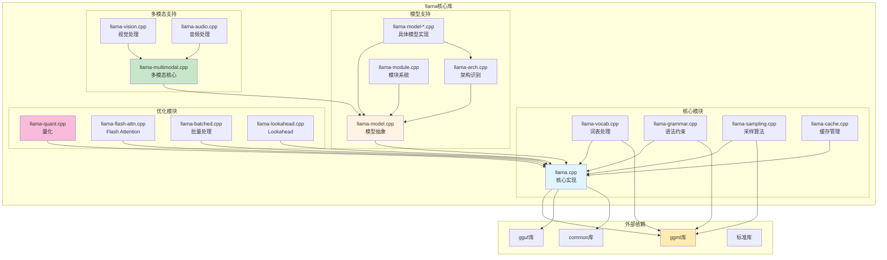

# llama 核心库模块依赖图

## 模块依赖图

## 模块详细说明

### 1. 核心模块

#### llama.cpp（核心实现）
- 模型加载和初始化
- 推理循环控制
- 内存管理
- 线程管理

#### llama-vocab.cpp（词表处理）
- Token化处理
- 分词器实现
- 词表管理
- 特殊Token处理

#### llama-grammar.cpp（语法约束）
- GBNF解析
- 语法约束实现
- 约束采样
- 多重约束

#### llama-sampling.cpp（采样算法）
- 各种采样策略
- 温度控制
- Top-p/Top-k采样
- 重复惩罚

#### llama-cache.cpp（缓存管理）
- KV Cache实现
- 缓存策略
- 内存优化
- 缓存共享

### 2. 模型支持

#### llama-model.cpp（模型抽象）
- 模型数据结构
- 模型加载接口
- 模型查询接口
- 模型管理

#### llama-arch.cpp（架构识别）
- 架构类型识别
- 架构特性判断
- 模型分类
- 架构优化

#### llama-module.cpp（模块系统）
- 模块注册
- 模块加载
- 模块配置
- 模块通信

#### llama-model-*.cpp（具体模型实现）
- LLaMA模型实现
- GPT模型实现
- Transformer模型实现
- 其他模型实现

### 3. 多模态支持

#### llama-multimodal.cpp（多模态核心）
- 多模态接口
- 数据流管理
- 模态融合
- 输出处理

#### llama-vision.cpp（视觉处理）
- 图像预处理
- 特征提取
- 图像编码器
- 视觉-语言对齐

#### llama-audio.cpp（音频处理）
- 音频预处理
- 特征提取
- 音频编码器
- 音频-语言对齐

### 4. 优化模块

#### llama-quant.cpp（量化）
- 量化算法实现
- 量化格式支持
- 量化/反量化
- 量化感知训练

#### llama-flash-attn.cpp（Flash Attention）
- Flash Attention实现
- 注意力优化
- 内存优化
- 性能调优

#### llama-batched.cpp（批量处理）
- 批量推理
- 批量采样
- 批量内存管理
- 批量调度

#### llama-lookahead.cpp（Lookahead）
- Lookahead算法
- 预测优化
- 树搜索
- 动态调整

## 依赖关系分析

### 内部依赖
1. **核心模块是基础**: 其他模块都依赖核心模块
2. **模型支持依赖核心**: 模型实现需要核心功能支持
3. **优化模块可插拔**: 优化模块相对独立，可动态加载
4. **多模态独立模块**: 多模态支持是可选功能

### 外部依赖
1. **ggml库**: 所有计算操作的底层实现
2. **gguf库**: 模型文件格式处理
3. **common库**: 公共工具函数
4. **标准库**: 系统API和数据结构

## 扩展性设计

### 添加新模型
1. 创建新的llama-model-*.cpp文件
2. 实现模型特定的加载和推理逻辑
3. 注册到架构识别系统
4. 保持与核心模块的接口兼容

### 添加新后端
1. 实现新的后端接口
2. 集成到ggml库
3. 测试和验证
4. 更新配置和文档

### 添加新优化
1. 在优化模块中添加新功能
2. 实现相关算法
3. 集成到核心推理流程
4. 提供配置选项