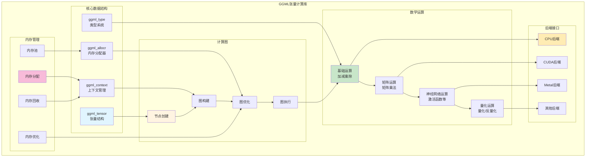

# GGML 张量计算库架构图

## 架构图



## 核心数据结构详解

### 1. ggml_tensor（张量结构）
```c
struct ggml_tensor {
    enum ggml_type type;      // 数据类型
    int64_t ne[GGML_MAX_DIMS]; // 每个维度的元素数量
    size_t nb[GGML_MAX_DIMS]; // 每个维度的字节跨度
    void * data;               // 数据指针
    struct ggml_context * ctx; // 所属上下文
    // ... 其他字段
};
```

### 2. ggml_context（上下文管理）
- 管理内存区域
- 跟踪所有张量
- 生命周期管理
- 线程安全

### 3. ggml_allocr（内存分配器）
- 高效内存分配
- 内存池管理
- 碎片整理
- 回收策略

### 4. ggml_type（类型系统）
- 支持多种数据类型
- 量化类型
- 定点类型
- 浮点类型

## 计算图系统

### 计算图构建


### 计算图优化
- **常量折叠**: 预计算常量运算
- **死代码消除**: 移除无用节点
- **节点合并**: 合并相似运算
- **内存优化**: 减少中间结果

### 计算图执行
- **拓扑排序**: 确定执行顺序
- **并行执行**: 利用多核/多GPU
- **内存复用**: 减少内存占用
- **异步执行**: 提高吞吐量

## 数学运算分类

### 基础运算
- 加法、减法、乘法、除法
- 逐元素运算
- 广播机制
- 类型转换

### 矩阵运算
- 矩阵乘法
- 矩阵转置
- 矩阵分解
- 特征值计算

### 神经网络运算
- 激活函数
- 池化操作
- 卷积运算
- 归一化

### 量化运算
- 量化/反量化
- 量化感知
- 混合精度
- 量化优化

## 内存管理策略

### 内存分配策略
- **预分配**: 预先分配大块内存
- **内存池**: 减少分配开销
- **复用策略**: 重用已分配内存
- **延迟分配**: 按需分配

### 内存优化技术
- **内存对齐**: 提高访问效率
- **内存共享**: 避免数据复制
- **内存压缩**: 减少内存占用
- **GPU内存管理**: 优化GPU内存使用

## 后端接口设计

### 统一接口
```c
struct ggml_backend {
    const char * name;              // 后端名称
    ggml_backend_buffer_type_t buft; // 缓冲区类型
    // 接口函数
    void (* free)(ggml_backend_t backend);
    // ... 其他接口
};
```

### 后端功能
- **CPU后端**: 基本计算功能
- **CUDA后端**: GPU加速
- **Metal后端**: Apple Silicon加速
- **其他后端**: 特定硬件优化

### 后端选择
- 自动选择最优后端
- 支持手动指定
- 多后端协同
- 后端切换

## 性能优化

### 计算优化
- **SIMD指令**: 利用向量指令
- **并行计算**: 多核/多GPU
- **批量操作**: 提高计算效率
- **缓存优化**: 减少缓存未命中

### 内存优化
- **内存预取**: 减少内存延迟
- **数据局部性**: 优化数据布局
- **内存带宽**: 提高带宽利用率
- **内存复用**: 减少分配次数

### 算法优化
- **快速算法**: 使用高效算法
- **近似计算**: 牺牲精度换取速度
- **自适应算法**: 根据数据特性调整
- **混合精度**: 平衡精度和性能

## 扩展性

### 添加新数据类型
1. 定义新的ggml_type
2. 实现相关运算
3. 更新类型转换
4. 测试和验证

### 添加新运算
1. 定义运算接口
2. 实现计算逻辑
3. 集成到计算图
4. 优化性能

### 添加新后端
1. 实现后端接口
2. 实现运算映射
3. 优化内存管理
4. 性能测试