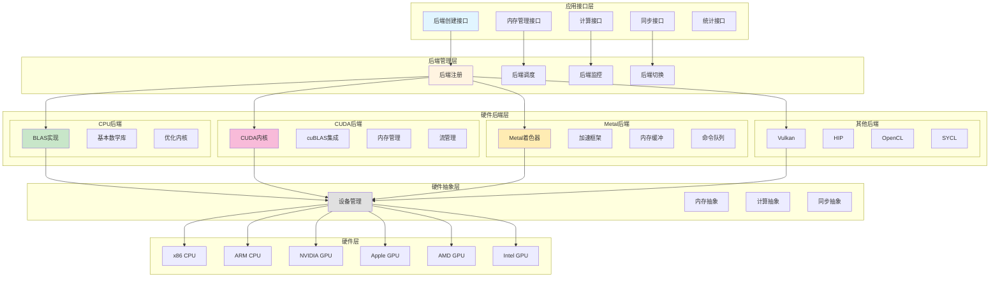
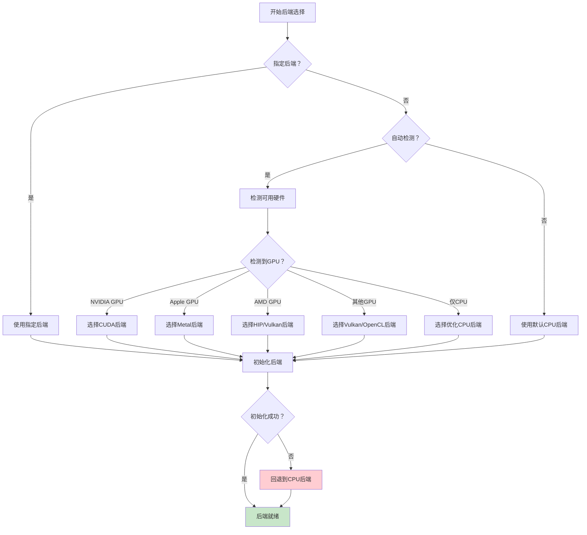
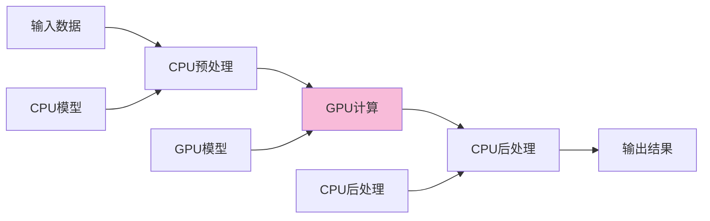

# 多后端系统架构图

## 系统架构图



## 后端选择流程



## 后端功能对比

| 功能 | CPU | CUDA | Metal | Vulkan | HIP | OpenCL |
|------|-----|------|-------|--------|-----|--------|
| 基础运算 | ✓ | ✓ | ✓ | ✓ | ✓ | ✓ |
| 矩阵乘法 | ✓ | ✓ | ✓ | ✓ | ✓ | ✓ |
| Flash Attention | ✓ | ✓ | ✓ | ✓ | ✓ | ✗ |
| 量化支持 | ✓ | ✓ | ✓ | ✓ | ✓ | ✓ |
| 多GPU | ✗ | ✓ | ✗ | ✓ | ✓ | ✓ |
| 内存池 | ✓ | ✓ | ✓ | ✓ | ✓ | ✓ |
| 异步执行 | ✓ | ✓ | ✓ | ✓ | ✓ | ✓ |

## 后端接口设计

### 统一后端接口
```c
// 后端类型
typedef struct ggml_backend * ggml_backend_t;

// 后端创建
ggml_backend_t ggml_backend_init(const char * name);

// 计算图执行
void ggml_backend_graph_compute(ggml_backend_t backend,
                                  struct ggml_cgraph * graph);

// 内存管理
ggml_backend_buffer_t ggml_backend_alloc_buffer(ggml_backend_t backend,
                                                 size_t size);

// 同步操作
void ggml_backend_synchronize(ggml_backend_t backend);
```

### 后端注册机制
- **自动注册**: 启动时自动扫描可用后端
- **手动注册**: 动态加载后端库
- **优先级管理**: 根据性能设置优先级
- **回退机制**: 失败时自动回退

### 后端调度策略
1. **负载均衡**: 在多个后端间分配任务
2. **数据局部性**: 优先使用数据所在后端
3. **性能优化**: 选择最优后端
4. **故障恢复**: 后端故障时自动切换

## 多后端协同

### 数据流图


### 协同模式
1. **流水线模式**: 不同阶段使用不同后端
2. **并行模式**: 并行使用多个后端
3. **分层模式**: 不同层使用不同后端
4. **混合模式**: 灵活组合多种模式

### 内存管理
- **统一内存**: CPU和GPU共享内存
- **零拷贝**: 避免不必要的数据拷贝
- **异步传输**: 隐藏数据传输开销
- **内存复用**: 减少内存分配次数

## 性能优化

### 后端选择优化
- **性能测试**: 测量各后端性能
- **自适应选择**: 根据输入特性选择
- **动态切换**: 运行时切换后端
- **负载感知**: 根据负载调整

### 计算优化
- **内核优化**: 针对特定硬件优化
- **批量处理**: 提高计算效率
- **内存对齐**: 优化内存访问
- **缓存友好**: 优化数据布局

### 传输优化
- **数据压缩**: 减少传输数据量
- **异步传输**: 隐藏传输延迟
- **批量传输**: 减少传输次数
- **智能预取**: 提前传输数据

## 调试和监控

### 后端调试
- **日志记录**: 记录后端操作
- **性能分析**: 分析后端性能
- **错误追踪**: 追踪后端错误
- **资源监控**: 监控资源使用

### 后端统计
- **计算时间**: 记录计算时间
- **内存使用**: 统计内存使用
- **吞吐量**: 测量吞吐量
- **利用率**: 计算资源利用率

## 扩展性

### 添加新后端
1. 实现后端接口
2. 注册后端
3. 实现运算映射
4. 测试和优化

### 后端定制
- **自定义内核**: 实现特定优化
- **参数调优**: 调整后端参数
- **功能扩展**: 添加新功能
- **性能优化**: 针对特定场景优化