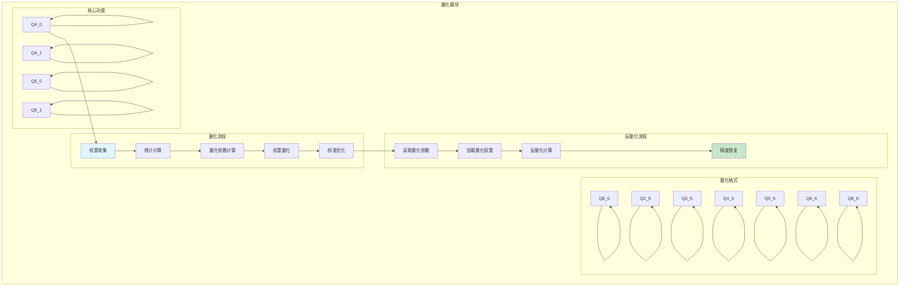
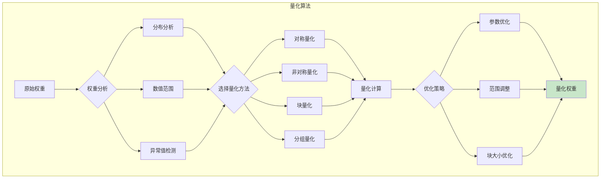
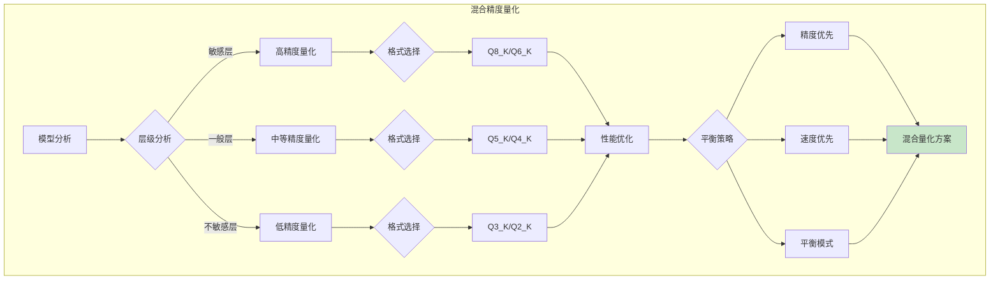
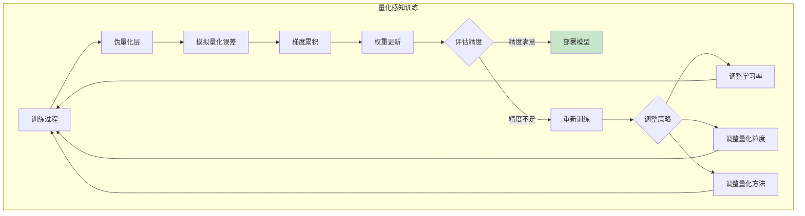
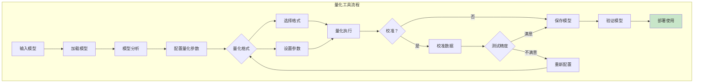
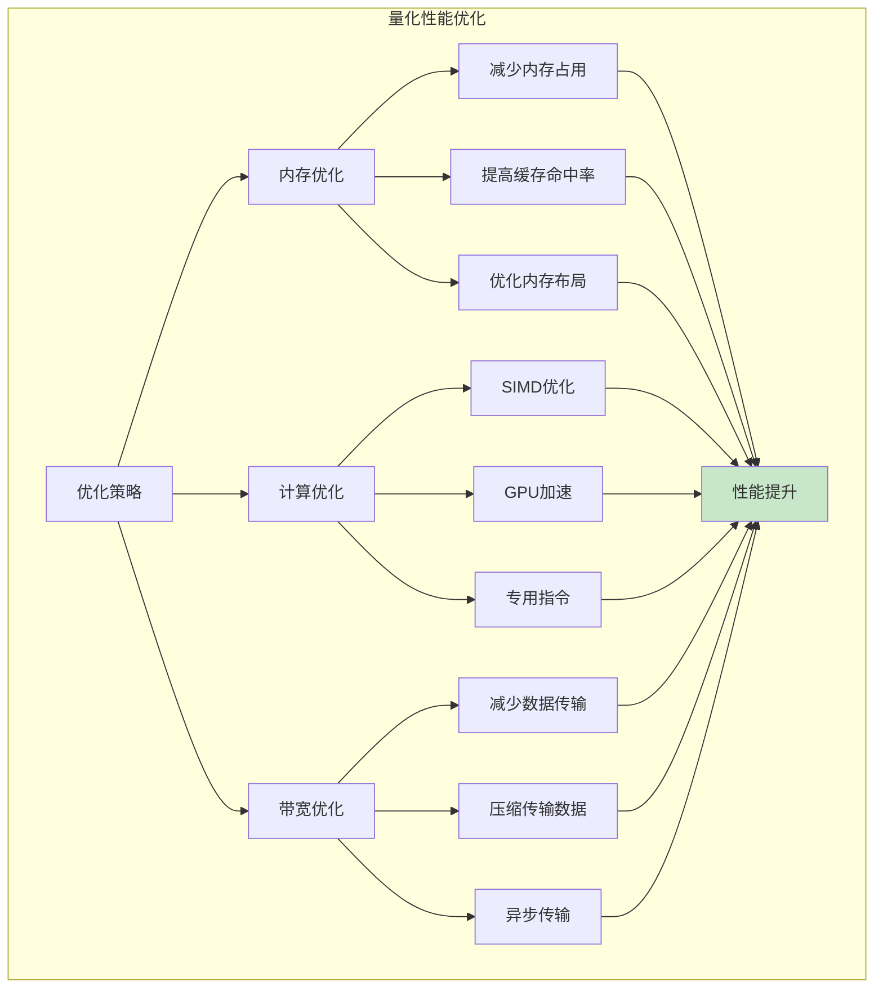

# 量化模块架构图

## 量化架构图



## 量化算法流程



## 量化格式对比

| 格式 | 比特数 | 压缩比 | 精度 | 适用场景 |
|------|--------|--------|------|----------|
| Q4_0 | 4 | 4x | 中等 | 通用场景 |
| Q4_1 | 4 | 4x | 较高 | 高精度需求 |
| Q5_0 | 5 | 3.2x | 较高 | 平衡选择 |
| Q5_1 | 5 | 3.2x | 高 | 精度优先 |
| Q8_0 | 8 | 2x | 高 | 高精度场景 |
| Q2_K | 2 | 8x | 低 | 极致压缩 |
| Q3_K | 3 | 5.3x | 较低 | 平衡压缩 |
| Q4_K | 4 | 4x | 中等 | 通用场景 |
| Q5_K | 5 | 3.2x | 较高 | 高性能场景 |
| Q6_K | 6 | 2.7x | 高 | 精度优先 |
| Q8_K | 8 | 2x | 很高 | 最高精度 |

## 量化参数计算

```mermaid
graph TB
    subgraph 参数计算[量化参数计算]
        STATS[统计信息] --> SCALE{缩放因子}
        STATS --> ZERO{零点偏移}
        STATS --> MIN{最小值}
        STATS --> MAX{最大值}

        SCALE --> S1[S = (max - min) / (2^n - 1)]
        ZERO --> Z1[Z = round(-min / S)]
        MIN --> M1[保持原始范围]
        MAX --> M2[确保覆盖范围]

        S1 --> APPLY[应用参数]
        Z1 --> APPLY
        M1 --> APPLY
        M2 --> APPLY

        APPLY --> VERIFY{验证精度}
        VERIFY --> |满意| FINAL[最终参数]
        VERIFY --> |不满意| ADJUST[调整策略]

        ADJUST --> SCALE

        style FINAL fill:#c8e6c9
    end
```

## 混合精度量化



## 量化感知训练



## 量化工具流程



## 量化性能优化



## 配置参数

| 参数 | 说明 | 默认值 |
|------|------|--------|
| `quant_type` | 量化格式 | Q4_K |
| `imatrix_file` | 重要性矩阵文件 | - |
| `f16_kv` | KV Cache是否使用F16 | true |
| `group_size` | 量化分组大小 | 128 |
| `quant_method` | 量化方法 | k-quants |
| `calibrate_samples` | 校准样本数 | 100 |

## 扩展性

### 添加新量化格式
1. 定义新的量化结构
2. 实现量化和反量化函数
3. 集成到量化框架
4. 测试和优化

### 自定义量化策略
- 实现自定义量化算法
- 添加量化感知训练
- 支持混合精度策略
- 优化特定场景量化

### 性能调优
- 优化计算内核
- 改进内存访问模式
- 利用硬件特性
- 提高量化精度