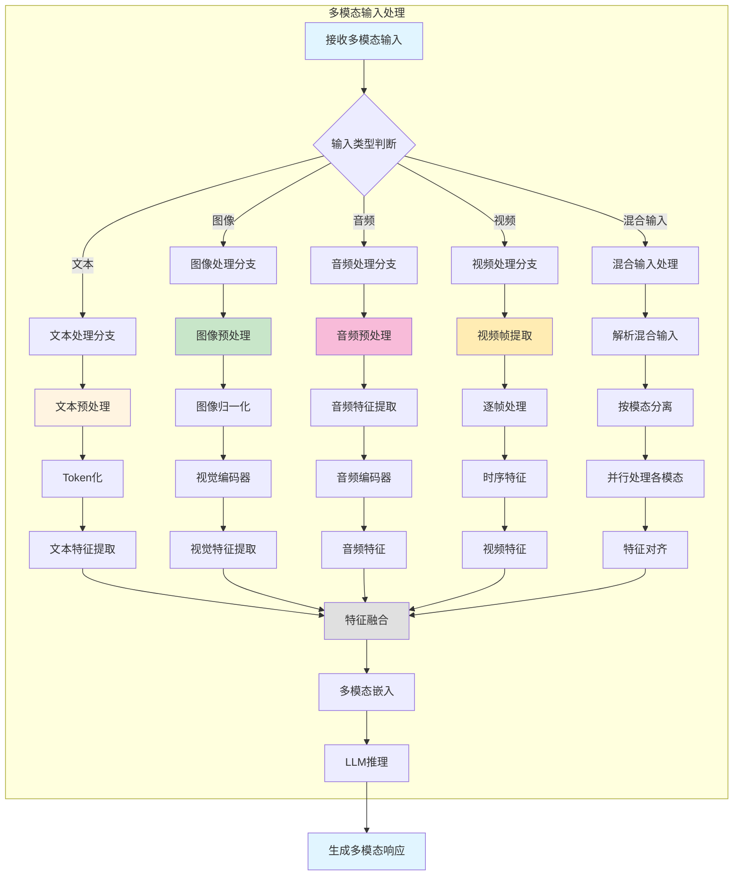
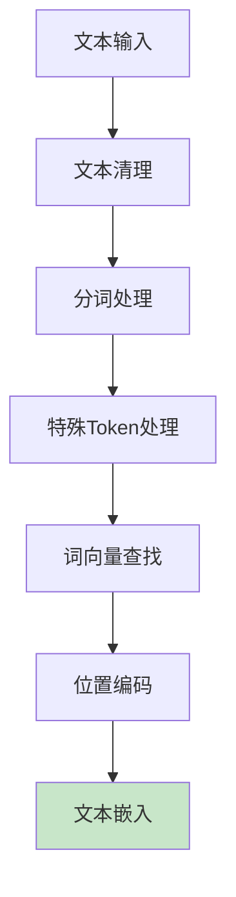
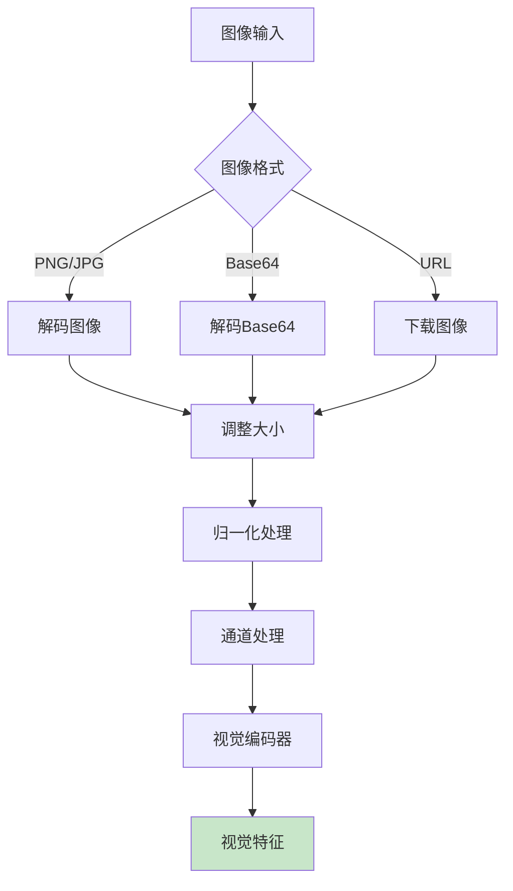
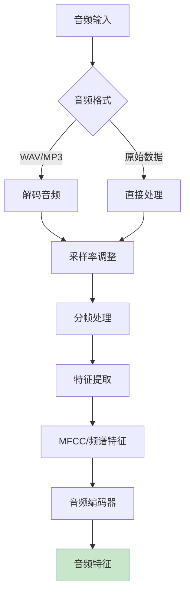
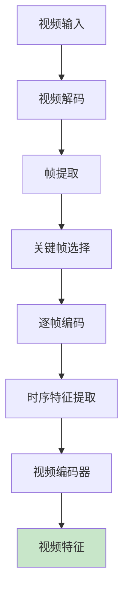
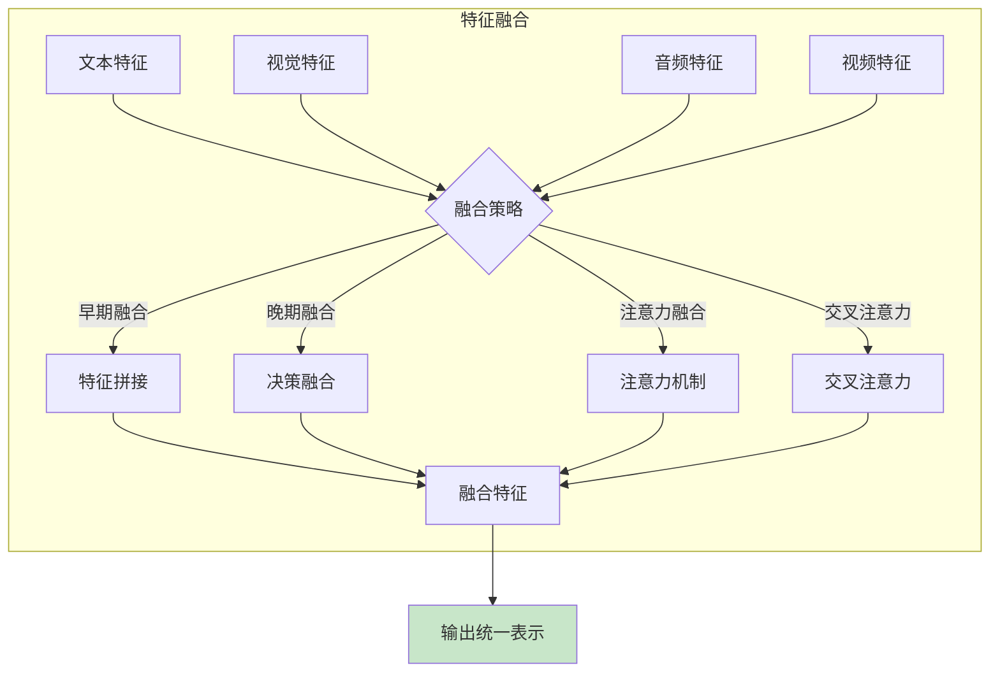
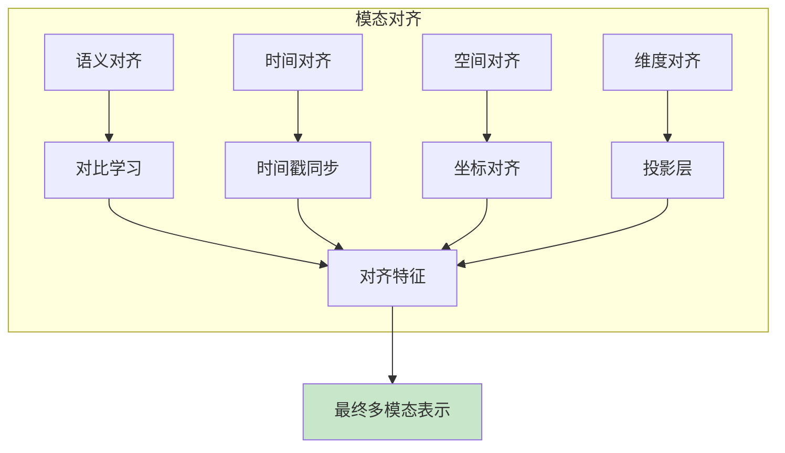
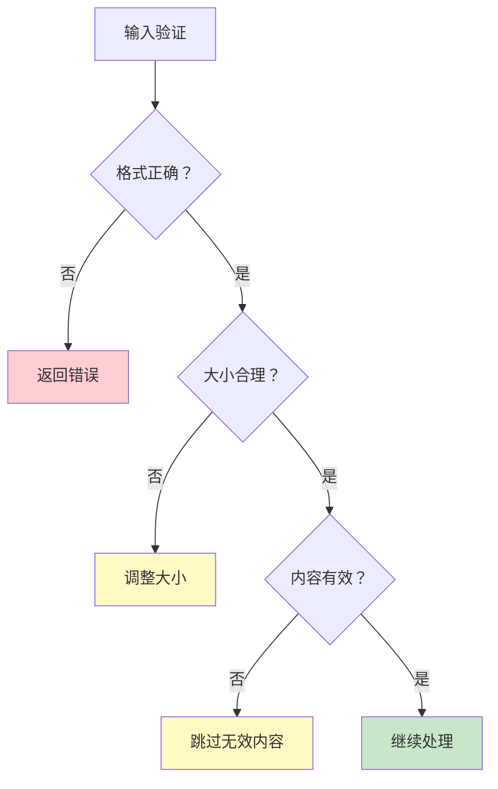

# 多模态输入处理逻辑图

## 多模态处理流程图

## 文本处理流程

## 图像处理流程

## 音频处理流程

## 视频处理流程

## 特征融合策略

## 多模态对齐机制

## 支持的模型架构

### 1. 视觉-语言模型
- **LLaVA**: 大型视觉-语言助手
- **MiniCPM-V**: 高效多模态模型
- **Gemma3**: 多模态Gemini模型
- **MobileVLM**: 移动端视觉-语言模型

### 2. 音频-语言模型
- **语音识别**: 音频转文本
- **语音合成**: 文本转音频
- **音频理解**: 音频内容分析

### 3. 视频-语言模型
- **视频理解**: 视频内容理解
- **视频生成**: 文本生成视频
- **视频问答**: 视频内容问答

## 数据预处理

### 图像预处理

**常用操作**:
- 调整大小: 224x224, 336x336, 448x448
- 归一化: mean=[0.485,0.456,0.406], std=[0.229,0.224,0.225]
- 数据增强: 随机裁剪、翻转、颜色抖动

### 音频预处理

**常用特征**:
- **MFCC**: 梅尔频率倒谱系数
- **频谱图**: 时频表示
- **音高**: 基频特征
- **能量**: 音量特征

## 内存和性能优化

### 内存优化
- **批处理**: 批量处理输入
- **特征缓存**: 缓存中间特征
- **内存复用**: 复用内存缓冲区
- **懒加载**: 按需加载模型

### 性能优化
- **并行处理**: 并行处理各模态
- **异步执行**: 异步IO和计算
- **GPU加速**: GPU加速编码器
- **模型量化**: 量化模型减少计算

## 错误处理

### 输入验证

### 异常处理
- **格式错误**: 返回友好错误信息
- **大小超限**: 自动调整或拒绝
- **内存不足**: 优化内存使用
- **处理失败**: 回退到默认策略

## 扩展性

### 添加新模态
1. 实现新的预处理流程
2. 添加新的编码器
3. 实现特征对齐
4. 更新融合策略

### 自定义处理
- **自定义预处理**: 针对特定应用优化
- **自定义融合**: 实现特定融合策略
- **自定义编码器**: 使用特定编码器
- **自定义后处理**: 针对输出优化