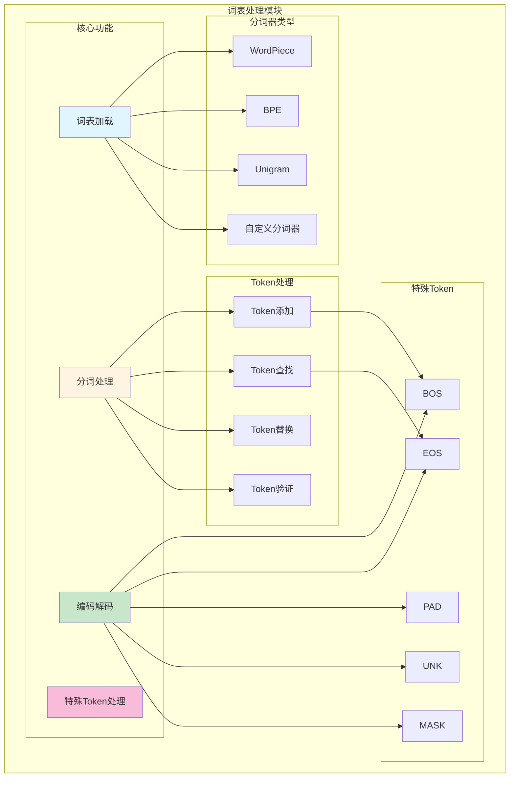
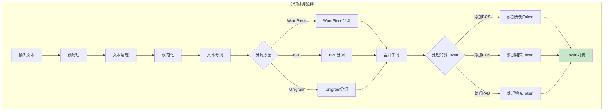
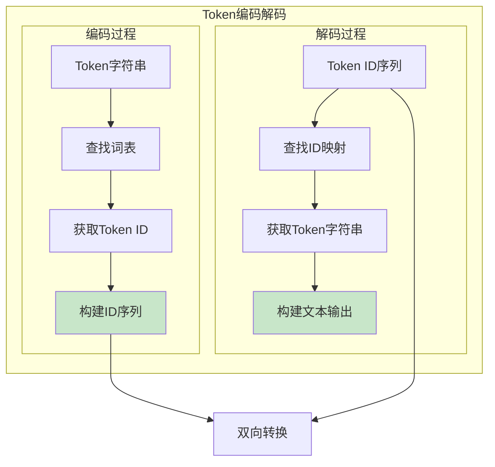
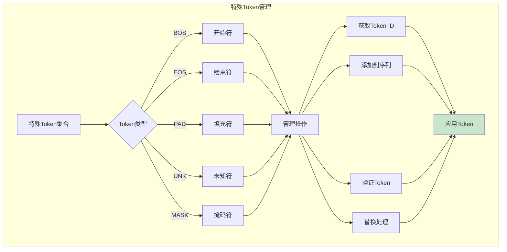
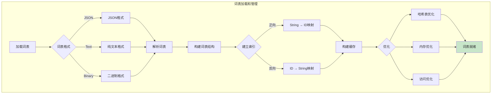
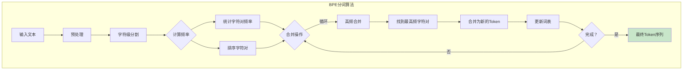
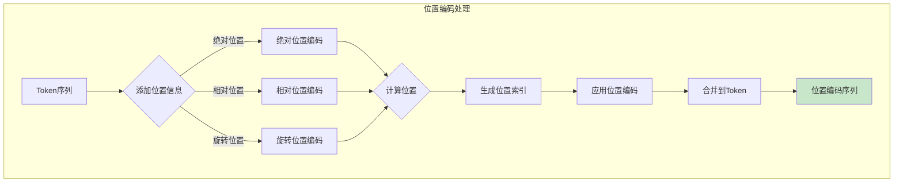
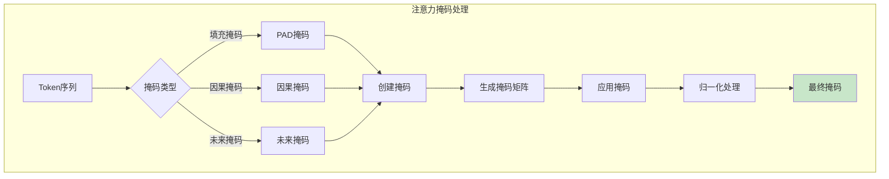
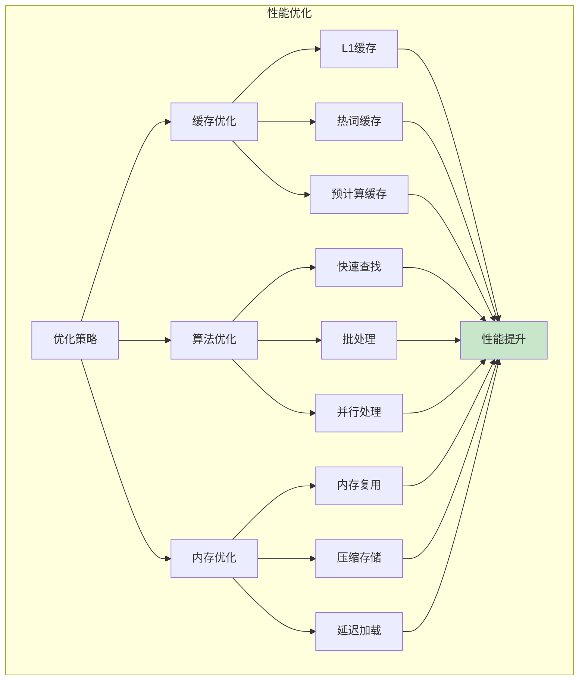

# 词表处理模块架构图

## 词表处理架构图

## 分词处理流程

## Token编码解码

## 特殊Token管理

## 词表加载和管理

## BPE分词算法

## 位置编码处理

## 注意力掩码处理

## 配置参数

| 参数 | 说明 | 默认值 |
|------|------|--------|
| `vocab_file` | 词表文件路径 | - |
| `tokenizer_type` | 分词器类型 | bpe |
| `add_bos_token` | 是否添加BOS | false |
| `add_eos_token` | 是否添加EOS | true |
| `pad_token_id` | PAD Token ID | -1 |
| `unk_token_id` | UNK Token ID | 0 |
| `max_length` | 最大序列长度 | 2048 |

## 性能优化

## 扩展性

### 添加新分词器
1. 实现新分词算法
2. 集成到分词框架
3. 支持自定义词表
4. 测试和优化

### 自定义特殊Token
- 定义新的特殊Token
- 实现特殊处理逻辑
- 支持Token替换
- 动态Token管理

### 多语言支持
- 支持多语言分词
- 实现语言检测
- 优化特定语言
- 文化适配