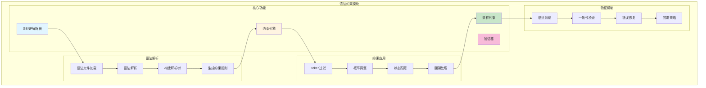
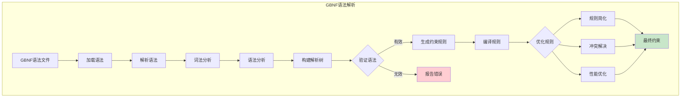
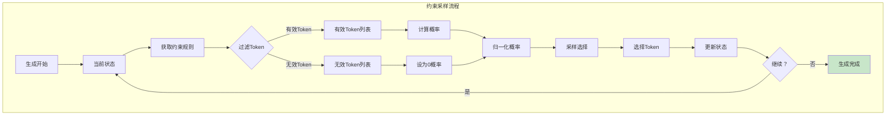
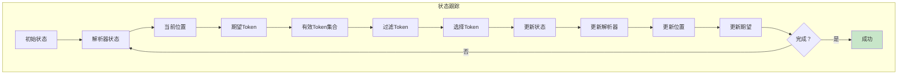
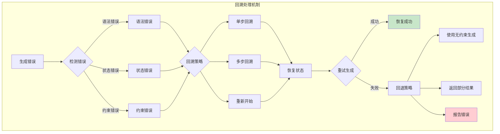
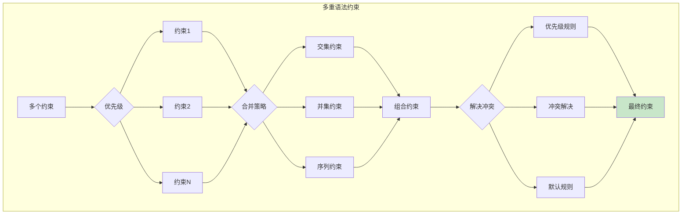
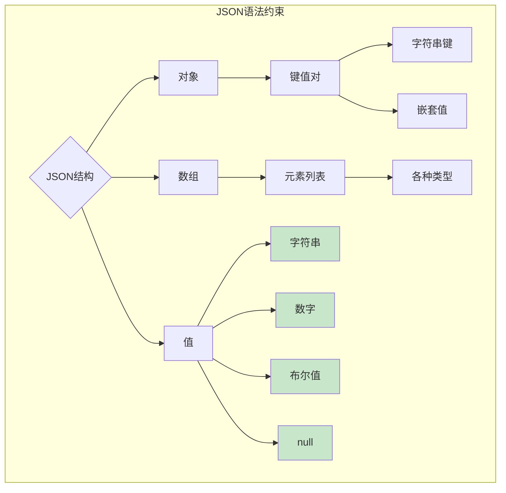
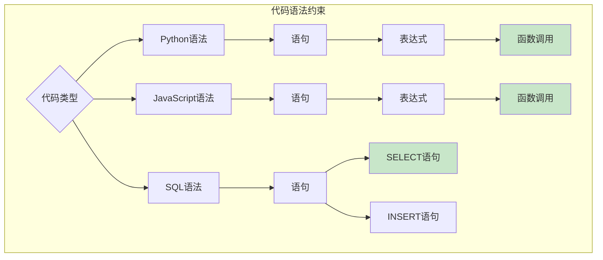
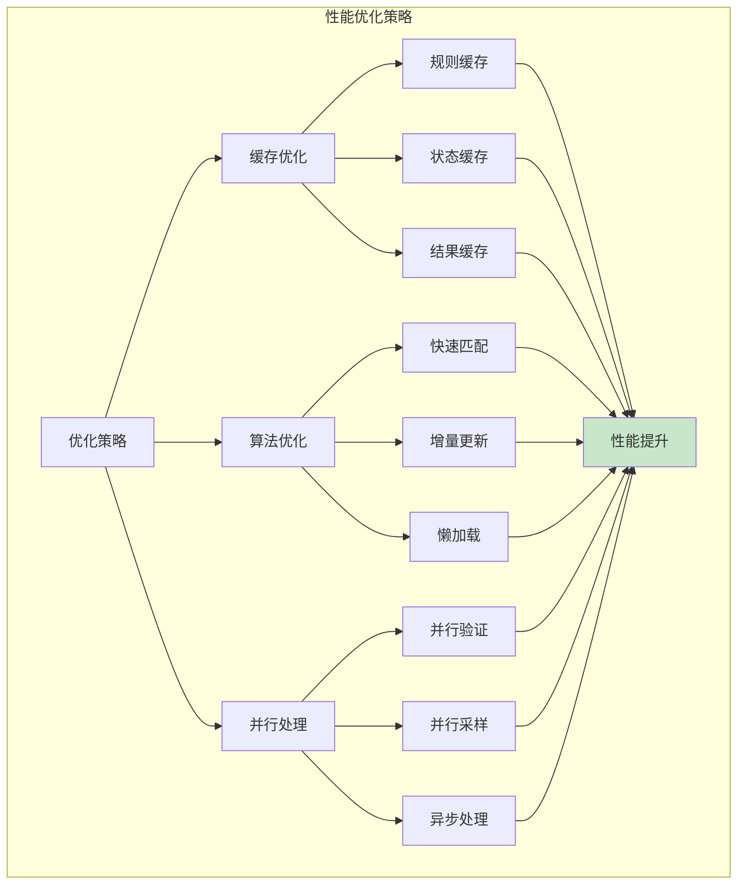
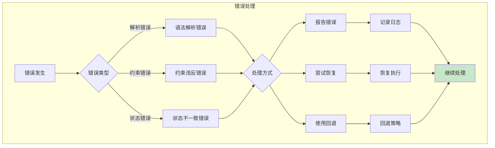

# 语法约束模块架构图

## 语法约束架构图

## GBNF语法解析流程

## 约束采样流程

## 语法约束状态跟踪

## 回溯处理机制

## 多重语法约束

## 语法规则示例

### JSON语法约束

### 代码语法约束

## 性能优化策略

## 配置参数

| 参数 | 说明 | 默认值 |
|------|------|--------|
| `grammar_file` | 语法约束文件 | - |
| `grammar_type` | 语法类型 | gbnf |
| `max_backtrack` | 最大回溯次数 | 10 |
| `fallback_mode` | 回退模式 | none |
| `enable_cache` | 启用缓存 | true |
| `strict_mode` | 严格模式 | false |

## 错误处理

## 扩展性

### 添加新语法支持
1. 定义新语法规则
2. 实现语法解析器
3. 集成到约束框架
4. 测试和优化

### 自定义约束
- 实现自定义约束逻辑
- 支持复杂约束组合
- 动态约束调整
- 约束优先级管理

### 性能监控
- 监控约束性能
- 优化热点代码
- 缓存优化策略
- 并行处理增强