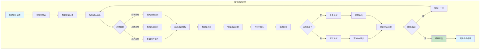
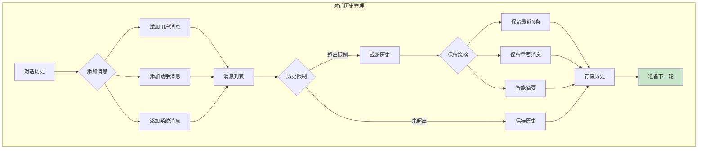
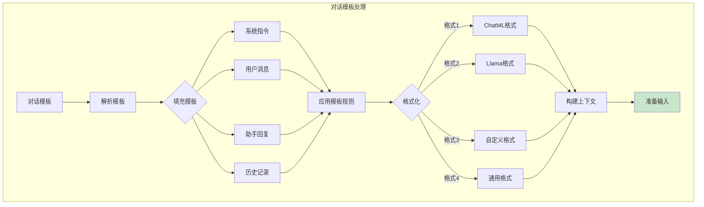

# 聊天对话业务逻辑图

## 聊天对话流程图

## 对话历史管理

## 对话模板处理

## 配置参数

| 参数 | 说明 | 默认值 |
|------|------|--------|
| `chat_template` | 对话模板 | auto |
| `history_max` | 最大历史记录 | 10 |
| `context_max` | 最大上下文Token | 4096 |
| `system_prompt` | 系统提示 | - |
| `temperature` | 温度参数 | 0.7 |
| `max_tokens` | 最大生成Token | 512 |
| `stream` | 流式输出 | true |
| `repeat_penalty` | 重复惩罚 | 1.1 |