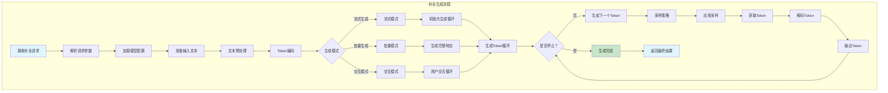
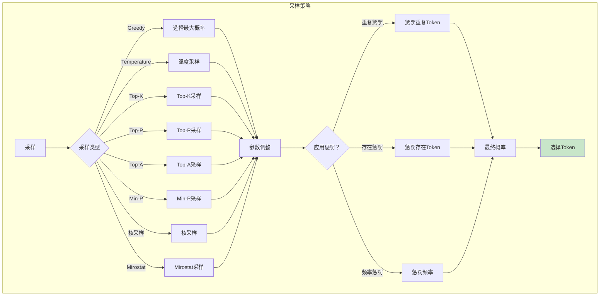
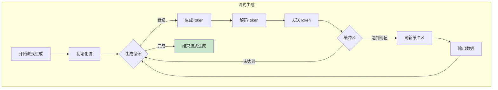

# 补全生成业务逻辑图

## 补全生成流程图

## 采样策略流程

## 流式生成流程

## 配置参数

| 参数 | 说明 | 默认值 |
|------|------|--------|
| `model_path` | 模型路径 | - |
| `max_tokens` | 最大生成Token数 | 512 |
| `temperature` | 温度参数 | 0.7 |
| `top_k` | Top-K采样值 | 40 |
| `top_p` | Top-P采样值 | 0.95 |
| `repeat_penalty` | 重复惩罚 | 1.1 |
| `presence_penalty` | 存在惩罚 | 0.0 |
| `frequency_penalty` | 频率惩罚 | 0.0 |
| `seed` | 随机种子 | -1 |
| `stream` | 是否流式输出 | false |