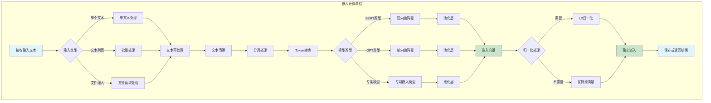
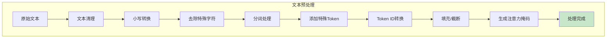

# 嵌入计算业务逻辑图

## 嵌入计算流程图



## 文本预处理流程



## 嵌入池化策略

```mermaid
graph TB
    subgraph 池化策略[嵌入池化策略]
        POOL1[编码器输出] --> POOL2{池化类型}

        POOL2 -->|CLS池化| CLS[使用[CLS] Token]
        POOL2 -->|平均池化| MEAN[平均所有Token]
        POOL2 -->|最大池化| MAX[最大值池化]
        POOL2 -->|加权池化| WEIGHT[注意力加权]

        CLS --> POOL3[选择[CLS]向量]
        MEAN --> POOL4[计算平均值]
        MAX --> POOL5[计算最大值]
        WEIGHT --> POOL6[计算加权平均]

        POOL3 --> FINAL[最终嵌入向量]
        POOL4 --> FINAL
        POOL5 --> FINAL
        POOL6 --> FINAL
    end

    style FINAL fill:#c8e6c9
```

## 配置参数

| 参数 | 说明 | 默认值 |
|------|------|--------|
| `embedding_model` | 嵌入模型路径 | - |
| `batch_size` | 批处理大小 | 32 |
| `max_length` | 最大序列长度 | 512 |
| `pooling_type` | 池化类型 | mean |
| `normalize` | 是否归一化 | true |
| `output_dim` | 输出维度 | 768 |