# 模型加载与初始化流程图

本图展示了 llama.cpp 中从 GGUF 文件加载模型并初始化的详细流程。

```mermaid
flowchart TD
    Start([开始加载模型]) --> BackendInit[llama_backend_init]

    BackendInit --> CheckParams{检查参数}
    CheckParams --> LoadGPU{加载 GPU 支持?}
    LoadGPU -->|是| LoadBackends[ggml_backend_load_all]
    LoadGPU -->|否| OpenFile
    LoadBackends --> OpenFile[打开 GGUF 文件]

    OpenFile --> CheckSplit{检查分片?}
    CheckSplit -->|是| DetectSplits[检测分片文件]
    CheckSplit -->|否| InitGGUF
    DetectSplits --> LoadGGUF[gguf_init_from_file]

    InitGGUF[gguf_init_from_file] --> ValidateMagic{验证魔数}
    ValidateMagic -->|失败| ErrorMagic[魔数错误]
    ValidateMagic -->|成功| CheckVersion{检查版本}
    CheckVersion -->|不兼容| ErrorVersion[版本不兼容]
    CheckVersion -->|兼容| ReadMetadata[读取元数据]

    ReadMetadata --> ExtractKV[提取键值对]
    ExtractKV --> ParseHParams[解析超参数]

    ParseHParams --> GetKV{n_vocab}
    GetKV --> n_embd[获取 n_embd]
    n_embd --> n_layer[获取 n_layer]
    n_layer --> n_head[获取 n_head]
    n_head --> otherParams[获取其他参数]

    otherParams --> CreateModel[创建 llama_model 结构]
    CreateModel --> CreateVocab[创建词汇表]

    CreateVocab --> VocabType{词汇表类型?}
    VocabType -->|SPM| LoadSPM[加载 SentencePiece]
    VocabType -->|BPE| LoadBPE[加载 BPE 合并规则]
    VocabType -->|WPM| LoadWPM[加载 WordPiece]
    VocabType -->|其他| LoadGeneric[加载通用词汇表]

    LoadSPM --> LoadTensors
    LoadBPE --> LoadTensors[加载张量信息]
    LoadWPM --> LoadTensors
    LoadGeneric --> LoadTensors

    LoadTensors --> ParseTensorInfo[解析张量信息]
    ParseTensorInfo --> CalcMemory[计算内存需求]

    CalcMemory --> Mmap{使用 mmap?}
    Mmap -->|是| InitMmap[初始化内存映射]
    Mmap -->|否| AllocMemory[分配内存]
    InitMmap --> AllocMemory

    AllocMemory --> LoadWeights[加载权重数据]
    LoadWeights --> DeviceOffload{设备卸载?}

    DeviceOffload -->|是| SelectGPU[选择 GPU 设备]
    DeviceOffload -->|否| PrepareLayers
    SelectGPU --> CheckSplitMode{检查分割模式}
    CheckSplitMode -->|LAYER| SplitLayer[按层分割]
    CheckSplitMode -->|TENSOR| SplitTensor[按张量分割]
    CheckSplitMode -->|ROW| SplitRow[按行分割]
    CheckSplitMode -->|NONE| SingleGPU[单 GPU]

    SplitLayer --> PrepareLayers[准备层结构]
    SplitTensor --> PrepareLayers
    SplitRow --> PrepareLayers
    SingleGPU --> PrepareLayers

    PrepareLayers --> AllocKVCache[分配 KV cache]
    AllocKVCache --> SetCacheType{设置 cache 类型}
    SetCacheType -->|FP16| UseFP16[使用 FP16]
    SetCacheType -->|FP8| UseFP8[使用 FP8]
    SetCacheType -->|Q4| UseQ4[使用 Q4 量化]

    UseFP16 --> CreateContext
    UseFP8 --> CreateContext[创建计算图上下文]
    UseQ4 --> CreateContext

    CreateContext --> ValidateModel{验证模型}
    ValidateModel -->|失败| ErrorModel[模型验证失败]
    ValidateModel -->|成功| ProgressCallback{进度回调?}

    ProgressCallback -->|是| ReportProgress[报告加载进度]
    ProgressCallback -->|否| Finish
    ReportCallback --> CheckCancel{用户取消?}
    CheckCancel -->|是| UserCancel[用户取消]
    CheckCancel -->|否| Finish
    ReportProgress --> CheckCancel

    Finish --> ReturnModel[返回 llama_model 指针]
    ReturnModel --> End([完成])

    ErrorMagic --> ErrorExit([返回 NULL])
    ErrorVersion --> ErrorExit
    ErrorModel --> ErrorExit
    UserCancel --> ErrorExit

    style Start fill:#e1f5e1
    style End fill:#ffe1e1
    style ReturnModel fill:#e1e1ff
    style BackendInit fill:#fff4e1
    style LoadBackends fill:#fff4e1
    style OpenFile fill:#fff4e1
    style LoadWeights fill:#ffe1f5
    style CreateContext fill:#ffe1f5
    style AllocKVCache fill:#e1f5ff
    style ErrorExit fill:#ffcccc
```

## 流程说明

### 1. 后端初始化
- **初始化 GGML**: 设置 GGML 后端和必要的内部状态
- **加载后端**: 根据 `llama_model_params` 加载 CUDA、Metal、Vulkan 等后端

### 2. 文件处理
- **打开 GGUF**: 打开模型文件并验证文件格式
- **检测分片**: 如果模型被分片存储，自动检测并加载所有分片
- **验证魔数**: 检查 GGUF 文件头魔数 `GGUF` 确保文件格式正确
- **检查版本**: 验证 GGUF 版本是否与当前实现兼容

### 3. 元数据解析
- **提取键值对**: 读取 GGUF 中的元数据键值对
- **解析超参数**:
  - `n_vocab`: 词汇表大小
  - `n_embd`: 嵌入维度
  - `n_layer`: 模型层数
  - `n_head`: 注意力头数
  - `n_head_kv`: KV 注意力头数
  - 其他模型特定参数

### 4. 词汇表加载
根据词汇表类型加载相应的分词器：
- **SPM**: SentencePiece 分词器
- **BPE**: Byte-Pair Encoding 分词器
- **WPM**: WordPiece 分词器
- **其他**: 通用或自定义分词器

### 5. 张量加载
- **解析张量信息**: 读取张量的名称、形状、数据类型
- **计算内存需求**: 估算加载模型所需的内存大小
- **内存分配**:
  - `mmap`: 使用内存映射（推荐）
  - `direct_io`: 使用直接 I/O
  - 常规分配: `malloc` 或 `new`

### 6. 设备卸载
根据 `llama_model_params` 配置：
- **单 GPU**: 整个模型加载到一个 GPU
- **层分割**: 将模型的不同层分配到不同 GPU
- **张量分割**: 将单个张量拆分到多个 GPU（张量并行）
- **行分割**: 按行分割张量到多个 GPU

### 7. KV Cache 初始化
- **分配缓存**: 根据上下文大小和序列数分配 KV cache
- **设置数据类型**: 支持 FP16、FP8、Q4 等量化格式
- **配置结构**: 初始化 KV cache 的内存布局

### 8. 上下文创建
- **创建计算图**: 为每一层创建 GGML 计算图
- **初始化中间缓冲**: 分配前向传播所需的中间缓冲区
- **验证模型**: 检查所有必需的张量已加载

## 关键数据结构

| 数据结构 | 说明 |
|---------|------|
| `gguf_context` | GGUF 文件上下文 |
| `llama_model` | 模型主结构 |
| `llama_hparams` | 模型超参数 |
| `llama_vocab` | 词汇表结构 |
| `ggml_tensor` | GGML 张量 |

## 关键 API 函数

| 函数 | 用途 |
|------|------|
| `llama_backend_init()` | 初始化 llama 后端 |
| `llama_model_load_from_file()` | 从文件加载模型 |
| `llama_model_load_from_splits()` | 从多个分片加载模型 |
| `llama_model_free()` | 释放模型资源 |
| `llama_init_from_model()` | 从模型创建推理上下文 |

## 配置参数

`llama_model_params` 关键字段：

| 参数 | 说明 | 默认值 |
|------|------|--------|
| `n_gpu_layers` | GPU 层数 | 0 (全部在 CPU) |
| `split_mode` | 分割模式 | `LLAMA_SPLIT_MODE_NONE` |
| `main_gpu` | 主 GPU ID | 0 |
| `use_mmap` | 使用内存映射 | true |
| `use_mlock` | 锁定内存 | false |
| `vocab_only` | 仅加载词汇表 | false |
| `progress_callback` | 进度回调函数 | NULL |

## 性能优化建议

1. **使用 mmap**: 减少内存占用，仅在需要时加载页面
2. **GPU 卸载**: 将计算密集型层卸载到 GPU
3. **量化加载**: 加载量化模型减少内存占用
4. **分片加载**: 超大模型使用分片加载到多 GPU