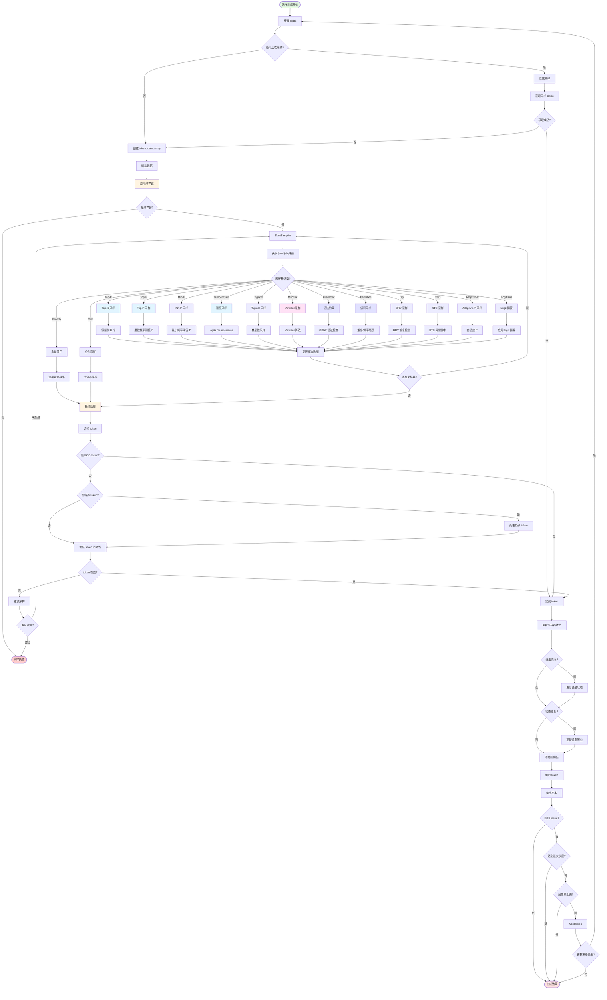

# 采样生成流程图

本图展示了 llama.cpp 中采样生成的详细流程，包括各种采样策略和采样链的应用。



## 流程说明

### 1. 获取 Logits
- 从前向传播的最后层获取 logits
- logits 是未归一化的词汇表概率分布
- 形状: `(n_vocab,)`

### 2. 采样链应用
llama.cpp 使用采样链（Sampler Chain）来组合多个采样策略：
1. 创建 `llama_token_data_array` 结构
2. 填充 token ID、logit 和初始概率
3. 按顺序应用采样链中的每个采样器
4. 最终选择一个 token

### 3. 采样策略

#### 3.1 基础采样
**Greedy (贪婪采样)**:
- 选择概率最高的 token
- `llama_sampler_init_greedy()`
- 确定性输出，适合精确任务

**Dist (分布采样)**:
- 根据概率分布随机采样
- `llama_sampler_init_dist(seed)`
- 增加多样性

#### 3.2 Top-K 采样
- 保留概率最高的 K 个 token
- 其余 token 概率设为 0
- `llama_sampler_init_top_k(k)`
- 控制候选集合大小

```
原始: [0.1, 0.3, 0.4, 0.1, 0.05, 0.05]
Top-K (K=3): [0.1, 0.3, 0.4, 0, 0, 0]
归一化: [0.125, 0.375, 0.5, 0, 0, 0]
```

#### 3.3 Top-P (Nucleus) 采样
- 选择累积概率达到 P 的最小 token 集合
- 动态调整候选数量
- `llama_sampler_init_top_p(p, min_keep)`
- 平衡多样性和质量

```
原始排序: [0.4, 0.3, 0.1, 0.1, 0.05, 0.05]
Top-P (P=0.9): [0.4, 0.3, 0.1, 0.1, 0, 0]
```

#### 3.4 Min-P 采样
- 移除相对于最高概率低于 P 的 token
- `llama_sampler_init_min_p(p, min_keep)`
- 过滤低质量候选

```
最高概率: 0.4
Min-P (P=0.1): 保留概率 >= 0.04 的 token
```

#### 3.5 Temperature 采样
- 缩放 logits: `logits = logits / temperature`
- 高温度: 更均匀分布，更多样化
- 低温度: 更尖锐分布，更确定性
- `llama_sampler_init_temp(t)`

#### 3.6 Typical 采样
- 选择"典型"（接近预期概率）的 token
- 减少异常输出
- `llama_sampler_init_typical(p, min_keep)`

#### 3.7 Mirostat 采样
- 动态调整目标熵/复杂度
- 维持生成的连贯性
- `llama_sampler_init_mirostat(n_vocab, seed, tau, eta, m)`
- `llama_sampler_init_mirostat_v2(seed, tau, eta)`

参数说明：
- `tau`: 目标交叉熵（惊喜值）
- `eta`: 学习率，控制调整速度
- `m`: 用于估计 s_hat 的 token 数量

#### 3.8 语法约束 (GBNF)
- 使用 GBNF 语法约束输出
- `llama_sampler_init_grammar(vocab, grammar_str, grammar_root)`
- 确保输出符合特定格式（JSON、XML 等）

#### 3.9 惩罚采样
- `llama_sampler_init_penalties(penalty_last_n, penalty_repeat, penalty_freq, penalty_present)`
- **Repeat penalty**: 惩罚重复 token
- **Frequency penalty**: 惩罚高频 token
- **Present penalty**: 惩罚已出现的 token

#### 3.10 DRY (Don't Repeat Yourself) 采样
- 检测和抑制重复模式
- `llama_sampler_init_dry(vocab, n_ctx_train, multiplier, base, allowed_length, penalty_last_n, seq_breakers)`
- 适用于长文本生成

#### 3.11 XTC 采样
- 抑制异常 token
- `llama_sampler_init_xtc(p, t, min_keep, seed)`

#### 3.12 Adaptive-P 采样
- 动态调整目标概率
- `llama_sampler_init_adaptive_p(target, decay, seed)`
- 维持平均概率接近目标值

#### 3.13 Logit Bias
- 手动调整特定 token 的 logit
- `llama_sampler_init_logit_bias(n_vocab, n_logit_bias, logit_bias)`
- 用于引导生成

### 4. Token 处理
- **验证**: 检查 token 是否有效
- **特殊 token**: 处理 BOS、EOS、EOT 等
- **EOG 检查**: 检查是否为生成结束 token

### 5. 状态更新
- **采样器状态**: 更新采样器内部状态（如 Mirostat 的 mu）
- **语法状态**: 更新 GBNF 解析器状态
- **重复历史**: 维护最近 token 的历史

### 6. 终止条件
- **EOS token**: 遇到结束 token
- **最大长度**: 达到预设的最大长度
- **停止词**: 输出包含停止词
- **用户请求**: 用户请求停止

## 采样链示例

### 常用配置
```cpp
// 创建采样链
auto chain = llama_sampler_chain_init(params);

// 添加采样器
llama_sampler_chain_add(chain, llama_sampler_init_top_k(40));
llama_sampler_chain_add(chain, llama_sampler_init_top_p(0.95, 1));
llama_sampler_chain_add(chain, llama_sampler_init_temp(0.8));
llama_sampler_chain_add(chain, llama_sampler_init_dist(seed));

// 采样
auto token = llama_sampler_sample(chain, ctx, -1);
```

### 创意生成配置
```cpp
llama_sampler_chain_add(chain, llama_sampler_init_top_k(0));      // 不限制 K
llama_sampler_chain_add(chain, llama_sampler_init_top_p(0.9, 1)); // Top-P 0.9
llama_sampler_chain_add(chain, llama_sampler_init_temp(1.2));     // 较高温度
llama_sampler_chain_add(chain, llama_sampler_init_dist(seed));    // 随机采样
```

### 精确任务配置
```cpp
llama_sampler_chain_add(chain, llama_sampler_init_top_k(1));      // 仅最佳
llama_sampler_chain_add(chain, llama_sampler_init_temp(0.0));     // 最低温度
llama_sampler_chain_add(chain, llama_sampler_init_greedy());      // 贪婪采样
```

### JSON 输出配置
```cpp
llama_sampler_chain_add(chain, llama_sampler_init_top_k(40));
llama_sampler_chain_add(chain, llama_sampler_init_top_p(0.95, 1));
llama_sampler_chain_add(chain, llama_sampler_init_temp(0.0));
llama_sampler_chain_add(chain, llama_sampler_init_grammar(vocab, json_grammar, "root"));
```

## 关键 API 函数

| 函数 | 用途 |
|------|------|
| `llama_sampler_chain_init()` | 初始化采样链 |
| `llama_sampler_chain_add()` | 添加采样器 |
| `llama_sampler_sample()` | 采样 token |
| `llama_sampler_accept()` | 接受采样结果 |
| `llama_sampler_free()` | 释放采样器 |

## 性能考虑

1. **采样顺序**: 某些采样器必须按特定顺序
2. **提前终止**: 采样失败时的重试机制
3. **后端加速**: 使用 GPU 加速采样计算
4. **批量采样**: 支持批量序列的并行采样