# 批处理推理流程图

本图展示了 llama.cpp 中批处理推理的详细流程，包括多序列并行处理和批次管理。

```mermaid
flowchart TD
    Start([批处理推理开始]) --> InitBatch[初始化批次结构]

    InitBatch --> AllocBatch[分配批次内存]
    AllocBatch --> SetBatchSize[设置批次大小]

    SetBatchSize --> PrepareInputs[准备输入序列]
    PrepareInputs --> LoopSequences[遍历序列]

    LoopSequences --> CheckSeq{序列有效?}
    CheckSeq -->|否| SkipSeq[跳过序列]
    CheckSeq -->|是| TokenizeSeq[分词序列]

    TokenizeSeq --> GetTokens[获取 tokens]
    GetTokens --> AddSpecial{添加特殊 token?}
    AddSpecial -->|是| AddBOS[添加 BOS]
    AddSpecial -->|否| FillBatch
    AddBOS --> FillBatch[填充批次数据]

    FillBatch --> SetTokenID[设置 token ID]
    SetTokenID --> SetPos[设置位置索引]
    SetPos --> SetSeqID[设置序列 ID]
    SetSeqID --> SetLogits{需要 logits?}
    SetLogits -->|是| EnableLogits[启用 logits]
    SetLogits -->|否| DisableLogits[禁用 logits]
    EnableLogits --> NextSeq
    DisableLogits --> NextSeq

    NextSeq --> CheckSeq
    SkipSeq --> CheckMoreSeq{更多序列?}
    NextSeq --> CheckMoreSeq
    CheckMoreSeq -->|是| LoopSequences
    CheckMoreSeq -->|否| CheckEmb

    CheckEmb{使用嵌入?}
    CheckEmb -->|是| PrepareEmbeddings[准备嵌入向量]
    CheckEmb -->|否| ValidateBatch
    PrepareEmbeddings --> SetEmbedPtr[设置嵌入指针]
    SetEmbedPtr --> ValidateBatch

    ValidateBatch[验证批次数据]
    ValidateBatch --> CheckValid{批次有效?}
    CheckValid -->|否| ErrorBatch[批次错误]
    CheckValid -->|是| CheckUBatch

    CheckUBatch{拆分为微批次?}
    CheckUBatch -->|是| SplitUBatch[拆分为微批次]
    CheckUBatch -->|否| ProcessBatch
    SplitUBatch --> LoopUBatches[遍历微批次]

    LoopUBatches --> GetUBatch[获取微批次]
    GetUBatch --> ProcessUBatch[处理微批次]

    ProcessUBatch --> CacheCheck{KV cache 命中?}
    CacheCheck -->|全部命中| SkipForward[跳过前向传播]
    CacheCheck -->|部分命中| PartialForward[部分前向传播]
    CacheCheck -->|全部未命中| FullForward[完整前向传播]

    SkipForward --> GetCachedLogits[获取缓存的 logits]
    GetCachedLogits --> UpdateMemory
    PartialForward --> FullForward
    FullForward --> EncodeDecode[编码/解码]

    EncodeDecode --> CheckMode{推理模式?}
    CheckMode -->|Encode| RunEncode[运行 llama_encode]
    CheckMode -->|Decode| RunDecode[运行 llama_decode]

    RunEncode --> MultiStream{多流处理?}
    RunDecode --> MultiStream
    MultiStream -->|是| ParallelForward[并行前向传播]
    MultiStream -->|否| SequentialForward[顺序前向传播]

    ParallelForward --> DispatchStreams[分发到流]
    DispatchStreams --> SyncStreams[同步流]
    SyncStreams --> GetResults
    SequentialForward --> GetResults[获取结果]

    GetResults --> UpdateMemory[更新内存状态]
    UpdateMemory --> CheckAbort{用户中止?}
    CheckAbort -->|是| AbortBatch[中止批次]
    CheckAbort -->|否| GetOutputs

    AbortBatch --> CleanupPartial[清理部分处理结果]
    CleanupPartial --> ReturnError
    GetOutputs --> ReturnData[返回输出数据]
    ReturnError --> ErrorReturn

    ProcessBatch --> CacheCheck
    ReturnData --> CheckBatchDone{批次完成?}
    ErrorReturn --> CheckBatchDone
    CheckBatchDone -->|否| LoopUBatches
    CheckBatchDone -->|是| CollectLogits[收集所有 logits]

    CollectLogits --> ConcatLogits[拼接 logits]
    ConcatLogits --> SortBySeq{按序列排序?}
    SortBySeq -->|是| SortResults[排序结果]
    SortBySeq -->|否| ProcessOutputs
    SortResults --> ProcessOutputs[处理输出]

    ProcessOutputs --> SplitBySeq[按序列拆分]
    SplitBySeq --> SampleEach[采样每个序列]

    SampleEach --> HasSampler{有采样器?}
    HasSampler -->|是| ApplySampler[应用采样器]
    HasSampler -->|否| GreedySample[贪婪采样]

    ApplySampler --> GetSampledToken[获取采样 token]
    GreedySample --> GetSampledToken

    GetSampledToken --> UpdateSeqState[更新序列状态]
    UpdateSeqState --> UpdateKVCache[更新 KV cache]

    UpdateKVCache --> CheckEOS{EOS token?}
    CheckEOS -->|是| MarkComplete[标记序列完成]
    CheckEOS -->|否| CheckMaxLen

    CheckMaxLen{最大长度?}
    CheckMaxLen -->|是| MarkComplete
    CheckMaxLen -->|否| CheckStopSeq

    CheckStopSeq{触发停止词?}
    CheckStopSeq -->|是| MarkComplete
    CheckStopSeq -->|否| CheckStopReason

    MarkComplete --> UpdateStats[更新统计信息]
    UpdateStats --> CheckStopReason

    CheckStopReason{需要停止?}
    CheckStopReason -->|全部完成| DecodeDone
    CheckStopReason -->|部分完成| RemoveCompleteSeq[移除已完成序列]
    CheckStopReason -->|未完成| NextTokenBatch

    RemoveCompleteSeq --> PrepareNextBatch[准备下一批次]
    PrepareNextBatch --> NextTokenBatch

    NextTokenBatch --> HasMore{有更多序列?}
    HasMore -->|是| InitBatch
    HasMore -->|否| FinalizeBatch

    FinalizeBatch[完成批次处理]
    FinalizeBatch --> DetokenizeAll[反分词所有输出]
    DetokenizeAll --> CollectResults[收集结果]

    CollectResults --> ReturnBatch[返回批次结果]
    ReturnBatch --> FreeBatch[释放批次内存]
    FreeBatch --> End([批处理结束])

    ErrorBatch --> Cleanup[清理资源]
    Cleanup --> ErrorExit([返回错误])

    style Start fill:#e1f5e1
    style End fill:#ffe1e1
    style ErrorExit fill:#ffcccc
    style InitBatch fill:#fff4e1
    style ProcessUBatch fill:#ffe1f5
    style ParallelForward fill:#e1f5ff
    style SequentialForward fill:#e1f5ff
    style ProcessOutputs fill:#fff4e1
    style SampleEach fill:#e1e1ff
    style UpdateKVCache fill:#e1f5ff
```



## 流程说明

### 1. 批次初始化
- **分配内存**: 使用 `llama_batch_init()` 分配批次结构
- **设置大小**: 配置 `n_tokens`、`n_seq_max` 等参数
- **准备数据**: 为每个序列准备输入数据

### 2. 批次填充
对于每个序列：
- **分词**: 将文本转换为 token 序列
- **特殊 token**: 根据模型配置添加 BOS/EOS
- **填充字段**:
  - `token[]`: token ID 数组
  - `pos[]`: 位置索引数组
  - `seq_id[]`: 序列 ID 数组
  - `n_seq_id[]`: 每个位置的序列 ID 数量
  - `logits[]`: 是否输出 logits 标志

### 3. 批次验证
- **检查有效性**: 确保批次数据正确
- **边界检查**: 验证位置和序列 ID
- **一致性检查**: 确保所有序列长度合理

### 4. 微批次拆分
- **原因**: GPU 内存限制或优化策略
- **大小**: `n_ubatch` 参数控制
- **拆分**: 将大批次拆分为多个微批次顺序处理

### 5. KV Cache 检查
- **命中**: 所有位置的 K,V 已缓存，跳过计算
- **部分命中**: 只有新位置需要计算
- **未命中**: 完整前向传播

### 6. 前向传播

#### 编码模式 (llama_encode)
- 用于 Encoder-Decoder 模型的编码器
- 不使用 KV cache
- 存储 encoder 输出供 cross-attention 使用

#### 解码模式 (llama_decode)
- 用于 decoder 或生成过程
- 使用 KV cache 加速
- 支持批处理并行计算

#### 多流处理
- **并行流**: 多个序列在不同流中并行处理
- **统一流**: 所有序列在同一流中处理
- **同步**: 确保所有流完成后继续

### 7. 结果收集
- **Logits 收集**: 从每个微批次收集 logits
- **拼接**: 合并所有微批次的输出
- **排序**: 按序列 ID 重新排序结果

### 8. 采样处理
对于每个序列：
- **应用采样器**: 使用该序列的采样器链
- **采样 token**: 根据 logits 选择 token
- **更新状态**: 更新序列状态和 KV cache

### 9. 序列管理
- **完成检查**: 检查序列是否满足停止条件
- **移除完成**: 从批次中移除已完成的序列
- **继续处理**: 为未完成序列准备下一批次

### 10. 输出处理
- **反分词**: 将 token 序列转换为文本
- **结果收集**: 收集所有序列的输出
- **清理**: 释放批次内存

## 批次数据结构

### llama_batch
```cpp
typedef struct llama_batch {
    int32_t n_tokens;              // token 数量

    llama_token  *  token;         // token ID 数组 [n_tokens]
    float        *  embd;          // 嵌入数组 [n_tokens * n_embd]
    llama_pos    *  pos;           // 位置数组 [n_tokens]
    int32_t      *  n_seq_id;      // 每个位置的序列 ID 数量 [n_tokens]
    llama_seq_id ** seq_id;        // 序列 ID 数组 [n_tokens][n_seq_id[i]]
    int8_t       *  logits;        // logits 输出标志 [n_tokens]
} llama_batch;
```

### 批次布局示例
```
批次包含 2 个序列:
序列 0: [token_0_0, token_0_1, token_0_2]
序列 1: [token_1_0, token_1_1]

批次结构:
n_tokens = 5
token[0] = token_0_0,  pos[0] = 0,  seq_id[0] = {0}
token[1] = token_1_0,  pos[1] = 0,  seq_id[1] = {1}
token[2] = token_0_1,  pos[2] = 1,  seq_id[2] = {0}
token[3] = token_1_1,  pos[3] = 1,  seq_id[3] = {1}
token[4] = token_0_2,  pos[4] = 2,  seq_id[4] = {0}
```

## 性能优化

### 1. 微批次拆分
- **GPU 限制**: 避免超出 GPU 内存
- **计算效率**: 优化 GPU 利用率
- **内存复用**: 减少 HBM 访问

### 2. KV Cache 共享
- **序列共享**: 相同前缀的序列共享 KV cache
- **减少计算**: 避免重复计算
- **节省内存**: 减少缓存占用

### 3. 动态批处理
- **可变大小**: 批次大小根据序列数量动态调整
- **流式处理**: 支持序列的动态添加/移除
- **负载均衡**: 优化计算资源利用

### 4. 并行计算
- **多 GPU**: 将批次分割到多个 GPU
- **多流**: 使用 CUDA 流并行处理
- **多线程**: CPU 端多线程分词/后处理

## 配置参数

| 参数 | 说明 | 默认值 |
|------|------|--------|
| `n_batch` | 逻辑最大批次大小 | 512 |
| `n_ubatch` | 物理最大批次大小 | 512 |
| `n_seq_max` | 最大序列数 | 1 |
| `n_threads_batch` | 批处理线程数 | 自动 |
| `kv_unified` | 统一 KV cache | true |
| `defrag_thold` | 碎片整理阈值 | 0 (禁用) |

## 使用场景

### 1. 单序列批处理
- 处理单个长序列
- 拆分为多个微批次
- 充分利用 GPU

### 2. 多序列并行
- 同时生成多个输出
- 每个序列独立采样
- 提高吞吐量

### 3. 流式对话
- 维护多个对话上下文
- 动态添加/移除序列
- 高效上下文切换

### 4. 批量推理
- 一次处理多个输入
- 统一的前向传播
- 批量结果收集

## 关键 API 函数

| 函数 | 用途 |
|------|------|
| `llama_batch_init()` | 初始化批次 |
| `llama_batch_free()` | 释放批次 |
| `llama_batch_get_one()` | 创建单序列批次 |
| `llama_encode()` | 编码批次 |
| `llama_decode()` | 解码批次 |
| `llama_get_logits_ith()` | 获取第 i 个 token 的 logits |
| `llama_sampler_sample()` | 采样 token |

## 性能指标

### 1. 吞吐量
- **tokens/s**: 每秒处理的 token 数
- **sequences/s**: 每秒完成的序列数

### 2. 延迟
- **TTFT**: 首个 token 延迟 (Time to First Token)
- **TBT**: 每个 token 延迟 (Time Between Tokens)

### 3. 资源利用
- **GPU 利用率**: 计算 vs 内存带宽限制
- **内存占用**: 模型 + KV cache + 中间缓冲
- **CPU 利用率**: 分词/后处理瓶颈