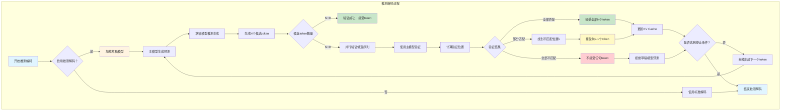

# 推测解码流程图

## 流程图

## 关键步骤说明

### 1. 启动阶段
- 检查是否启用推测解码
- 加载草稿模型（通常比主模型更小更快）

### 2. 推测生成阶段
- 主模型生成初始预测
- 草稿模型基于主模型预测，快速推测生成多个候选token
- 生成N个候选token序列

### 3. 验证阶段
- 使用主模型验证草稿模型生成的候选序列
- 并行计算验证位置
- 检查每个候选token是否与主模型预测一致

### 4. 结果处理阶段
- **全部匹配**：接受全部N个候选token，实现N倍加速
- **部分匹配**：接受前k-1个正确token，丢弃错误token
- **全部不匹配**：不接受任何token，回退到主模型预测

### 5. 优化效果
- 平均加速比：在理想情况下达到N倍加速
- 内存开销：需要同时加载主模型和草稿模型
- 适合场景：草稿模型与主模型性能差异明显时效果最佳

## 技术要点

1. **并行验证**：一次主模型推理验证多个候选token
2. **KV Cache优化**：高效的KV Cache更新机制
3. **动态调整**：根据验证成功率动态调整推测长度
4. **多轮解码**：支持多级推测解码，叠加多个草稿模型