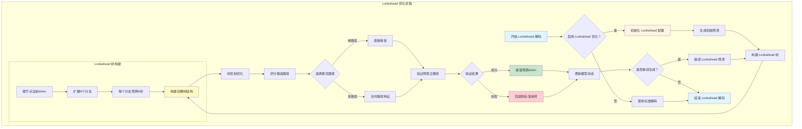
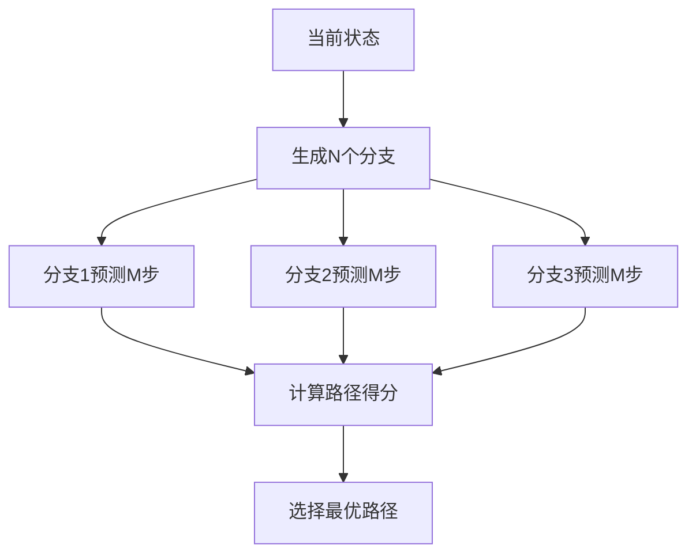

# Lookahead 优化流程图

## 流程图

## 核心算法流程

### 1. 初始化阶段
- 配置 Lookahead 参数（分支数N、预测步数M）
- 初始化树结构和评分机制
- 预分配内存和缓存

### 2. 树构建阶段

### 3. 优化策略

#### 树剪枝
- 移除低概率分支
- 合并相似路径
- 动态调整树深度

#### 路径评分
- 考虑概率分布
- 计算预测置信度
- 综合路径长度和概率

### 4. 验证机制
- 检查预测的合理性
- 避免过度乐观预测
- 动态调整策略参数

## 技术优势

1. **计算效率**：通过批量预测减少计算开销
2. **缓存友好**：优化内存访问模式
3. **自适应**：根据输入特性动态调整策略
4. **低开销**：最小化额外计算成本

## 参数配置

| 参数 | 默认值 | 说明 |
|------|--------|------|
| 分支数 (N) | 2-4 | 每个节点扩展的分支数量 |
| 预测步数 (M) | 3-5 | 每个分支预测的步数 |
| 剪枝阈值 | 0.01 | 低于该概率的分支被剪除 |
| 最大深度 | 10 | 树的最大深度 |

## 与推测解码的区别

- **Lookahead**：基于单模型的多路径探索，无需草稿模型
- **推测解码**：基于主模型+草稿模型的并行验证
- **互补性**：两种方法可以结合使用，进一步提升性能