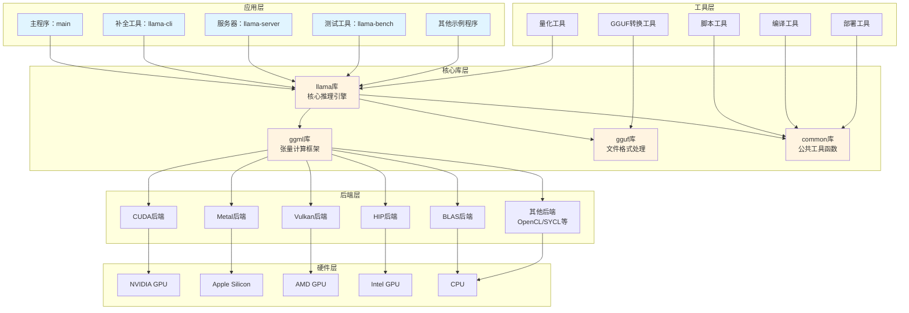

# llama.cpp 总体模块架构图

## 架构图



## 模块详细说明

### 1. 应用层
- **main.c**: 主程序，提供命令行界面
- **llama-cli**: 补全生成工具，支持交互式和批处理
- **llama-server**: HTTP API服务器，支持RESTful接口
- **llama-bench**: 性能基准测试工具
- **示例程序**: 各种功能演示和测试程序

### 2. 工具层
- **量化工具**: 模型量化，支持多种量化格式
- **GGUF转换工具**: 格式转换和模型处理
- **脚本工具**: 辅助开发和部署的脚本
- **编译工具**: 构建和依赖管理

### 3. 核心库层

#### llama库（核心推理引擎）
- 模型加载和初始化
- 推理循环和采样
- KV Cache管理
- 多模态支持
- 语法约束

#### ggml库（张量计算框架）
- 张量数据结构
- 数学运算实现
- 内存管理
- 量化操作
- 优化算法

#### gguf库（文件格式处理）
- GGUF格式解析
- 元数据管理
- 模型序列化/反序列化
- 版本兼容性处理

#### common库（公共工具函数）
- 字符串处理
- 时间和日志
- 配置管理
- 工具函数

### 4. 后端层
- **CUDA**: NVIDIA GPU加速
- **Metal**: Apple Silicon GPU加速
- **Vulkan**: 跨平台GPU加速
- **HIP**: AMD GPU加速
- **BLAS**: CPU BLAS库加速
- **其他**: OpenCL、SYCL等

### 5. 硬件层
- **NVIDIA GPU**: CUDA后端
- **Apple Silicon**: Metal后端
- **AMD GPU**: HIP/Vulkan后端
- **Intel GPU**: Vulkan/SYCL后端
- **CPU**: BLAS和其他CPU后端

## 设计特点

1. **模块化设计**: 清晰的层次结构，便于维护和扩展
2. **硬件抽象**: 通过后端层实现硬件无关性
3. **可扩展性**: 支持添加新的后端和功能
4. **性能优化**: 针对不同硬件进行专门的优化
5. **跨平台**: 支持多种操作系统和硬件平台

## 依赖关系

```
应用层
  ↓ 依赖
核心库层
  ↓ 调用
后端层
  ↓ 访问
硬件层
```

工具层可以独立于应用层使用，也可以与核心库层集成。