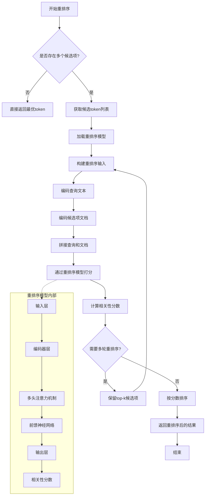

# 重排序业务逻辑图

## 核心组件

### 1. 重排序流程
- **候选收集**: 从解码器获取多个候选token
- **模型推理**: 使用重排序模型评估每个候选项
- **分数计算**: 计算查询与候选项的相关性
- **结果排序**: 按相关性分数重新排序

### 2. 重排序模型
- 基于 Transformer 架构
- 采用交叉注意力机制
- 输出相关性分数

### 3. 关键优势
- 提高解码质量
- 支持长文本重排序
- 可配置的重排序深度