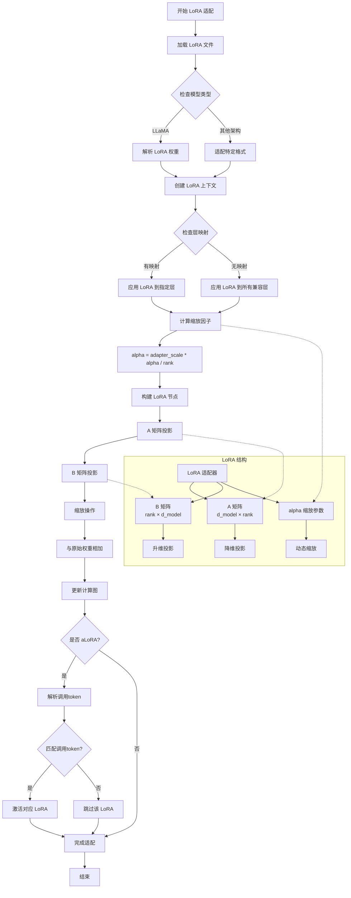

# LoRA 适配器应用逻辑图

## 核心组件

### 1. LoRA 适配器结构
- **A 矩阵**: 降维投影 (d_model × rank)
- **B 矩阵**: 升维投影 (rank × d_model)
- **alpha**: 缩放参数

### 2. 应用流程
- **权重加载**: 从 GGUF 文件加载 LoRA 权重
- **层映射**: 将 LoRA 应用到指定层
- **缩放计算**: 根据 alpha 和 rank 动态计算缩放因子

### 3. aLoRA 机制
- 支持 token 级别的 LoRA 激活
- 通过调用 token 动态切换 LoRA
- 实现自适应适配器选择