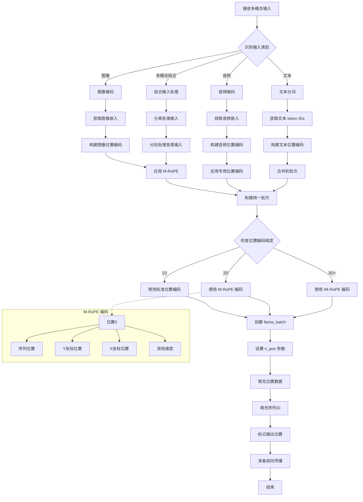

# 多模态输入处理逻辑图

## 核心组件

### 1. 输入类型处理
- **文本分词**: 使用词汇表将文本转换为 token IDs
- **图像编码**: 视觉编码器将图像转换为嵌入向量
- **音频编码**: 音频编码器将音频转换为嵌入向量

### 2. 位置编码机制
- **1D 编码**: 标准序列位置编码
- **M-RoPE**: 多维度 RoPE 位置编码（图像等 2D 输入）
- **IM-RoPE**: 交错多维度位置编码（复杂多模态场景）

### 3. 批次构建
- **n_pos 参数**: 每个token的位置编码数量
- **位置数据**: 包含多个维度的位置信息
- **序列ID**: 标识每个token所属的序列

### 4. 关键特性
- 支持混合模态输入
- 灵活的位置编码配置
- 统一的批次处理接口