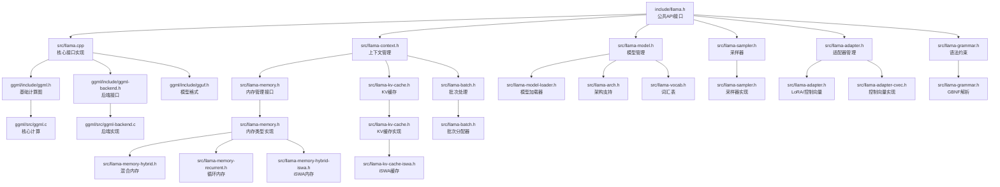

# 核心模块依赖关系图

## 核心模块说明

### 1. 公共接口层
- **llama.h**: C语言公共API接口
- 提供模型加载、推理、采样等功能

### 2. 核心实现层
- **llama.cpp**: 主要接口实现
- **llama-context.h**: 推理上下文管理
- **llama-model.h**: 模型结构和加载

### 3. 功能模块层
- **llama-sampler**: 采样器和采样链
- **llama-adapter**: LoRA 适配器和控制向量
- **llama-grammar**: GBNF 语法约束
- **llama-batch**: 批次处理和分配

### 4. 内存管理层
- **llama-memory**: 内存管理接口
- **llama-kv-cache**: KV 缓存管理
- 支持多种内存类型（混合、循环、iSWA）

### 5. 依赖基础
- **ggml**: 基础计算图和操作
- **ggml-backend**: 后端接口实现
- **gguf**: 模型文件格式