# 工具链依赖关系图

```mermaid
graph TD
    A[common/common.h<br/>公共头文件] --> B[tools/工具程序]
    A --> C[examples/示例程序]

    B --> D[tools/quantize<br/>量化工具]
    B --> E[tools/server<br/>HTTP服务器]
    B --> F[tools/perplexity<br/>困惑度评估]
    B --> G[tools/llama-bench<br/>性能基准测试]
    B --> H[tools/export-lora<br/>LoRA导出工具]
    B --> I[tools/imatrix<br/>重要性矩阵]
    B --> J[tools/cli<br/>命令行工具]

    C --> K[examples/main<br/>主示例]
    C --> L[examples/finetune<br/>微调示例]
    C --> M[examples/gguf<br/>GGUF工具]
    C --> N[examples/quantize<br/>量化示例]

    D --> O[llama.h + ggml.h<br/>核心库]
    E --> O
    F --> O
    G --> O
    H --> O
    I --> O
    J --> O
    K --> O
    L --> O
    M --> O
    N --> O

    D --> P[ggml/include/ggml-alloc.h<br/>内存分配]
    G --> P

    E --> Q[tools/server/server.h<br/>服务器组件]
    E --> R[tools/server/server-context.h<br/>上下文管理]
    E --> S[tools/server/server-http.h<br/>HTTP处理]

    H --> T[gguf/include/gguf.h<br/>GGUF格式]

    I --> U[llama.h + llama-quant.h<br/>量化支持]

    K --> V[include/llama.h<br/>公共API]
    K --> W[common/sampling.h<br/>采样实现]

    subgraph 共享依赖
        X[common/build-info.h<br/>构建信息]
        Y[common/log.h<br/>日志系统]
        Z[common/common.h<br/>通用工具]
    end

    D --> X
    E --> X
    F --> X
    G --> X
    H --> X
    I --> X
    J --> X

    D --> Y
    E --> Y
    F --> Y
    G --> Y
    H --> Y
    I --> Y
    J --> Y

    D --> Z
    E --> Z
    F --> Z
    G --> Z
    H --> Z
    I --> Z
    J --> Z
```

## 工具链说明

### 1. 核心工具
- **quantize**: 模型量化工具，支持多种量化格式
- **server**: HTTP API 服务器，支持 OpenAI 兼容接口
- **perplexity**: 模型困惑度评估工具
- **llama-bench**: 性能基准测试工具

### 2. 辅助工具
- **export-lora**: LoRA 适配器导出工具
- **imatrix**: 量化重要性矩阵生成工具
- **cli**: 统一命令行工具

### 3. 示例程序
- **main**: 基础推理示例
- **finetune**: 模型微调示例
- **gguf**: GGUF 格式处理示例
- **quantize**: 量化实现示例

### 4. 共享依赖
- **common**: 公共头文件和工具函数
- **llama.h**: 核心库接口
- **ggml**: 计算图和操作库