# 后端实现依赖关系图

```mermaid
graph TD
    A[ggml/include/ggml-backend.h<br/>后端接口定义] --> B[ggml/src/ggml-backend.c<br/>后端核心实现]
    B --> C[CPU 后端]
    B --> D[GPU 后端]
    B --> E[专用加速后端]
    B --> F[远程后端]

    C --> G[ggml/src/ggml-cpu/ggml-cpu.c<br/>CPU实现]
    C --> H[ggml/include/ggml-cpu.h<br/>CPU头文件]

    D --> I[ggml/src/ggml-cuda/ggml-cuda.c<br/>CUDA实现]
    D --> J[ggml/src/ggml-metal/ggml-metal.m<br/>Metal实现]
    D --> K[ggml/src/ggml-vulkan/ggml-vulkan.cpp<br/>Vulkan实现]
    D --> L[ggml/src/ggml-webgpu/ggml-webgpu.cpp<br/>WebGPU实现]

    E --> M[ggml/src/ggml-blas/ggml-blas.c<br/>BLAS加速]
    E --> N[ggml/src/ggml-sycl/ggml-sycl.cpp<br/>SYCL加速]
    E --> O[ggml/src/ggml-opencl/ggml-opencl.c<br/>OpenCL加速]
    E --> P[ggml/src/ggml-cann/ggml-cann.c<br/>华为CANN]
    E --> Q[ggml/src/ggml-openvino/ggml-openvino.c<br/>Intel OpenVINO]
    E --> R[ggml/src/ggml-zdnn/ggml-zdnn.c<br/>IBM zDNN]
    E --> S[ggml/src/ggml-zendnn/ggml-zendnn.c<br/>ZenDNN]

    F --> T[ggml/src/ggml-rpc/transport.h<br/>RPC传输]
    F --> U[ggml/src/ggml-rpc/ggml-rpc.cpp<br/>RPC实现]

    G --> V[ggml/src/ggml.c<br/>核心计算]
    I --> V
    J --> V
    K --> V
    L --> V
    M --> V
    N --> V
    O --> V
    P --> V
    Q --> V
    R --> V
    S --> V
    U --> V

    subgraph 后端注册机制
        W[ggml_backend_reg_t<br/>后端注册表]
        X[ggml_backend_dev_t<br/>设备注册表]
    end

    B --> W
    W --> X
    I --> W
    J --> W
    K --> W
    L --> W
    M --> W
    N --> W
    O --> W
    P --> W
    Q --> W
    R --> W
    S --> W
    U --> W

    subgraph 缓冲区类型
        Y[ggml_backend_buffer_type_t<br/>缓冲区类型]
        Z[ggml_backend_buffer_t<br/>缓冲区实例]
    end

    G --> Y
    I --> Y
    J --> Y
    K --> Y
    L --> Y
    M --> Y
    N --> Y
    O --> Y
    P --> Y
    Q --> Y
    R --> Y
    S --> Y

    Y --> Z
```

## 后端说明

### 1. CPU 后端
- **ggml-cpu**: 基础 CPU 实现
- 支持多线程并行计算
- AVX/AVX2/AVX-512 优化

### 2. GPU 后端
- **CUDA**: NVIDIA GPU 支持
- **Metal**: Apple GPU 支持
- **Vulkan**: 跨平台 GPU 支持
- **WebGPU**: Web 浏览器支持

### 3. 专用加速后端
- **BLAS**: 线性代数加速库
- **SYCL**: Intel OneAPI 加速
- **OpenCL**: 跨平台计算加速
- **CANN**: 华为昇腾加速
- **OpenVINO**: Intel 推理引擎
- **zDNN/ZenDNN**: IBM Z 系列加速

### 4. 远程后端
- **RPC**: 远程过程调用支持
- 支持分布式推理

### 5. 核心机制
- **后端注册表**: 统一的后端注册机制
- **设备管理**: 设备发现和管理
- **缓冲区系统**: 内存管理和分配