# 第三方库依赖关系图

```mermaid
graph TD
    A[llama.cpp 项目] --> B[核心依赖]
    A --> C[后端依赖]
    A --> D[工具依赖]
    A --> E[测试依赖]

    B --> F[ggml<br/>内部计算库]
    B --> G[gguf<br/>模型格式库]
    B --> H[ggml-opt<br/>优化算法库]

    C --> I[CUDA<br/>NVIDIA GPU]
    C --> J[Metal<br/>Apple GPU]
    C --> K[Vulkan<br/>跨平台GPU]
    C --> L[OpenCL<br/>跨平台计算]
    C --> M[SYCL<br/>Intel OneAPI]
    C --> N[BLAS<br/>线性代数库]
    C --> O[OpenVINO<br/>Intel推理引擎]
    C --> P[CANN<br/>华为昇腾]
    C --> Q[zDNN/ZenDNN<br/>IBM Z系列]

    N --> R[OpenBLAS<br/>开源BLAS]
    N --> S[Apple Accelerate<br/>Mac优化]
    N --> T[Intel MKL<br/>Intel优化]
    N --> U[BLIS<br/>开源BLAS]

    D --> V[pthread<br/>多线程]
    D --> W[libcurl<br/>HTTP客户端]
    D --> X[OpenSSL<br/>加密库]
    D --> Y[Jinja2<br/>模板引擎]

    E --> Z[Catch2<br/>C++测试框架]
    E --> AA[Python<br/>测试脚本]

    subgraph 可选依赖
        AB[ncurses<br/>终端UI]
        AC[readline<br/>命令行编辑]
        AD[jieba<br/>中文分词]
    end

    subgraph Python生态
        AE[gguf-py<br/>GGUF Python库]
        AF[convert.py<br/>模型转换]
        AG[quantize.py<br/>Python量化]
    end

    D --> AB
    D --> AC
    D --> AD

    AE --> F
    AF --> F
    AG --> F

    Y -.-> D

    subgraph 平台特定依赖
        AH[Windows: winmm, ws2_32]
        AI[Linux: numa, dl]
        AJ[macOS: Cocoa, Foundation]
    end

    A --> AH
    A --> AI
    A --> AJ
```

## 第三方库说明

### 1. 核心依赖
- **ggml**: 内部计算图库（项目内部）
- **gguf**: 模型格式库（项目内部）
- **ggml-opt**: 优化算法库（项目内部）

### 2. GPU 后端依赖
- **CUDA**: NVIDIA GPU 支持（10.0+）
- **Metal**: Apple GPU 支持（macOS 10.15+）
- **Vulkan**: 跨平台 GPU 支持
- **WebGPU**: Web 浏览器支持

### 3. 加速库依赖
- **BLAS**: 线性代数加速
  - OpenBLAS（开源）
  - Apple Accelerate（Mac）
  - Intel MKL（Intel）
  - BLIS（开源）
- **OpenCL**: 跨平台计算
- **SYCL**: Intel OneAPI
- **OpenVINO**: Intel 推理引擎
- **CANN**: 华为昇腾
- **zDNN/ZenDNN**: IBM Z 系列

### 4. 工具依赖
- **pthread**: 多线程支持
- **libcurl**: HTTP 客户端
- **OpenSSL**: 加密库
- **Jinja2**: 模板引擎（Python）

### 5. 测试依赖
- **Catch2**: C++ 测试框架
- **Python**: 测试脚本支持

### 6. 可选依赖
- **ncurses**: 终端 UI
- **readline**: 命令行编辑
- **jieba**: 中文分词

### 7. 平台特定依赖
- **Windows**: winmm, ws2_32
- **Linux**: numa, dl
- **macOS**: Cocoa, Foundation