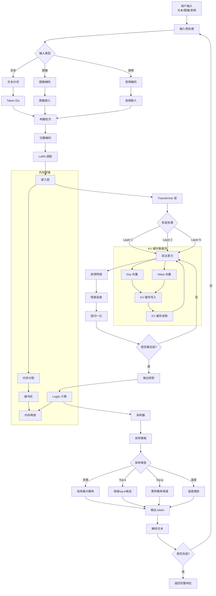

# 数据流向图

## 数据流说明

### 1. 输入处理流程
- **预处理**: 根据输入类型选择处理方式
- **分词/编码**: 将输入转换为模型可理解的格式
- **批次构建**: 合并多种输入到统一批次

### 2. 推理流程
- **位置编码**: 添加位置信息
- **LoRA 适配**: 应用 LoRA 权重调整
- **嵌入层**: 将 token 转换为向量表示
- **Transformer 层**: 多层注意力机制处理

### 3. KV 缓存流程
- **Key/Value 存储**: 保存每层的 Key 和 Value
- **缓存读取**: 复用之前计算的 KV
- **优化计算**: 减少重复计算

### 4. 采样流程
- **Logits 计算**: 输出层计算 token 概率
- **采样策略**: 选择采样方法
- **采样类型**: 贪婪、Top-k、Top-p、温度等

### 5. 输出生成
- **Token 选择**: 根据采样结果选择 token
- **解码**: 将 token 转换为文本
- **循环**: 继续生成直到完成

### 6. 内存管理
- **内存分配**: 为计算分配内存
- **缓冲区管理**: 管理计算缓冲区
- **内存释放**: 释放不再使用的内存