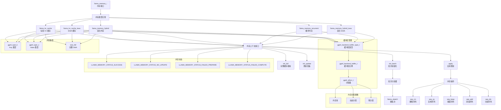

# 内存管理架构图

## 内存管理说明

### 1. 内存接口
- **llama_memory_i**: 统一的内存管理接口
- 定义所有内存类型必须实现的方法

### 2. 内存类型
- **标准 KV 缓存**: 基础键值缓存
- **iSWA 缓存**: 滑动窗口注意力缓存
- **混合内存**: 组合多种内存类型
- **循环内存**: 支持循环网络结构
- **混合 iSWA**: 混合滑动窗口缓存

### 3. 内存上下文
- **init_batch**: 初始化批次处理
- **init_full**: 模拟完整缓存
- **init_update**: 准备内存更新
- **apply**: 应用内存状态

### 4. 批次处理
- **批次分割器**: 将批次分割为微批次
- **llama_ubatch**: 微批次结构
- 支持多种分割策略

### 5. 序列操作
- **seq_rm**: 删除指定序列
- **seq_cp**: 复制序列数据
- **seq_keep**: 保留序列
- **seq_add**: 添加新序列
- **seq_div**: 分割序列

### 6. 缓冲区管理
- **缓冲区类型**: 定义内存类型
- **缓冲区实例**: 实际内存缓冲区
- **分配器**: 内存分配策略

### 7. 内存状态
- **SUCCESS**: 操作成功
- **NO_UPDATE**: 无需更新
- **FAILED_PREPARE**: 准备失败
- **FAILED_COMPUTE**: 计算失败

### 8. 分配策略
- **内存池**: 预分配内存池
- **动态分配**: 按需分配
- **预分配**: 提前分配所需内存