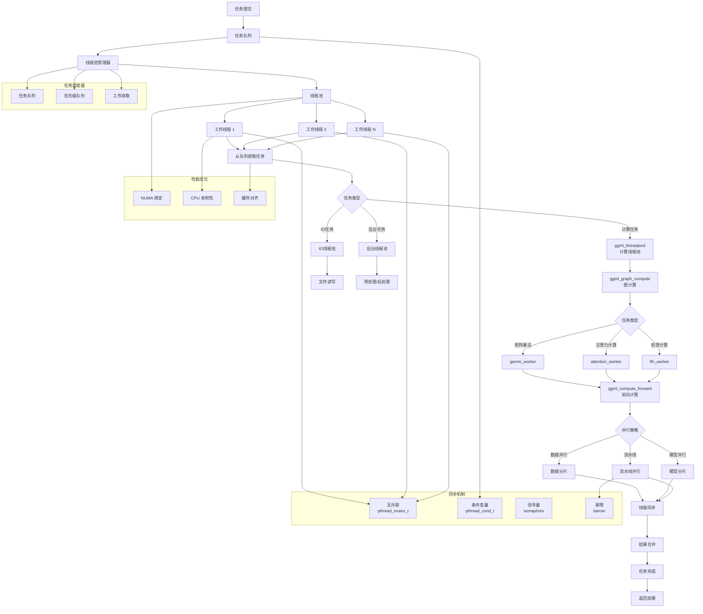

# 线程池与任务调度图

## 线程池说明

### 1. 线程池类型
- **计算线程池**: 处理图计算任务
- **IO 线程池**: 处理文件读写任务
- **后台线程池**: 处理预处理和后处理

### 2. 任务类型
- **矩阵乘法**: GEMM 计算
- **注意力计算**: 注意力机制
- **前馈计算**: 前馈网络计算

### 3. 并行策略
- **数据并行**: 数据分片处理
- **模型并行**: 模型分片处理
- **流水线并行**: 流水线处理

### 4. 同步机制
- **互斥锁**: 保护共享资源
- **条件变量**: 线程间通知
- **信号量**: 控制并发数量
- **屏障**: 同步多个线程

### 5. 任务调度
- **任务队列**: FIFO 调度
- **优先级队列**: 按优先级调度
- **工作窃取**: 动态负载均衡

### 6. 性能优化
- **NUMA 绑定**: 优化内存访问
- **CPU 亲和性**: 绑定到特定 CPU
- **缓存对齐**: 优化缓存使用

### 7. 工作流程
1. 任务提交到队列
2. 线程池管理器分配任务
3. 工作线程获取并执行任务
4. 根据任务类型选择处理方式
5. 使用并行策略加速计算
6. 通过同步机制协调线程
7. 合并结果并返回