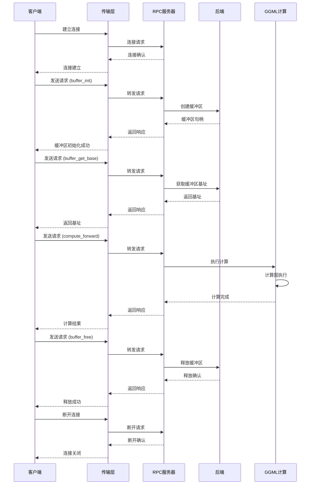

# RPC 通信架构图

## RPC 架构说明

### 1. 通信协议
- **传输层**: 支持 TCP、Unix Socket 等
- **序列化**: 使用自定义二进制协议
- **请求/响应**: 同步 RPC 调用模式

### 2. RPC 操作
- **buffer_init**: 初始化远程缓冲区
- **buffer_get_base**: 获取缓冲区基址
- **compute_forward**: 执行前向计算
- **buffer_free**: 释放远程缓冲区

### 3. 服务器端
- **请求处理**: 接收并处理客户端请求
- **后端管理**: 管理计算后端资源
- **计算执行**: 调用 GGML 计算图

### 4. 客户端端
- **连接管理**: 建立和维护连接
- **请求发送**: 发送 RPC 请求
- **响应处理**: 处理服务器响应

### 5. 数据流
- **初始化**: 创建远程缓冲区
- **计算**: 远程执行计算任务
- **清理**: 释放远程资源

### 6. 优势
- **分布式计算**: 支持多机分布式推理
- **资源隔离**: 客户端和服务器端资源分离
- **灵活性**: 支持多种传输协议

### 7. 应用场景
- 多机 GPU 集群推理
- CPU-GPU 混合计算
- 远程推理服务