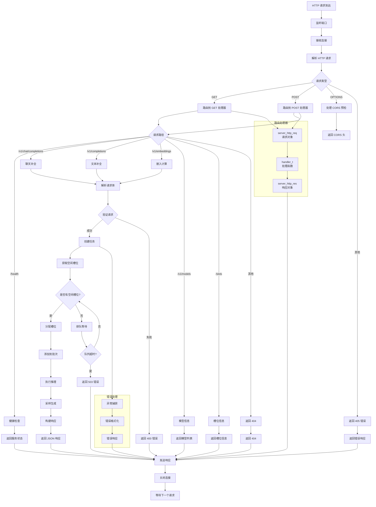

# HTTP 服务器请求处理流程图

## HTTP 服务器说明

### 1. 请求处理流程
- **连接接收**: 接受客户端连接
- **请求解析**: 解析 HTTP 请求头和体
- **路由分发**: 根据路径和方法分发到处理器
- **响应构建**: 构建并返回响应

### 2. 支持的 API
- **/health**: 健康检查
- **/v1/chat/completions**: 聊天补全
- **/v1/completions**: 文本补全
- **/v1/embeddings**: 嵌入计算
- **/v1/models**: 模型信息
- **/slots**: 槽位信息

### 3. 请求类型
- **GET**: 查询操作
- **POST**: 创建操作
- **OPTIONS**: CORS 预检

### 4. 推理流程
- **请求验证**: 验证请求参数
- **任务创建**: 创建推理任务
- **槽位分配**: 分配推理槽位
- **批次处理**: 添加到推理批次
- **结果返回**: 返回生成结果

### 5. 并发控制
- **槽位管理**: 管理并发推理槽位
- **队列管理**: 处理超载情况
- **超时处理**: 超时返回错误

### 6. 错误处理
- **异常捕获**: 捕获处理异常
- **错误格式化**: 统一错误格式
- **错误响应**: 返回错误信息

### 7. CORS 支持
- **预检请求**: 处理 OPTIONS 请求
- **跨域头**: 添加 CORS 头部
- **安全控制**: 配置允许的来源