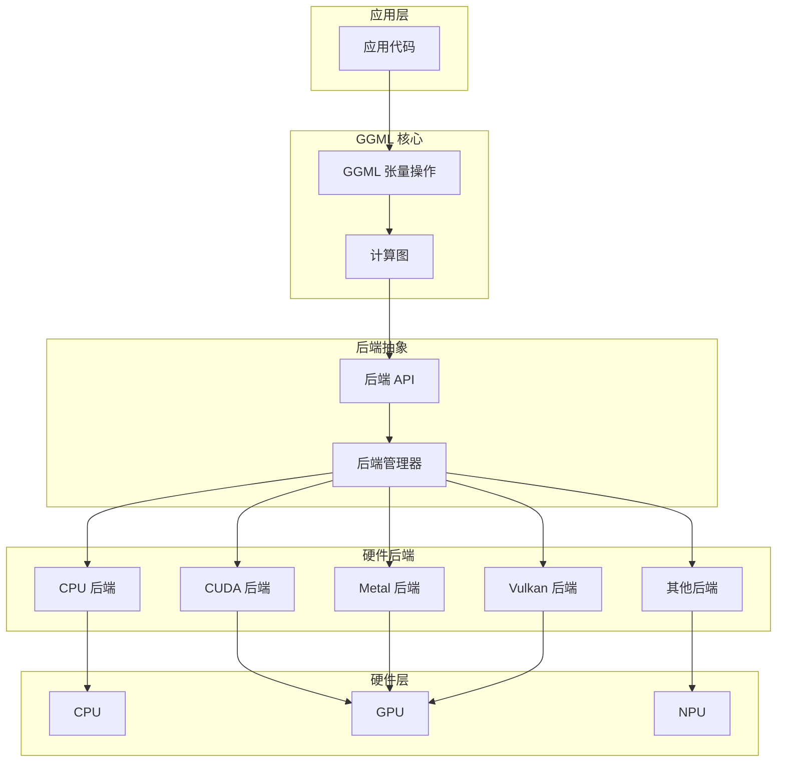
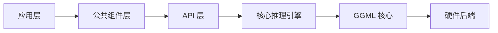

# 架构设计

## 整体架构概述

llama.cpp 采用分层架构设计，从底层硬件抽象到上层应用接口，提供了完整的推理生态系统。这种设计使得项目具有良好的可维护性、可扩展性和跨平台能力。

### 架构层次

```mermaid
graph TB
    subgraph "应用层 / Application Layer"
        APP1[应用示例<br/>examples/]
        APP2[CLI 工具<br/>main, llama-cli]
        APP3[服务器<br/>llama-server]
        APP4[测试套件<br/>tests/]
        APP5[基准测试<br/>benches/]
    end

    subgraph "公共组件层 / Common Layer"
        COMMON1[聊天解析<br/>chat.cpp]
        COMMON2[采样策略<br/>sampling.cpp]
        COMMON3[JSON 解析<br/>json-schema-to-grammar.cpp]
        COMMON4[模板引擎<br/>jinja/]
        COMMON5[文件下载<br/>download.cpp]
        COMMON6[Unicode 处理<br/>unicode.cpp]
        COMMON7[日志系统<br/>log.cpp]
        COMMON8[推理解码<br/>speculative.cpp]
    end

    subgraph "核心推理引擎 / Core Inference Engine"
        CORE1[模型加载<br/>llama-model.cpp]
        CORE2[推理上下文<br/>llama-context.cpp]
        CORE3[批处理<br/>llama-batch.cpp]
        CORE4[采样器<br/>llama-sampler.cpp]
        CORE5[词汇表<br/>llama-vocab.cpp]
        CORE6[语法约束<br/>llama-grammar.cpp]
        CORE7[KV 缓存<br/>llama-kv-cache.cpp]
        CORE8[内存管理<br/>llama-memory.cpp]
        CORE9[计算图<br/>llama-graph.cpp]
        CORE10[量化<br/>llama-quant.cpp]
        CORE11[适配器<br/>llama-adapter.cpp]
        CORE12[架构抽象<br/>llama-arch.cpp]
        CORE13[聊天引擎<br/>llama-chat.cpp]
    end

    subgraph "GGML 核心库 / GGML Core Library"
        GGML1[张量操作<br/>ggml.c]
        GGML2[内存分配<br/>ggml-alloc.c]
        GGML3[优化器<br/>ggml-opt.cpp]
        GGML4[量化<br/>ggml-quants.c]
        GGML5[后端管理<br/>ggml-backend.cpp]
        GGML6[文件格式<br/>gguf.cpp]
        GGML7[张量类型定义<br/>ggml.h]
    end

    subgraph "硬件后端层 / Hardware Backend Layer"
        BACKEND1[CPU 后端<br/>ggml-cpu/]
        BACKEND2[CUDA 后端<br/>ggml-cuda/]
        BACKEND3[Metal 后端<br/>ggml-metal/]
        BACKEND4[OpenCL 后端<br/>ggml-opencl/]
        BACKEND5[Vulkan 后端<br/>ggml-vulkan/]
        BACKEND6[SYCL 后端<br/>ggml-sycl/]
        BACKEND7[HIP 后端<br/>ggml-hip/]
        BACKEND8[OpenVINO 后端<br/>ggml-openvino/]
        BACKEND9[CANN 后端<br/>ggml-cann/]
        BACKEND10[BLAS 后端<br/>ggml-blas/]
        BACKEND11[RPC 后端<br/>ggml-rpc/]
        BACKEND12[WebGPU 后端<br/>ggml-webgpu/]
    end

    subgraph "工具链层 / Toolchain Layer"
        TOOL1[模型转换<br/>convert_hf_to_gguf.py]
        TOOL2[LoRA 转换<br/>convert_lora_to_gguf.py]
        TOOL3[量化工具<br/>llama-quantize]
        TOOL4[GGUF 工具<br/>gguf-py/]
        TOOL5[构建系统<br/>CMake/Makefile]
    end

    subgraph "API 接口层 / API Layer"
        API1[C API<br/>include/llama.h]
        API2[GGML API<br/>ggml/include/ggml.h]
        API3[后端 API<br/>ggml/include/ggml-backend.h]
        API4[FFI 接口<br/>include/llama-cpp.h]
    end

    subgraph "基础设施 / Infrastructure"
        INFRA1[构建系统<br/>CMake/]
        INFRA2[CI/CD<br/>.github/]
        INFRA3[文档<br/>docs/]
        INFRA4[许可证<br/>licenses/]
    end

    %% 主要依赖关系
    APP1 & APP2 & APP3 & APP4 & APP5 --> API1
    APP1 & APP2 & APP3 & APP4 & APP5 --> COMMON1
    APP1 & APP2 & APP3 & APP4 & APP5 --> COMMON2
    APP3 --> COMMON8

    COMMON1 --> COMMON3
    COMMON1 --> COMMON4
    COMMON2 --> CORE4
    COMMON3 --> CORE6
    COMMON8 --> CORE4

    CORE1 --> CORE2
    CORE1 --> CORE12
    CORE1 --> CORE5
    CORE1 --> CORE10
    CORE2 --> CORE3
    CORE2 --> CORE7
    CORE2 --> CORE8
    CORE2 --> CORE9
    CORE2 --> CORE13
    CORE4 --> CORE2
    CORE5 --> CORE2
    CORE6 --> CORE5
    CORE7 --> CORE8
    CORE8 --> CORE9
    CORE9 --> CORE2
    CORE10 --> CORE1
    CORE11 --> CORE1
    CORE12 --> CORE1
    CORE13 --> COMMON1

    CORE1 --> GGML1
    CORE1 --> GGML2
    CORE1 --> GGML6
    CORE2 --> GGML1
    CORE2 --> GGML2
    CORE3 --> GGML1
    CORE4 --> GGML1
    CORE5 --> GGML1
    CORE6 --> GGML1
    CORE7 --> GGML1
    CORE8 --> GGML1
    CORE9 --> GGML1
    CORE10 --> GGML4
    CORE11 --> GGML6

    GGML1 --> GGML7
    GGML1 --> GGML2
    GGML1 --> GGML3
    GGML1 --> GGML4
    GGML1 --> GGML5
    GGML2 --> GGML5
    GGML3 --> GGML5
    GGML4 --> GGML5
    GGML5 --> GGML7
    GGML6 --> GGML5

    GGML5 --> BACKEND1
    GGML5 --> BACKEND2
    GGML5 --> BACKEND3
    GGML5 --> BACKEND4
    GGML5 --> BACKEND5
    GGML5 --> BACKEND6
    GGML5 --> BACKEND7
    GGML5 --> BACKEND8
    GGML5 --> BACKEND9
    GGML5 --> BACKEND10
    GGML5 --> BACKEND11
    GGML5 --> BACKEND12

    TOOL1 --> GGML6
    TOOL2 --> GGML6
    TOOL3 --> CORE10
    TOOL4 --> GGML6
    TOOL5 --> INFRA1

    API1 --> CORE1
    API1 --> CORE2
    API1 --> CORE3
    API1 --> CORE4
    API2 --> GGML1
    API2 --> GGML2
    API3 --> GGML5
    API4 --> API1

    APP1 --> INFRA1
    APP2 --> INFRA1
    APP3 --> INFRA1
    APP4 --> INFRA1
    APP5 --> INFRA1
    INFRA1 --> INFRA2
    INFRA2 --> INFRA3

    style APP1 fill:#e1f5ff
    style APP2 fill:#e1f5ff
    style APP3 fill:#e1f5ff
    style APP4 fill:#e1f5ff
    style APP5 fill:#e1f5ff
    style COMMON1 fill:#fff4e1
    style COMMON2 fill:#fff4e1
    style COMMON3 fill:#fff4e1
    style COMMON4 fill:#fff4e1
    style COMMON5 fill:#fff4e1
    style COMMON6 fill:#fff4e1
    style COMMON7 fill:#fff4e1
    style COMMON8 fill:#fff4e1
    style CORE1 fill:#e1ffe1
    style CORE2 fill:#e1ffe1
    style CORE3 fill:#e1ffe1
    style CORE4 fill:#e1ffe1
    style CORE5 fill:#e1ffe1
    style CORE6 fill:#e1ffe1
    style CORE7 fill:#e1ffe1
    style CORE8 fill:#e1ffe1
    style CORE9 fill:#e1ffe1
    style CORE10 fill:#e1ffe1
    style CORE11 fill:#e1ffe1
    style CORE12 fill:#e1ffe1
    style CORE13 fill:#e1ffe1
    style GGML1 fill:#ffe1f5
    style GGML2 fill:#ffe1f5
    style GGML3 fill:#ffe1f5
    style GGML4 fill:#ffe1f5
    style GGML5 fill:#ffe1f5
    style GGML6 fill:#ffe1f5
    style GGML7 fill:#ffe1f5
    style BACKEND1 fill:#f5e1ff
    style BACKEND2 fill:#f5e1ff
    style BACKEND3 fill:#f5e1ff
    style BACKEND4 fill:#f5e1ff
    style BACKEND5 fill:#f5e1ff
    style BACKEND6 fill:#f5e1ff
    style BACKEND7 fill:#f5e1ff
    style BACKEND8 fill:#f5e1ff
    style BACKEND9 fill:#f5e1ff
    style BACKEND10 fill:#f5e1ff
    style BACKEND11 fill:#f5e1ff
    style BACKEND12 fill:#f5e1ff
    style TOOL1 fill:#e1f5ff
    style TOOL2 fill:#e1f5ff
    style TOOL3 fill:#e1f5ff
    style TOOL4 fill:#e1f5ff
    style TOOL5 fill:#e1f5ff
    style API1 fill:#f5ffe1
    style API2 fill:#f5ffe1
    style API3 fill:#f5ffe1
    style API4 fill:#f5ffe1
```



### 各层职责

#### 1. 应用层（Application Layer）
- **职责**: 提供用户直接使用的应用和工具
- **组件**: 
  - `examples/`: 各种应用示例
  - `main`, `llama-cli`: 命令行工具
  - `llama-server`: HTTP 服务器
  - `tests/`: 测试套件
  - `benches/`: 性能基准测试
- **特点**: 直接面向用户，提供丰富的使用场景

#### 2. 公共组件层（Common Layer）
- **职责**: 提供通用的公共组件和服务
- **组件**:
  - `chat.cpp`: 聊天解析和自动解析器
  - `sampling.cpp`: 采样策略实现
  - `json-schema-to-grammar.cpp`: JSON Schema 到语法的转换
  - `jinja/`: 模板引擎
  - `download.cpp`: 文件下载
  - `unicode.cpp`: Unicode 处理
  - `log.cpp`: 日志系统
  - `speculative.cpp`: 推理解码支持
- **特点**: 被多个应用共享，减少代码重复

#### 3. 核心推理引擎（Core Inference Engine）
- **职责**: 实现所有核心推理逻辑
- **组件**:
  - `llama-model.cpp`: 模型加载和管理
  - `llama-context.cpp`: 推理上下文管理
  - `llama-batch.cpp`: 批处理管理
  - `llama-sampler.cpp`: 采样器实现
  - `llama-vocab.cpp`: 词汇表处理
  - `llama-grammar.cpp`: 语法约束
  - `llama-kv-cache.cpp`: KV 缓存管理
  - `llama-memory.cpp`: 内存管理
  - `llama-graph.cpp`: 计算图构建和执行
  - `llama-quant.cpp`: 量化支持
  - `llama-adapter.cpp`: 适配器支持
  - `llama-arch.cpp`: 架构抽象
  - `llama-chat.cpp`: 聊天引擎
- **特点**: 核心业务逻辑，高度优化

#### 4. GGML 核心库（GGML Core Library）
- **职责**: 提供底层张量计算能力
- **组件**:
  - `ggml.c`: 张量操作实现
  - `ggml-alloc.c`: 内存分配器
  - `ggml-opt.cpp`: 优化器
  - `ggml-quants.c`: 量化算法
  - `ggml-backend.cpp`: 后端管理
  - `gguf.cpp`: GGUF 文件格式支持
  - `ggml.h`: 张量类型定义
- **特点**: 硬件无关的张量计算抽象

#### 5. 硬件后端层（Hardware Backend Layer）
- **职责**: 支持多种硬件平台
- **组件**:
  - `ggml-cpu/`: CPU 后端
  - `ggml-cuda/`: CUDA (NVIDIA GPU) 后端
  - `ggml-metal/`: Metal (Apple GPU) 后端
  - `ggml-opencl/`: OpenCL 后端
  - `ggml-vulkan/`: Vulkan 后端
  - `ggml-sycl/`: SYCL (Intel GPU) 后端
  - `ggml-hip/`: HIP (AMD GPU) 后端
  - `ggml-openvino/`: OpenVINO 后端
  - `ggml-cann/`: CANN (华为昇腾) 后端
  - `ggml-blas/`: BLAS 后端
  - `ggml-rpc/`: RPC 后端
  - `ggml-webgpu/`: WebGPU 后端
- **特点**: 可插拔的后端系统，支持多种硬件

#### 6. 工具链层（Toolchain Layer）
- **职责**: 提供模型和数据处理工具
- **组件**:
  - `convert_hf_to_gguf.py`: HuggingFace 模型转换为 GGUF
  - `convert_lora_to_gguf.py`: LoRA 转换为 GGUF
  - `llama-quantize`: 量化工具
  - `gguf-py/`: GGUF Python 库
  - 构建系统: CMake/Makefile
- **特点**: 支持模型生态和数据转换

#### 7. API 接口层（API Layer）
- **职责**: 暴露给用户的 API 接口
- **组件**:
  - `include/llama.h`: C API
  - `ggml/include/ggml.h`: GGML API
  - `ggml/include/ggml-backend.h`: 后端 API
  - `include/llama-cpp.h`: FFI 接口
- **特点**: 稳定的接口，便于集成

#### 8. 基础设施（Infrastructure）
- **职责**: 支持项目的构建和维护
- **组件**:
  - `CMake/`: 构建系统配置
  - `.github/`: CI/CD 配置
  - `docs/`: 文档
  - `licenses/`: 许可证
- **特点**: 项目基础支持

## 核心模块设计

### 1. 推理引擎模块

#### 模型加载（llama-model.cpp）
- **功能**: 负责加载和管理模型
- **主要组件**:
  - 模型文件解析（GGUF 格式）
  - 模型架构识别
  - 权重数据加载
  - 模型元数据管理
- **关键数据结构**:
  ```cpp
  struct llama_model {
      llama_model_desc desc;      // 模型描述
      llama_hparams hparams;       // 超参数
      std::vector<llama_layer> layers;  // Transformer 层
      llama_vocab vocab;           // 词汇表
      ggml_backend_buffer_t weights_buffer;  // 权重缓冲区
  };
  ```

#### 推理上下文（llama-context.cpp）
- **功能**: 管理推理过程中的状态和资源
- **主要组件**:
  - 上下文初始化和清理
  - 批次处理管理
  - KV Cache 管理
  - 内存分配和释放
- **关键数据结构**:
  ```cpp
  struct llama_context {
      const llama_model & model;   // 关联的模型
      llama_kv_cache kv_cache;     // KV 缓存
      llama_batch batch;           // 当前批次
      std::vector<ggml_backend_buffer_t> buffers;  // 缓冲区
      llama sampling_params sparams;  // 采样参数
  };
  ```

#### 批处理（llama-batch.cpp）
- **功能**: 管理批量推理
- **主要组件**:
  - 批次创建和销毁
  - 逻辑批次到物理批次的映射
  - 多序列并行处理
  - 批次优化（重用计算图）
- **关键数据结构**:
  ```cpp
  struct llama_batch {
      int32_t n_tokens;                    // token 数量
      llama_token * token;                 // token IDs
      float * embd;                        // embeddings
      llama_pos * pos;                     // 位置信息
      int32_t * n_seq_id;                  // 序列 ID 数量
      llama_seq_id ** seq_id;              // 序列 ID 数组
      int8_t * logits;                     // logits 标志
  };
  ```

### 2. 采样模块

#### 采样器（llama-sampler.cpp）
- **功能**: 实现 token 采样策略
- **主要组件**:
  - 多种采样算法实现
  - 采样器链管理
  - 语法约束集成
  - 采样状态跟踪
- **采样器类型**:
  - 贪婪采样（greedy）
  - Top-K 采样（top_k）
  - Top-P 采样（top_p）
  - 温度采样（temp）
  - Mirostat 采样（mirostat）

#### 词汇表（llama-vocab.cpp）
- **功能**: 管理 token 和文本之间的映射
- **主要组件**:
  - Token 编码和解码
  - 特殊 token 处理
  - 分词器接口
  - 词汇表加载
- **支持的分词器**:
  - BPE（Byte-Pair Encoding）
  - WordPiece
  - Unigram
  - 自定义分词器

#### 语法约束（llama-grammar.cpp）
- **功能**: 实现 GBNF 语法约束
- **主要组件**:
  - GBNF 语法解析
  - 约束引擎
  - 采样约束应用
  - 状态跟踪和回溯
- **应用场景**:
  - JSON 格式输出
  - 函数调用参数
  - 特定文本格式
  - 代码生成

### 3. 优化模块

#### KV Cache（llama-kv-cache.cpp）
- **功能**: 管理键值缓存
- **主要组件**:
  - KV Cache 分配和管理
  - 多序列 KV 隔离
  - KV 量化支持
  - 状态保存和恢复
- **优化技术**:
  - Flash Attention
  - KV Cache 量化
  - 无限滑动窗口（ISWA）

#### 量化（llama-quant.cpp）
- **功能**: 支持模型和 KV Cache 量化
- **主要组件**:
  - 量化算法实现
  - 反量化操作
  - 量化感知训练
  - 混合精度量化
- **支持的格式**:
  - Q4_0, Q4_1, Q5_0, Q5_1, Q8_0
  - Q2_K, Q3_K, Q4_K, Q5_K
  - IQ2_M, IQ2_XS, IQ3_XXS 等

#### 计算图（llama-graph.cpp）
- **功能**: 构建和执行计算图
- **主要组件**:
  - 计算图构建
  - 图优化
  - 图重用
  - 后端调度
- **优化技术**:
  - 静态图重用
  - 算子融合
  - 内存重用
  - 并行执行

### 4. 扩展模块

#### 适配器（llama-adapter.cpp）
- **功能**: 支持 LoRA 等适配器
- **主要组件**:
  - LoRA 适配器加载
  - 适配器权重应用
  - 多适配器管理
  - 适配器量化
- **应用场景**:
  - 模型微调
  - 领域适配
  - 风格迁移
  - 任务特定优化

#### 架构抽象（llama-arch.cpp）
- **功能**: 提供架构抽象层
- **主要组件**:
  - 架构识别
  - 模型类型支持
  - 架构特定优化
  - 新架构集成
- **支持的架构**:
  - Transformer（标准）
  - Mamba
  - RWKV
  - 混合专家（MoE）

#### 聊天引擎（llama-chat.cpp）
- **功能**: 实现聊天对话功能
- **主要组件**:
  - 对话历史管理
  - 对话模板处理
  - 多轮对话
  - 流式输出
- **特性**:
  - 自动解析器
  - 对话模板
  - 系统提示
  - 多模态支持

## GGML 核心库架构

### GGML 张量计算库

GGML（GPT-Generated Model Language）是 llama.cpp 的底层张量计算库，提供：

#### 核心数据结构

```cpp
struct ggml_tensor {
    enum ggml_type type;          // 张量类型（量化格式）
    ggml_backend_buffer_t buffer; // 后端缓冲区
    int64_t ne[GGML_MAX_DIMS];   // 各维度大小
    size_t nb[GGML_MAX_DIMS];    // 各维度步长
    void * data;                  // 数据指针
    char name[GGML_MAX_NAME];     // 张量名称
    ggml_op op;                   // 操作类型
    ggml_tensor * src[GGML_MAX_SRC];  // 源张量
    struct ggml_tensor * view_src;    // 视图源张量
    size_t view_offs;                 // 视图偏移
    int64_t flags;                // 标志位
};
```

#### 张量操作类型

- **基础运算**: 加减乘除、激活函数
- **矩阵运算**: 矩阵乘法、转置、求逆
- **神经网络**: 卷积、池化、注意力
- **量化操作**: 量化、反量化、混合精度
- **内存操作**: 复制、拼接、重塑

#### 内存管理

- **分配器（ggml-alloc.c）**:
  - 基于图的内存分配
  - 内存重用优化
  - 多缓冲区管理
  
- **后端缓冲区**:
  - 支持多种后端
  - 跨设备内存传输
  - 统一的内存接口

#### 计算图系统

- **图构建**:
  - 静态图定义
  - 动态图支持
  - 图优化
  
- **图执行**:
  - 拓扑排序
  - 后端调度
  - 并行执行

- **图重用**:
  - 相同结构图重用
  - 参数化图
  - 缓存机制

### GGUF 文件格式

GGUF（GPT-Generated Unified Format）是 llama.cpp 的模型文件格式：

#### 文件结构

```
GGUF 文件
├── 文件头（File Header）
│   ├── 魔数（Magic Number）
│   ├── 版本号（Version）
│   ├── token 计数（Token Count）
│   ├── 元数据 KV 对数量
│   └── 张量信息数量
├── 元数据（Metadata）
│   ├── 模型参数
│   ├── 架构信息
│   ├── 量化信息
│   └── 自定义元数据
└── 张量数据（Tensor Data）
    ├── 张量 1
    ├── 张量 2
    └── ...
```

#### 特性

- **自描述**: 包含完整的模型元数据
- **可扩展**: 支持自定义元数据
- **高效**: 压缩和量化支持
- **兼容**: 跨平台二进制兼容

## 硬件后端架构

### 后端抽象层



### 后端接口

```cpp
// 后端接口
struct ggml_backend {
    const char * name;                      // 后端名称
    ggml_backend_interface_t iface;         // 接口函数
    void * user_data;                       // 用户数据
};

// 后端接口函数
struct ggml_backend_interface {
    const char * (*get_name)(ggml_backend_t backend);
    void (*free)(ggml_backend_t backend);
    
    // 缓冲区操作
    ggml_backend_buffer_type_t (*get_default_buffer_type)(ggml_backend_t backend);
    ggml_backend_buffer_t (*alloc_buffer)(ggml_backend_t backend, size_t size);
    
    // 计算图操作
    ggml_backend_graph_plan_t (*graph_plan_create)(ggml_backend_t backend, ggml_cgraph * cgraph);
    void (*graph_plan_free)(ggml_backend_t backend, ggml_backend_graph_plan_t plan);
    enum ggml_status (*graph_plan_compute)(ggml_backend_t backend, ggml_backend_graph_plan_t plan);
    
    // 其他操作...
};
```

### 多后端协同

- **自动选择**: 根据硬件自动选择最优后端
- **混合执行**: CPU/GPU 混合计算
- **负载均衡**: 动态分配计算任务
- **数据传输**: 优化的跨设备数据传输

## 模块依赖关系

### 依赖层级



### 关键依赖路径

#### 推理流程路径
```
应用入口 → 公共组件 → C API → 核心推理引擎 → GGML 核心 → 硬件后端
```

#### 模型加载路径
```
应用入口 → C API → 模型加载 → GGUF 解析 → GGML 核心 → 硬件后端
```

#### 采样路径
```
应用入口 → 公共采样 → C API → 采样器 → 词汇表 → 语法约束 → GGML 核心
```

### 依赖强度分析

- **强依赖**: 必须依赖，如核心推理引擎 → GGML 核心
- **中等依赖**: 功能依赖，如采样器 → 词汇表
- **弱依赖**: 可选依赖，如语法约束 → 采样器

## 设计模式和原则

### 1. 分层架构模式
- **目的**: 降低耦合，提高可维护性
- **实现**: 清晰的层次划分，单向依赖

### 2. 后端抽象模式
- **目的**: 支持多种硬件平台
- **实现**: 统一的后端接口，可插拔的后端实现

### 3. API 封装模式
- **目的**: 提供稳定的接口
- **实现**: C API 封装内部实现

### 4. 插件模式
- **目的**: 支持功能扩展
- **实现**: 各种硬件后端和采样器作为插件

### 5. 工厂模式
- **目的**: 创建对象时隐藏实现细节
- **实现**: 模型、采样器、后端的工厂函数

### 6. 策略模式
- **目的**: 算法可替换
- **实现**: 多种采样策略和量化算法

## 性能优化设计

### 1. 内存优化
- **量化**: 减少内存占用
- **KV Cache 量化**: 减少 KV Cache 大小
- **内存重用**: 计算图中内存重用
- **动态分配**: 按需分配内存

### 2. 计算优化
- **批量处理**: 提高吞吐量
- **计算图优化**: 算子融合和重排
- **Flash Attention**: 优化注意力计算
- **并行执行**: 多线程和 GPU 并行

### 3. 缓存优化
- **KV Cache**: 避免重复计算
- **计算图重用**: 避免重复构建
- **模型缓存**: 减少加载时间
- **结果缓存**: 避免重复推理

### 4. 推理优化
- **推测解码**: 加速生成
- **Lookahead**: 预测多个 token
- **多 GPU 并行**: 分布式推理
- **动态批次**: 自适应批次大小

## 扩展性设计

### 1. 新模型支持
- 通过架构抽象层添加新架构
- 扩展词汇表支持
- 添加模型特定的优化

### 2. 新硬件支持
- 实现后端接口
- 添加硬件特定的优化
- 集成到后端管理系统

### 3. 新采样策略
- 实现采样器接口
- 添加到采样器链
- 支持参数配置

### 4. 新量化格式
- 实现量化算法
- 添加到量化器
- 支持模型和 KV Cache

## 总结

llama.cpp 的架构设计体现了以下特点：

1. **分层清晰**: 从硬件到应用的清晰分层
2. **模块化**: 各模块职责明确，便于维护
3. **可扩展**: 支持多种硬件、模型和优化策略
4. **高性能**: 多层次的优化设计
5. **易用性**: 丰富的工具和 API

这种架构设计使得 llama.cpp 能够在保持高性能的同时，提供良好的可维护性和扩展性，成为一个优秀的大语言模型推理框架。