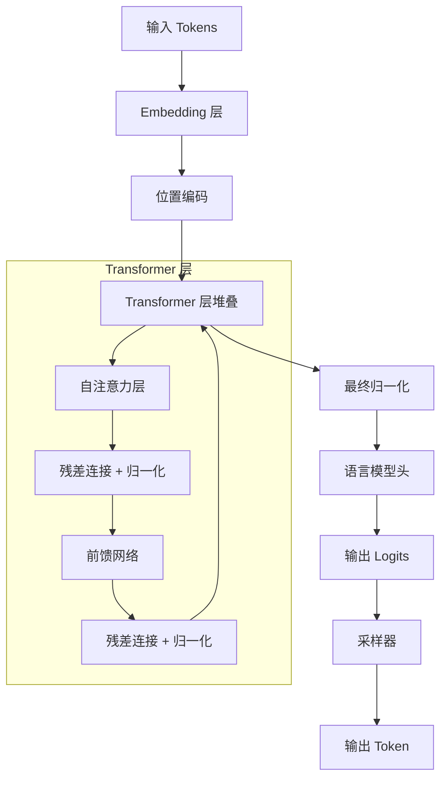
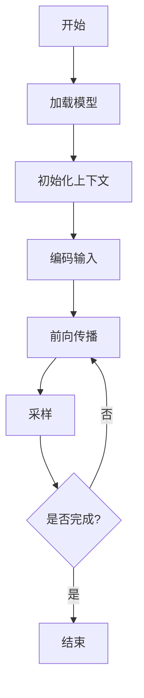

# 核心原理

## 概述

llama.cpp 的核心原理建立在 Transformer 架构、量化技术、KV Cache 管理和采样策略等技术之上。本章将深入解析这些核心技术的工作原理和实现细节。

## 1. Transformer 架构原理

### 1.1 整体架构

llama.cpp 基于标准的 Transformer 架构，包含以下核心组件：



### 1.2 自注意力机制

自注意力是 Transformer 的核心机制，用于捕捉序列中的长距离依赖关系：

**数学公式：**

```
Attention(Q, K, V) = softmax(QK^T / √d_k)V
```

其中：
- Q (Query)：查询向量
- K (Key)：键向量
- V (Value)：值向量
- d_k：键向量的维度

**实现流程：**

```cpp
// 1. 计算查询、键、值
ggml_tensor * Q = ggml_mul_mat(ctx, q_proj, input);
ggml_tensor * K = ggml_mul_mat(ctx, k_proj, input);
ggml_tensor * V = ggml_mul_mat(ctx, v_proj, input);

// 2. 添加位置编码
Q = ggml_add(ctx, Q, pos_emb_Q);
K = ggml_add(ctx, K, pos_emb_K);

// 3. 缓存 K 和 V (KV Cache)
kv_cache_store(K_cache, K, seq_id, pos);
kv_cache_store(V_cache, V, seq_id, pos);

// 4. 计算注意力分数
ggml_tensor * QK = ggml_mul_mat(ctx, K, Q);  // K^T × Q
QK = ggml_scale(ctx, QK, 1.0f / sqrt(d_k));  // 缩放

// 5. 应用因果掩码
QK = ggml_add(ctx, QK, causal_mask);

// 6. Softmax 归一化
ggml_tensor * attn = ggml_soft_max(ctx, QK);

// 7. 加权求和
ggml_tensor * output = ggml_mul_mat(ctx, V, attn);
```

### 1.3 位置编码

llama.cpp 支持多种位置编码方式：

#### RoPE（旋转位置编码）

RoPE 是目前最流行的位置编码方式，通过旋转向量实现位置信息编码：

```cpp
// RoPE 计算示例
void apply_rope(float * data, int64_t n_embd, int64_t n_head, 
                llama_pos pos, llama_pos n_ctx, int n_rot) {
    for (int i = 0; i < n_head; i++) {
        for (int j = 0; j < n_rot; j += 2) {
            float freq = pow(10000.0f, -j / (float)n_rot);
            float angle = pos * freq;
            
            // 复数旋转
            float x = data[i * n_embd + j];
            float y = data[i * n_embd + j + 1];
            
            data[i * n_embd + j]     = x * cos(angle) - y * sin(angle);
            data[i * n_embd + j + 1] = x * sin(angle) + y * cos(angle);
        }
    }
}
```

#### ALiBi（注意力线性偏置）

ALiBi 通过在注意力分数中添加线性偏置来实现位置编码：

```cpp
void apply_alibi(ggml_tensor * attn_scores, llama_pos pos, 
                 int n_head, int n_ctx) {
    for (int i = 0; i < n_head; i++) {
        float m = pow(2, -8.0f * (i + 1) / n_head);  // 头特定斜率
        
        for (int j = 0; j < n_ctx; j++) {
            // 添加线性偏置
            attn_scores[i][j] -= m * (pos - j);
        }
    }
}
```

### 1.4 前馈网络（FFN）

前馈网络是 Transformer 层的另一个核心组件：

**结构：**

```
FFN(x) = Activation(xW1 + b1)W2 + b2
```

**常用激活函数：**

- **GELU**: `GELU(x) = x * Φ(x)`，其中 Φ 是标准正态分布的 CDF
- **SwiGLU**: `SwiGLU(x) = (xW_gate) ⊙ Swish(xW_up))W_down`

**实现示例：**

```cpp
ggml_tensor * ffn_layer(ggml_context * ctx, ggml_tensor * input,
                        ggml_tensor * W_gate, ggml_tensor * W_up,
                        ggml_tensor * W_down) {
    // 门控投影
    ggml_tensor * gate = ggml_mul_mat(ctx, W_gate, input);
    gate = ggml_silu(ctx, gate);  // SiLU 激活
    
    // 上投影
    ggml_tensor * up = ggml_mul_mat(ctx, W_up, input);
    
    // 元素乘积
    ggml_tensor * hidden = ggml_mul(ctx, gate, up);
    
    // 下投影
    ggml_tensor * output = ggml_mul_mat(ctx, W_down, hidden);
    
    return output;
}
```

## 2. 量化技术原理

### 2.1 量化基本原理

量化是将高精度浮点数转换为低精度整数的过程，主要目标是：

1. **减少内存占用**：降低模型存储需求
2. **提高计算速度**：减少内存访问和计算量
3. **降低能耗**：减少计算资源消耗

### 2.2 量化分类

#### 按精度分类

| 量化类型 | 比特数 | 精度 | 内存占用 |
|---------|-------|------|----------|
| FP32    | 32-bit | 最高 | 100% |
| FP16/BF16 | 16-bit | 高 | 50% |
| INT8    | 8-bit  | 中 | 25% |
| INT4    | 4-bit  | 低 | 12.5% |

#### 按方法分类

1. **对称量化**：使用统一的量化尺度，零点固定为 0
2. **非对称量化**：使用量化尺度和零点偏移
3. **分块量化**：每个块使用独立的量化参数
4. **K-均值量化**：基于聚类的量化方法

### 2.3 llama.cpp 量化格式

#### Q4_0 量化

**结构：**
```cpp
struct block_q4_0 {
    uint16_t d;              // 量化尺度 (FP16)
    uint8_t  qs[QK4_0/2];    // 量化值 (每个字节存储2个4-bit值)
};
```

**压缩比：** 约 7.1:1

**优点：**
- 结构简单，计算快速
- 适合资源受限场景

**缺点：**
- 精度损失较大
- 不适合对精度敏感的层

#### Q4_K 量化

**结构：**
```cpp
struct block_q4_K {
    uint16_t d;                          // 主缩放因子
    uint16_t dmin;                       // 最小值缩放因子
    uint8_t  scales[K_SCALE_SIZE];      // 细粒度缩放因子
    uint8_t  qs[QK_K/2];                // 量化值
};
```

**压缩比：** 约 7.1:1

**优点：**
- 比Q4_0精度更高
- 支持负值处理
- 适合大多数场景

**缺点：**
- 结构复杂，计算开销较大

#### Q5_K 量化

**结构：**
```cpp
struct block_q5_K {
    uint16_t d;                          // 主缩放因子
    uint16_t dmin;                       // 最小值缩放因子
    uint8_t  scales[K_SCALE_SIZE];      // 细粒度缩放因子
    uint8_t  qs[QK_K/8*5];              // 量化值 (5-bit)
    uint8_t  qh[QK_K/8];                // 高位存储
};
```

**压缩比：** 约 5.8:1

**优点：**
- 精度高于 Q4_K
- 适合对精度要求较高的场景

**缺点：**
- 内存占用略高
- 计算复杂度增加

#### Q8_0 量化

**结构：**
```cpp
struct block_q8_0 {
    uint16_t d;              // 量化尺度 (FP16)
    int8_t   qs[QK8_0];      // 量化值 (8-bit有符号)
};
```

**压缩比：** 约 3.8:1

**优点：**
- 精度最高，几乎无损
- 适合精度敏感场景

**缺点：**
- 压缩率较低
- 内存占用相对较高

### 2.4 量化算法

#### 量化流程

```cpp
void quantize_tensor(ggml_tensor * src, ggml_tensor * dst, 
                    ggml_type type, const float * imatrix) {
    int64_t n_elements = ggml_nelements(src);
    int64_t block_size = ggml_blck_size(type);
    int64_t n_blocks = n_elements / block_size;
    
    for (int64_t i = 0; i < n_blocks; i++) {
        const float * block_src = src->data + i * block_size;
        void * block_dst = dst->data + i * ggml_type_size(type);
        
        // 根据重要性矩阵调整量化策略
        float importance_sum = 0.0f;
        for (int j = 0; j < block_size; j++) {
            importance_sum += imatrix[i * block_size + j];
        }
        
        // 调用量化函数
        switch (type) {
            case GGML_TYPE_Q4_0:
                quantize_row_q4_0(block_src, block_dst, block_size);
                break;
            case GGML_TYPE_Q4_K:
                quantize_row_q4_K(block_src, block_dst, block_size);
                break;
            // ... 其他格式
        }
    }
}
```

#### 反量化流程

```cpp
void dequantize_tensor(ggml_tensor * src, ggml_tensor * dst) {
    int64_t n_elements = ggml_nelements(dst);
    int64_t block_size = ggml_blck_size(src->type);
    int64_t n_blocks = n_elements / block_size;
    
    for (int64_t i = 0; i < n_blocks; i++) {
        const void * block_src = src->data + i * ggml_type_size(src->type);
        float * block_dst = dst->data + i * block_size;
        
        // 调用反量化函数
        const ggml_type_traits * qtype = ggml_get_type_traits(src->type);
        qtype->to_float(block_src, block_dst, block_size);
    }
}
```

### 2.5 量化优化技术

#### 向量化优化

使用 SIMD 指令优化量化计算：

```cpp
void quantize_row_q4_0_avx2(const float * x, block_q4_0 * y, int64_t k) {
    for (int64_t i = 0; i < k; i += QK4_0) {
        // 使用 AVX2 并行处理
        __m256 v = _mm256_loadu_ps(x + i);
        
        // 计算最大值和缩放因子
        __m256 vmax = _mm256_max_ps(v, _mm256_setzero_ps());
        vmax = _mm256_max_ps(vmax, _mm256_permute_ps(vmax, _MM_SHUFFLE(1, 0, 3, 2)));
        vmax = _mm256_max_ps(vmax, _mm256_permute_ps(vmax, _MM_SHUFFLE(2, 3, 0, 1)));
        float max_val = _mm256_cvtss_f32(vmax);
        
        // 量化
        float d = max_val / 7.0f;
        y->d = ggml_fp32_to_fp16(d);
        
        __m256 vd = _mm256_set1_ps(d);
        __m256 vq = _mm256_mul_ps(v, vd);
        vq = _mm256_add_ps(vq, _mm256_set1_ps(8.0f));
        vq = _mm256_round_ps(vq, _MM_FROUND_TO_NEAREST_INT);
        
        // 存储结果
        // ...
    }
}
```

#### GPU 量化

使用 GPU 并行化量化：

```cpp
__global__ void quantize_q4_0_cuda(const float * src, block_q4_0 * dst, int64_t n) {
    int idx = blockIdx.x * blockDim.x + threadIdx.x;
    if (idx >= n / QK4_0) return;
    
    const float * x = src + idx * QK4_0;
    block_q4_0 * y = dst + idx;
    
    // 计算最大值
    float max_val = 0.0f;
    for (int i = 0; i < QK4_0; i++) {
        max_val = fmaxf(max_val, fabsf(x[i]));
    }
    
    // 计算缩放因子
    y->d = max_val / 7.0f;
    
    // 量化
    float scale = 7.0f / max_val;
    for (int i = 0; i < QK4_0/2; i++) {
        int q0 = (int)(x[2*i] * scale + 8.5f);
        int q1 = (int)(x[2*i+1] * scale + 8.5f);
        y->qs[i] = (clamp(q0, 0, 15) << 4) | clamp(q1, 0, 15);
    }
}
```

## 3. KV Cache 管理原理

### 3.1 KV Cache 基本原理

KV Cache（键值缓存）用于缓存 Transformer 模型中自注意力机制计算的键 (Key) 和值 (Value) 张量。

**核心目的：**
- 避免重复计算历史 token 的 K、V 值
- 降低计算复杂度：从 O(n²) 降到 O(n)
- 减少推理延迟：每个新 token 只需计算当前 token 的注意力
- 节省内存带宽：减少从 GPU 内存读取历史数据的次数

**工作原理对比：**

```
传统方法（无 KV Cache）:
对于第 n 个 token:
  计算 K[0], K[1], ..., K[n]
  计算 V[0], V[1], ..., V[n]
  计算注意力: Q[n] × [K[0], K[1], ..., K[n]]^T × [V[0], V[1], ..., V[n]]

使用 KV Cache:
对于第 n 个 token:
  只计算 K[n], V[n]
  从缓存获取 [K[0], K[1], ..., K[n-1]], [V[0], V[1], ..., V[n-1]]
  计算注意力: Q[n] × [K[0], ..., K[n]]^T × [V[0], ..., V[n]]
```

### 3.2 KV Cache 结构

```cpp
struct llama_kv_cache {
    const llama_model & model;
    llama_hparams hparams;
    
    // 每层的 K 和 V 缓存
    struct layer_t {
        int32_t il;                              // 层索引
        ggml_tensor * k;                         // K 缓存张量
        ggml_tensor * v;                         // V 缓存张量
        std::vector<ggml_tensor *> k_stream;    // 每个流的 K 视图
        std::vector<ggml_tensor *> v_stream;    // 每个流的 V 视图
    };
    std::vector<layer_t> layers;
    
    // 单元格管理
    std::vector<llama_kv_cells> v_cells;
    std::vector<uint32_t> v_heads;             // 每个流的头部位置
    
    // 配置参数
    uint32_t n_seq_max;                        // 最大序列数
    uint32_t n_stream;                          // 流数量
    ggml_type type_k;                          // K 缓存数据类型
    ggml_type type_v;                          // V 缓存数据类型
    
    // 内存后端
    std::vector<std::pair<ggml_context_ptr, ggml_backend_buffer_t>> ctxs_bufs;
};
```

### 3.3 ISWA（无限滑动窗口注意力）

ISWA 允许模型处理超长序列而不增加计算复杂度：

**核心思想：**
- 只保留最近 N 个 token 的 KV Cache
- 使用滑动窗口机制动态管理缓存
- 支持无限序列长度的推理

**结构：**

```cpp
struct llama_kv_cache_iswa {
    std::unique_ptr<llama_kv_cache> kv_base;   // 基础 KV Cache
    std::unique_ptr<llama_kv_cache> kv_swa;    // SWA KV Cache
    
    bool unified;                              // 是否使用统一缓冲区
    uint32_t n_swa;                            // SWA 窗口大小
};
```

**工作流程：**

```cpp
// 初始化：创建基础和 SWA 缓存
kv_base = std::make_unique<llama_kv_cache>(model, ...);
kv_swa = std::make_unique<llama_kv_cache>(model, ..., n_swa);

// 对于非 SWA 层：使用完整的 KV Cache
if (!is_swa_layer) {
    ggml_tensor * K = kv_base->get_k(ctx, il, n_kv);
    ggml_tensor * V = kv_base->get_v(ctx, il, n_kv);
}
// 对于 SWA 层：使用滑动窗口 KV Cache
else {
    ggml_tensor * K = kv_swa->get_k(ctx, il, n_kv);
    ggml_tensor * V = kv_swa->get_v(ctx, il, n_kv);
    apply_swa_mask(attn_mask, n_swa);  // 应用 SWA 掩码
}
```

**SWA 掩码机制：**

```cpp
void set_swa_mask(float * data, int n_tokens, int n_kv, 
                  llama_pos p1, uint32_t n_swa) {
    for (int j = 0; j < n_kv; j++) {
        llama_pos p0 = get_kv_position(j);
        
        // 因果掩码：不能看到未来的 token
        if (p0 > p1) {
            data[i * n_kv + j] = -INFINITY;
            continue;
        }
        
        // SWA 掩码：只保留最近的 n_swa 个 token
        if (p1 - p0 > n_swa) {
            data[i * n_kv + j] = -INFINITY;
        }
    }
}
```

### 3.4 KV Cache 量化

KV Cache 量化可以大幅减少内存占用：

**内存节省对比：**

```
原始 KV Cache (FP32):
- K: 32层 × 4096维 × 4096位置 × 4字节 = 2.1GB
- V: 32层 × 4096维 × 4096位置 × 4字节 = 2.1GB
总计: 4.2GB

量化后 KV Cache (Q4_K):
- K: 32层 × 4096维 × 4096位置 × 0.6字节 = 323MB
- V: 32层 × 4096维 × 4096位置 × 0.6字节 = 323MB
总计: 646MB

内存节省: 85%
```

**配置示例：**

```cpp
llama_context_params params = llama_context_default_params();

// KV Cache 量化类型
params.type_k = GGML_TYPE_Q4_K;  // K 使用 4-bit 量化
params.type_v = GGML_TYPE_Q4_K;  // V 使用 4-bit 量化

// 或者使用不同的量化策略
params.type_k = GGML_TYPE_Q8_0;  // K 使用 8-bit 量化
params.type_v = GGML_TYPE_F16;   // V 使用 16-bit 浮点
```

### 3.5 KV Cache 操作接口

**序列管理：**

```cpp
// 删除序列的 KV
bool seq_rm(llama_seq_id seq_id, llama_pos p0, llama_pos p1);

// 复制序列的 KV
void seq_cp(llama_seq_id seq_id_src, llama_seq_id seq_id_dst, 
            llama_pos p0, llama_pos p1);

// 保留特定序列
void seq_keep(llama_seq_id seq_id);

// 添加位置偏移
void seq_add(llama_seq_id seq_id, llama_pos p0, llama_pos p1, 
             llama_pos shift);
```

**状态管理：**

```cpp
// 保存 KV Cache 状态
void state_write(llama_io_write_i & io, llama_seq_id seq_id, 
                llama_state_seq_flags flags) const;

// 恢复 KV Cache 状态
void state_read(llama_io_read_i & io, llama_seq_id seq_id, 
               llama_state_seq_flags flags);
```

## 4. 采样策略原理

### 4.1 采样器架构

llama.cpp 采用链式采样器设计，支持多种采样策略的组合：

```cpp
struct llama_sampler {
    struct llama_sampler_i * iface;  // 接口函数
    llama_sampler_context_t ctx;     // 上下文数据
};
```

### 4.2 常用采样策略

#### 贪婪采样（Greedy）

选择概率最大的 token：

```cpp
llama_token sample_greedy(float * logits, int n_vocab) {
    int max_idx = 0;
    float max_logit = logits[0];
    
    for (int i = 1; i < n_vocab; i++) {
        if (logits[i] > max_logit) {
            max_logit = logits[i];
            max_idx = i;
        }
    }
    
    return max_idx;
}
```

**特点：**
- 确定性输出
- 适合需要一致性的场景
- 可能导致重复内容

#### Top-K 采样

从前 K 个概率最高的 token 中随机选择：

```cpp
void sample_top_k(float * logits, int n_vocab, int k) {
    // 部分排序，只保留前 k 个
    std::partial_sort(logits, logits + k, logits + n_vocab, 
                     std::greater<float>());
    
    // 将其他 token 的概率设为 -inf
    for (int i = k; i < n_vocab; i++) {
        logits[i] = -INFINITY;
    }
}
```

**特点：**
- 增加输出多样性
- 避免低概率 token
- 平衡质量和多样性

#### Top-P（Nucleus）采样

从累积概率达到 P 的最小 token 集合中采样：

```cpp
void sample_top_p(float * logits, int n_vocab, float p) {
    // 1. 计算 softmax 概率
    std::vector<float> probs = softmax(logits, n_vocab);
    
    // 2. 按概率排序
    std::vector<int> indices = sort_indices(probs);
    
    // 3. 计算累积概率
    float cum_sum = 0.0f;
    int last_idx = 0;
    for (int i = 0; i < n_vocab; i++) {
        cum_sum += probs[indices[i]];
        if (cum_sum >= p) {
            last_idx = i;
            break;
        }
    }
    
    // 4. 只保留前 last_idx+1 个 token
    for (int i = last_idx + 1; i < n_vocab; i++) {
        logits[indices[i]] = -INFINITY;
    }
}
```

**特点：**
- 动态调整候选集大小
- 保持多样性
- 自动适应不同场景

#### 温度采样

通过温度参数调整概率分布的尖锐度：

```cpp
void sample_temperature(float * logits, int n_vocab, float temp) {
    if (temp <= 0.0f) {
        // 温度为 0 时等价于贪婪采样
        sample_greedy(logits, n_vocab);
    } else {
        // 调整 logits: logit / temp
        for (int i = 0; i < n_vocab; i++) {
            logits[i] /= temp;
        }
    }
}
```

**特点：**
- 温度 < 1: 更保守，更确定性
- 温度 = 1: 原始分布
- 温度 > 1: 更随机，更多样性

#### Mirostat 采样

动态调整采样参数以保持目标熵：

```cpp
struct mirostat_state {
    float mu;              // 上下文内的最大可能惊讶值
    float eta;             // 学习率
    int tau;               // 目标熵
    std::vector<float> observed_surprisals;
};

void sample_mirostat(float * logits, int n_vocab, mirostat_state & state) {
    // 1. 计算惊讶值
    float surprise = -log2(max_probability(logits, n_vocab));
    state.observed_surprisals.push_back(surprise);
    
    // 2. 调整 mu
    if (state.observed_surprisals.size() > 1) {
        float recent_surprise = state.observed_surprisals.back();
        float avg_surprise = average(state.observed_surprisals);
        state.mu += state.eta * (recent_surprise - avg_surprise);
    }
    
    // 3. 根据 mu 调整采样策略
    float top_p = 1.0f - exp(-state.mu);
    sample_top_p(logits, n_vocab, top_p);
}
```

**特点：**
- 自动调整采样参数
- 保持一致的文本质量
- 适合长文本生成

### 4.3 采样器链

llama.cpp 支持将多个采样器串联使用：

```cpp
// 创建采样器链
auto * sampler = llama_sampler_chain_init(params);

// 添加采样器
llama_sampler_chain_add(sampler, llama_sampler_init_top_k(50));
llama_sampler_chain_add(sampler, llama_sampler_init_top_p(0.9, 1));
llama_sampler_chain_add(sampler, llama_sampler_init_temp(0.8));
llama_sampler_chain_add(sampler, llama_sampler_init_dist(seed));

// 执行采样
llama_token token = llama_sampler_sample(sampler, ctx, -1);

// 接受采样结果
llama_sampler_accept(sampler, token);
```

**执行流程：**

```
原始 Logits
    ↓
Top-K 采样 (保留前 50 个)
    ↓
Top-P 采样 (累积概率达到 0.9)
    ↓
温度调整 (temp = 0.8)
    ↓
随机采样 (使用种子)
    ↓
输出 Token
```

### 4.4 语法约束采样

支持通过 GBNF 语法约束输出格式：

```cpp
// 创建语法约束
auto * grammar = llama_grammar_init(
    "root ::= obj\n"
    "obj ::= '{' ws string ws ':' ws value ws '}'\n"
    "value ::= string | number | obj | arr\n"
    "arr ::= '[' ws (value (',' ws value)*)? ws ']'\n"
);

// 创建带语法约束的采样器
auto * sampler = llama_sampler_init_grammar(grammar);

// 执行采样
llama_token token = llama_sampler_sample(sampler, ctx, -1);
```

**应用场景：**
- JSON 格式输出
- 函数调用参数
- 特定文本格式
- 代码生成

## 5. 推理流程原理

### 5.1 完整推理流程



**详细步骤：**

```cpp
// 1. 加载模型
llama_model * model = llama_load_model_from_file(model_path, model_params);

// 2. 初始化上下文
llama_context * ctx = llama_new_context_with_model(model, ctx_params);

// 3. 编码输入
std::vector<llama_token> tokens = llama_tokenize(ctx, prompt, true);

// 4. 前向传播
for (size_t i = 0; i < tokens.size(); i++) {
    llama_batch batch = llama_batch_init(1, 0, 1);
    batch.token[0] = tokens[i];
    batch.pos[0] = i;
    batch.seq_id[0][0] = 0;
    batch.n_tokens = 1;
    
    llama_decode(ctx, batch);
}

// 5. 采样生成
while (!finished) {
    // 获取 logits
    float * logits = llama_get_logits_ith(ctx, -1);
    
    // 采样
    llama_token new_token = llama_sampler_sample(sampler, ctx, -1);
    
    // 检查是否完成
    if (new_token == llama_token_eos(model)) {
        finished = true;
    }
    
    // 添加新 token
    llama_batch batch = llama_batch_init(1, 0, 1);
    batch.token[0] = new_token;
    batch.pos[0] = pos++;
    batch.seq_id[0][0] = 0;
    batch.n_tokens = 1;
    
    llama_decode(ctx, batch);
}
```

### 5.2 批量推理

支持在单个批次中处理多个序列：

```cpp
// 创建批次
llama_batch batch = llama_batch_init(n_tokens, embd, n_seq_max);

// 填充批次数据
for (int i = 0; i < n_tokens; i++) {
    batch.token[i] = tokens[i];
    batch.pos[i] = positions[i];
    batch.seq_id[i] = &seq_ids[i];
    batch.n_seq_id[i] = 1;
    batch.logits[i] = (i == n_tokens - 1);  // 最后一个 token 输出 logits
}
batch.n_tokens = n_tokens;

// 执行推理
int ret = llama_decode(ctx, batch);

// 获取结果
float * logits = llama_get_logits_ith(ctx, -1);
```

### 5.3 KV Cache 管理

```cpp
// 更新 KV Cache
void update_kv_cache(llama_context * ctx, llama_batch batch) {
    // 1. 查找可用缓存槽位
    llama_kv_cache::slot_info sinfo = kv_cache.find_slot(batch);
    
    // 2. 更新 KV Cache
    kv_cache.apply_ubatch(sinfo, batch);
    
    // 3. 复制新的 K、V 到缓存
    for (int il = 0; il < n_layers; il++) {
        kv_cache.cpy_k(ctx, k_cur, k_idxs, il);
        kv_cache.cpy_v(ctx, v_cur, v_idxs, il);
    }
}
```

### 5.4 性能优化

#### Flash Attention

优化注意力计算，减少内存访问：

```cpp
ggml_tensor * flash_attention(ggml_context * ctx, ggml_tensor * Q, 
                              ggml_tensor * K, ggml_tensor * V) {
    // 1. 分块处理
    int block_size = 128;
    int n_blocks = (Q->ne[0] + block_size - 1) / block_size;
    
    // 2. 逐步计算注意力
    ggml_tensor * output = ggml_new_tensor(...);
    for (int i = 0; i < n_blocks; i++) {
        for (int j = 0; j < n_blocks; j++) {
            // 计算块的注意力
            ggml_tensor * Q_block = get_block(Q, i);
            ggml_tensor * K_block = get_block(K, j);
            ggml_tensor * V_block = get_block(V, j);
            
            ggml_tensor * attn = compute_block_attention(Q_block, K_block);
            ggml_tensor * out = ggml_mul_mat(ctx, V_block, attn);
            
            // 累积结果
            output = ggml_add(ctx, output, out);
        }
    }
    
    return output;
}
```

#### 计算图重用

相同结构的批次可以重用计算图：

```cpp
// 检查是否可以重用计算图
if (can_reuse_graph) {
    gf = lctx->get_gf_res_reserve();
} else {
    gf = lctx->graph_reserve(n_tokens, n_seqs, n_outputs, nullptr);
}

// 执行计算图
ggml_backend_graph_compute(backend, gf);
```

## 6. 总结

llama.cpp 的核心原理建立在以下技术之上：

1. **Transformer 架构**：基于自注意力机制的强大模型架构
2. **量化技术**：多种量化格式，平衡精度和效率
3. **KV Cache 管理**：高效的缓存管理策略，支持超长序列
4. **采样策略**：灵活的采样器链，支持多种采样方法
5. **性能优化**：多层次优化，包括 Flash Attention、计算图重用等

这些技术的结合使得 llama.cpp 能够在保持高性能的同时，提供灵活的配置和优秀的可扩展性，成为一个优秀的大语言模型推理框架。