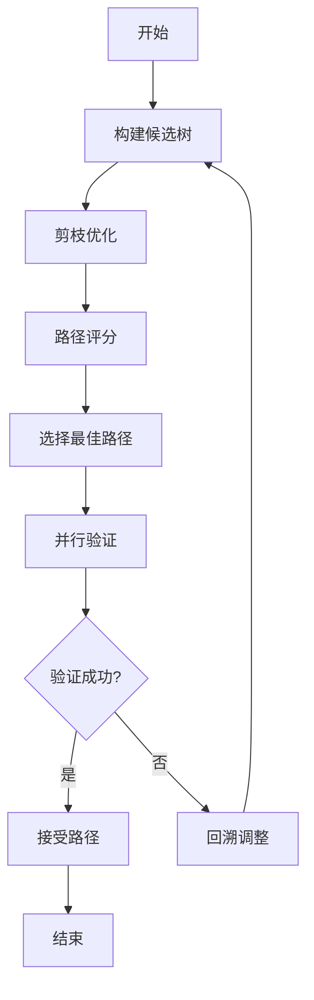

# 技术实现

## 概述

本章详细介绍 llama.cpp 的高级技术实现，包括硬件后端、多模态支持、推测解码、Lookahead 优化等高级功能。

## 1. 硬件后端实现

### 1.1 多后端架构

llama.cpp 采用统一的后端接口，支持多种硬件平台：

```cpp
struct ggml_backend {
    const char * name;                      // 后端名称
    ggml_backend_interface_t iface;         // 接口函数
    void * user_data;                       // 用户数据
};
```

### 1.2 CUDA 后端

#### 核心特性

- 自定义 CUDA 内核优化
- CUDA Graphs 支持
- 多 GPU 并行
- Flash Attention 优化
- 混合精度计算

#### 实现示例

```cpp
// CUDA 矩阵乘法内核
__global__ void ggml_mul_mat_cuda(const void * vx, const void * vy, 
                                  void * dst, const int ncols_x, 
                                  const int nrows_y, const int nrows_x) {
    const float * x = (const float *) vx;
    const float * y = (const float *) vy;
    float * d = (float *) dst;
    
    int row = blockIdx.y * blockDim.y + threadIdx.y;
    int col = blockIdx.x * blockDim.x + threadIdx.x;
    
    if (row < nrows_x && col < nrows_y) {
        float sum = 0.0f;
        for (int i = 0; i < ncols_x; i++) {
            sum += x[row * ncols_x + i] * y[i * nrows_y + col];
        }
        d[row * nrows_y + col] = sum;
    }
}
```

#### Flash Attention 实现

```cpp
__global__ void flash_attention_cuda(
    const float * Q, const float * K, const float * V,
    float * output, int seq_len, int head_dim) {
    
    int block_size = 128;
    int n_blocks = (seq_len + block_size - 1) / block_size;
    
    // 分块计算注意力
    extern __shared__ float shared_mem[];
    float * Q_block = shared_mem;
    float * K_block = shared_mem + block_size * head_dim;
    float * V_block = shared_mem + 2 * block_size * head_dim;
    float * O_block = shared_mem + 3 * block_size * head_dim;
    float * L_block = shared_mem + 4 * block_size;
    float * m_block = shared_mem + 4 * block_size + block_size;
    
    // 计算注意力
    for (int j = 0; j < n_blocks; j++) {
        // 加载 K、V 块
        load_block(K, K_block, j, block_size, head_dim);
        load_block(V, V_block, j, block_size, head_dim);
        
        // 计算注意力和输出
        for (int i = 0; i < block_size; i++) {
            float sum = 0.0f;
            for (int k = 0; k < block_size; k++) {
                float attn = Q[i] * K_block[k];
                attn = expf(attn - m_block[i]);
                sum += attn * V_block[k];
            }
            
            // 更新输出
            float new_m = m_block[i] + log1pf(expf(m_block[i] - m_block[i]));
            float new_l = expf(m_block[i] - new_m) * L_block[i] + 
                         expf(log1pf(expf(m_block[i] - m_block[i])) - new_m);
            O_block[i] = (expf(m_block[i] - new_m) * L_block[i] * O_block[i] + 
                          expf(log1pf(expf(m_block[i] - m_block[i])) - new_m) * 
                          sum) / new_l;
            L_block[i] = new_l;
            m_block[i] = new_m;
        }
    }
    
    // 存储结果
    output[blockIdx.x] = O_block[threadIdx.x];
}
```

### 1.3 Metal 后端

#### 核心特性

- Apple Silicon 原生支持
- Metal Performance Shaders
- Unified Memory
- 多 GPU 支持

#### 实现示例

```objc
// Metal 矩阵乘法着色器
kernel void ggml_mul_mat_metal(
    const device float * x [[buffer(0)]],
    const device float * y [[buffer(1)]],
    device float * dst [[buffer(2)]],
    constant int & ncols_x [[buffer(3)]],
    constant int & nrows_y [[buffer(4)]],
    constant int & nrows_x [[buffer(5)]],
    uint2 gid [[thread_position_in_grid]]) {
    
    int row = gid.y;
    int col = gid.x;
    
    if (row < nrows_x && col < nrows_y) {
        float sum = 0.0f;
        for (int i = 0; i < ncols_x; i++) {
            sum += x[row * ncols_x + i] * y[i * nrows_y + col];
        }
        dst[row * nrows_y + col] = sum;
    }
}
```

### 1.4 Vulkan 后端

#### 核心特性

- 跨平台支持
- 计算着色器优化
- 多 GPU 厂商支持
- 异步执行

#### 实现示例

```glsl
// Vulkan 计算着色器
#version 450

layout(local_size_x = 16, local_size_y = 16, local_size_z = 1) in;

layout(binding = 0) buffer X { float x[]; };
layout(binding = 1) buffer Y { float y[]; };
layout(binding = 2) buffer Dst { float dst[]; };
layout(push_constant) uniform Params {
    int ncols_x;
    int nrows_y;
    int nrows_x;
} params;

void main() {
    uint row = gl_GlobalInvocationID.y;
    uint col = gl_GlobalInvocationID.x;
    
    if (row < params.nrows_x && col < params.nrows_y) {
        float sum = 0.0;
        for (uint i = 0; i < params.ncols_x; i++) {
            sum += x[row * params.ncols_x + i] * y[i * params.nrows_y + col];
        }
        dst[row * params.nrows_y + col] = sum;
    }
}
```

### 1.5 后端选择策略

```cpp
ggml_backend_t select_best_backend(ggml_tensor * tensor) {
    // 检查可用的后端
    std::vector<ggml_backend_t> available_backends = get_available_backends();
    
    // 根据张量大小和类型选择最优后端
    for (auto backend : available_backends) {
        if (backend_supports_tensor(backend, tensor)) {
            if (is_gpu_backend(backend) && tensor_is_large(tensor)) {
                return backend;  // 大张量使用 GPU
            }
        }
    }
    
    // 默认使用 CPU
    return ggml_backend_cpu_init();
}
```

## 2. 多模态支持

### 2.1 多模态架构

llama.cpp 通过 `libmtmd` 库支持多模态输入：

```
┌─────────────────────────────────────┐
│         多模态输入层                  │
├─────────────────────────────────────┤
│  文本输入 │ 图像输入 │ 音频输入      │
└─────────────────────────────────────┘
              ↓
┌─────────────────────────────────────┐
│      多模态投影器层                  │
├─────────────────────────────────────┤
│  CLIP │ ViT │ Audio Encoder        │
└─────────────────────────────────────┘
              ↓
┌─────────────────────────────────────┐
│      融合层                          │
├─────────────────────────────────────┤
│  交叉注意力 │ 特征拼接 │ 门控机制    │
└─────────────────────────────────────┘
              ↓
┌─────────────────────────────────────┐
│      文本模型层                      │
├─────────────────────────────────────┤
│  Transformer 层                     │
└─────────────────────────────────────┘
              ↓
┌─────────────────────────────────────┐
│      输出层                          │
├─────────────────────────────────────┤
│  文本 │ 对话 │ 结构化输出            │
└─────────────────────────────────────┘
```

### 2.2 视觉模型实现

#### CLIP 视觉编码器

```cpp
struct clip_vision_encoder {
    ggml_tensor * conv1;              // 卷积层
    ggml_tensor * pos_emb;            // 位置编码
    std::vector<transformer_block> blocks;  // Transformer 块
    ggml_tensor * ln_final;           // 最终层归一化
};

ggml_tensor * encode_image(ggml_context * ctx, ggml_tensor * image, 
                          clip_vision_encoder * encoder) {
    // 1. 卷积特征提取
    ggml_tensor * x = ggml_conv_2d(ctx, encoder->conv1, image);
    x = ggml_reshape_3d(ctx, x, n_patch, n_patch, n_embd);
    
    // 2. 添加位置编码
    x = ggml_add(ctx, x, encoder->pos_emb);
    
    // 3. Transformer 处理
    for (auto & block : encoder->blocks) {
        x = transformer_forward(ctx, x, block);
    }
    
    // 4. 层归一化
    x = ggml_norm(ctx, x);
    x = ggml_mul(ctx, x, encoder->ln_final);
    
    return x;
}
```

#### 视觉-文本融合

```cpp
ggml_tensor * fuse_vision_text(ggml_context * ctx, 
                               ggml_tensor * vision_features,
                               ggml_tensor * text_embeddings) {
    // 1. 投影到相同维度
    ggml_tensor * vision_proj = ggml_mul_mat(ctx, vision_proj_w, vision_features);
    ggml_tensor * text_proj = ggml_mul_mat(ctx, text_proj_w, text_embeddings);
    
    // 2. 拼接
    ggml_tensor * fused = ggml_concat(ctx, text_proj, vision_proj);
    
    // 3. 交叉注意力
    fused = cross_attention(ctx, fused, text_proj, vision_proj);
    
    return fused;
}
```

### 2.3 音频模型实现

#### 音频编码器

```cpp
struct audio_encoder {
    ggml_tensor * conv1;              // 1D 卷积
    std::vector<transformer_block> blocks;  // Transformer 块
    ggml_tensor * output_proj;        // 输出投影
};

ggml_tensor * encode_audio(ggml_context * ctx, ggml_tensor * audio, 
                          audio_encoder * encoder) {
    // 1. 1D 卷积特征提取
    ggml_tensor * x = ggml_conv_1d(ctx, encoder->conv1, audio);
    x = ggml_gelu(ctx, x);
    
    // 2. Transformer 处理
    for (auto & block : encoder->blocks) {
        x = transformer_forward(ctx, x, block);
    }
    
    // 3. 输出投影
    x = ggml_mul_mat(ctx, encoder->output_proj, x);
    
    return x;
}
```

### 2.4 多模态推理流程

```cpp
std::string run_multimodal_inference(llama_context * ctx, 
                                    const std::string & text,
                                    const std::string & image_path) {
    // 1. 编码文本
    auto text_tokens = llama_tokenize(ctx, text, true);
    
    // 2. 加载图像
    ggml_tensor * image = load_image(image_path);
    
    // 3. 编码图像
    ggml_tensor * vision_features = encode_image(ctx, image, vision_encoder);
    
    // 4. 融合多模态输入
    ggml_tensor * fused = fuse_vision_text(ctx, vision_features, text_embeddings);
    
    // 5. 推理生成
    std::string output;
    for (int i = 0; i < max_tokens; i++) {
        // 前向传播
        llama_decode(ctx, batch);
        
        // 采样
        llama_token token = llama_sampler_sample(sampler, ctx, -1);
        
        // 检查是否结束
        if (token == llama_token_eos(model)) break;
        
        // 添加 token
        output += llama_token_to_piece(ctx, token);
    }
    
    return output;
}
```

## 3. 推测解码实现

### 3.1 基本原理

推测解码使用草稿模型快速生成候选 token，然后由主模型验证：

```
草稿模型: "The quick brown fox" → 生成 3 个候选 tokens
主模型: 并行验证这 3 个 tokens → 接受 2 个，拒绝 1 个
结果: 有效加速比 = 2.0
```

### 3.2 草稿模型实现

```cpp
struct draft_model {
    llama_model * model;
    llama_context * ctx;
    int n_draft_max;              // 最大草稿 token 数
    float acceptance_rate;        // 接受率
};

std::vector<llama_token> generate_draft(draft_model * draft, 
                                       const std::vector<llama_token> & context) {
    std::vector<llama_token> draft_tokens;
    
    for (int i = 0; i < draft->n_draft_max; i++) {
        // 编码上下文
        llama_batch batch = encode_context(draft->ctx, context + draft_tokens);
        
        // 前向传播
        llama_decode(draft->ctx, batch);
        
        // 采样
        llama_token token = llama_sampler_sample(draft->sampler, draft->ctx, -1);
        draft_tokens.push_back(token);
        
        // 检查是否需要停止
        if (token == llama_token_eos(draft->model)) break;
    }
    
    return draft_tokens;
}
```

### 3.3 验证机制

```cpp
verification_result verify_draft(llama_context * main_ctx,
                                  const std::vector<llama_token> & draft_tokens) {
    verification_result result;
    result.n_accepted = 0;
    result.n_rejected = 0;
    
    // 批量验证
    llama_batch batch = llama_batch_init(draft_tokens.size(), 0, 1);
    for (size_t i = 0; i < draft_tokens.size(); i++) {
        batch.token[i] = draft_tokens[i];
        batch.pos[i] = i;
        batch.seq_id[i][0] = 0;
    }
    batch.n_tokens = draft_tokens.size();
    
    // 前向传播
    llama_decode(main_ctx, batch);
    
    // 逐个验证
    for (size_t i = 0; i < draft_tokens.size(); i++) {
        float * logits = llama_get_logits_ith(main_ctx, i);
        
        // 检查草稿 token 是否在概率最高的位置
        llama_token predicted = sample_argmax(logits, n_vocab);
        
        if (predicted == draft_tokens[i]) {
            result.n_accepted++;
        } else {
            result.n_rejected++;
            break;  // 发现错误，停止验证
        }
    }
    
    result.acceptance_rate = (float)result.n_accepted / draft_tokens.size();
    return result;
}
```

### 3.4 n-gram 推测

```cpp
struct ngram_speculator {
    std::unordered_map<std::string, std::vector<llama_token>> cache;
    int n_gram_size;               // n-gram 大小
    int m_gram_size;               // m-gram 大小
};

std::vector<llama_token> ngram_predict(ngram_speculator * spec,
                                       const std::vector<llama_token> & context) {
    // 构建 n-gram
    std::string ngram;
    int start = std::max(0, (int)context.size() - spec->n_gram_size);
    for (int i = start; i < context.size(); i++) {
        ngram += std::to_string(context[i]) + ",";
    }
    
    // 查找匹配
    auto it = spec->cache.find(ngram);
    if (it != spec->cache.end()) {
        return it->second;  // 返回预测的 m-gram
    }
    
    return {};  // 无匹配
}
```

### 3.5 性能优化

```cpp
float calculate_speedup(float draft_time, float verify_time, 
                        int n_accepted, int n_draft) {
    // 传统方法时间
    float traditional_time = n_draft * verify_time;
    
    // 推测解码时间
    float speculative_time = draft_time + verify_time;
    
    // 加速比
    float speedup = traditional_time / speculative_time;
    
    return speedup;
}
```

## 4. Lookahead 优化

### 4.1 基本原理

Lookahead 通过构建候选树并预测多个路径，减少实际的推理次数：



### 4.2 候选树构建

```cpp
struct candidate_node {
    llama_token token;
    std::vector<candidate_node *> children;
    float score;
    int depth;
};

struct candidate_tree {
    candidate_node * root;
    int max_depth;
    int branching_factor;
};

candidate_tree * build_lookahead_tree(llama_context * ctx, 
                                     llama_token start_token,
                                     int max_depth, int branching_factor) {
    candidate_tree * tree = new candidate_tree();
    tree->root = new candidate_node{start_token, {}, 0.0f, 0};
    tree->max_depth = max_depth;
    tree->branching_factor = branching_factor;
    
    // BFS 构建候选树
    std::queue<candidate_node *> queue;
    queue.push(tree->root);
    
    while (!queue.empty()) {
        candidate_node * node = queue.front();
        queue.pop();
        
        if (node->depth >= max_depth) continue;
        
        // 编码上下文
        auto tokens = get_path_tokens(node);
        llama_batch batch = encode_tokens(ctx, tokens);
        llama_decode(ctx, batch);
        
        // 获取 top-k 候选
        float * logits = llama_get_logits_ith(ctx, -1);
        auto candidates = get_top_k(logits, n_vocab, branching_factor);
        
        // 添加子节点
        for (auto & [token, score] : candidates) {
            candidate_node * child = new candidate_node{token, {}, score, node->depth + 1};
            node->children.push_back(child);
            queue.push(child);
        }
    }
    
    return tree;
}
```

### 4.3 路径评分

```cpp
float score_path(candidate_node * node, llama_context * ctx) {
    if (node->children.empty()) {
        return node->score;
    }
    
    float max_child_score = 0.0f;
    for (auto * child : node->children) {
        float child_score = score_path(child, ctx);
        if (child_score > max_child_score) {
            max_child_score = child_score;
        }
    }
    
    return node->score + max_child_score;
}
```

### 4.4 并行验证

```cpp
std::vector<llama_token> verify_lookahead_tree(llama_context * ctx,
                                               candidate_tree * tree) {
    // 1. 选择最佳路径
    std::vector<llama_token> best_path;
    candidate_node * current = tree->root;
    
    while (current) {
        best_path.push_back(current->token);
        if (current->children.empty()) break;
        
        // 选择分数最高的子节点
        current = *std::max_element(current->children.begin(), 
                                   current->children.end(),
                                   [](auto * a, auto * b) {
                                       return a->score < b->score;
                                   });
    }
    
    // 2. 并行验证路径
    llama_batch batch = encode_tokens(ctx, best_path);
    int ret = llama_decode(ctx, batch);
    
    if (ret == 0) {
        return best_path;  // 验证成功
    } else {
        return {};  // 验证失败
    }
}
```

## 5. 总结

llama.cpp 的技术实现体现了以下特点：

1. **多后端支持**：统一的接口支持多种硬件平台
2. **多模态能力**：支持图像、音频等多种输入模态
3. **推测解码**：通过草稿模型加速生成
4. **Lookahead 优化**：智能预测和验证
5. **性能优化**：多层次优化技术

这些技术的结合使得 llama.cpp 能够在各种硬件平台上提供高效、灵活的推理服务。