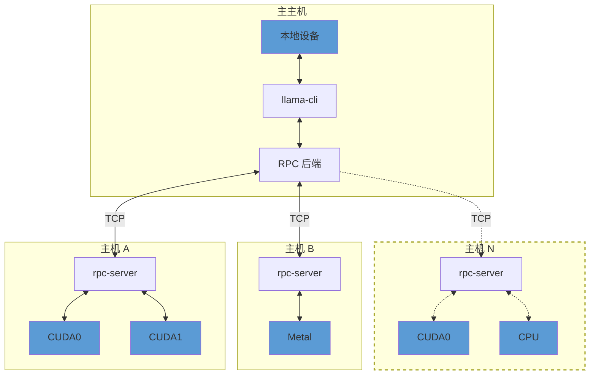

# RPC 服务器

## 概述

> [!重要]
> 此示例和 RPC 后端目前处于概念验证开发阶段。因此，功能脆弱且不安全。**永远不要在开放网络或敏感环境中运行 RPC 服务器！**

`rpc-server` 允许在远程主机上暴露 `ggml` 设备。
RPC 后端与一个或多个 `rpc-server` 实例通信，并将计算卸载到它们。
这可以用于通过以下方式使用 `llama.cpp` 进行分布式 LLM 推理：



默认情况下，`rpc-server` 暴露主机上所有可用的加速器设备。
如果没有加速器，它会暴露一个 `CPU` 设备。

## 用法

### 远程主机

在每个远程主机上，通过向构建选项添加 `-DGGML_RPC=ON` 来为每个加速器构建后端。
例如，要构建支持 CUDA 加速器的 `rpc-server`：

```bash
mkdir build-rpc-cuda
cd build-rpc-cuda
cmake .. -DGGML_CUDA=ON -DGGML_RPC=ON
cmake --build . --config Release
```

启动时，`rpc-server` 将检测并暴露所有可用的 `CUDA` 设备：

```bash
$ bin/rpc-server
ggml_cuda_init: GGML_CUDA_FORCE_MMQ:    no
ggml_cuda_init: GGML_CUDA_FORCE_CUBLAS: no
ggml_cuda_init: found 1 CUDA devices:
  Device 0: NVIDIA GeForce RTX 5090, compute capability 12.0, VMM: yes
Starting RPC server v3.0.0
  endpoint       : 127.0.0.1:50052
  local cache    : n/a
Devices:
  CUDA0: NVIDIA GeForce RTX 5090 (32109 MiB, 31588 MiB free)
```

您可以使用 `CUDA_VISIBLE_DEVICES` 环境变量或 `--device` 命令行选项控制暴露的 CUDA 设备集。以下两个命令具有相同的效果：
```bash
$ CUDA_VISIBLE_DEVICES=0 bin/rpc-server -p 50052
$ bin/rpc-server --device CUDA0 -p 50052
```

### 主主机

在主主机上，构建具有本地设备后端的 `llama.cpp` 并向构建选项添加 `-DGGML_RPC=ON`。
最后，在运行 `llama-cli` 或 `llama-server` 时，使用 `--rpc` 选项指定每个 `rpc-server` 的主机和端口：

```bash
$ llama-cli -hf ggml-org/gemma-3-1b-it-GGUF -ngl 99 --rpc 192.168.88.10:50052,192.168.88.11:50052
```

默认情况下，llama.cpp 根据每个设备的可用内存，将模型权重和 KV 缓存分布在所有可用设备上（包括本地和远程）。
您可以使用 `--tensor-split` 选项覆盖此行为，并在跨设备分割张量数据时设置自定义比例。

### 本地缓存

RPC 服务器可以使用本地缓存来存储大型张量，避免通过网络传输它们。
这可以显着加快模型加载速度，尤其是在使用大型模型时。
要启用缓存，使用 `-c` 选项：

```bash
$ bin/rpc-server -c
```

默认情况下，缓存存储在 `$HOME/.cache/llama.cpp/rpc` 目录中，可以通过 `LLAMA_CACHE` 环境变量控制。

### RDMA 传输

在具有 RoCEv2 功能网卡（例如 Mellanox ConnectX）的 Linux 系统上，RPC 后端可以使用 RDMA 而不是 TCP 来实现更低的延迟和更高的吞吐量。传输会自动协商——无需更改命令行用法。

在构建时找到 `libibverbs` 时，默认启用 RDMA。

### 故障排除

使用 `GGML_RPC_DEBUG` 环境变量启用来自 `rpc-server` 的调试消息：
```bash
$ GGML_RPC_DEBUG=1 bin/rpc-server
```

## 命令行选项

| 选项 | 说明 |
|------|------|
| `-p, --port PORT` | RPC 服务器监听端口（默认：50052） |
| `-d, --device DEVICE` | 指定要暴露的设备（例如：CUDA0, Metal） |
| `-c, --cache` | 启用本地张量缓存 |
| `-h, --help` | 显示帮助信息 |
| `--host HOST` | 绑定到特定主机地址（默认：0.0.0.0） |

## 使用场景

### 多 GPU 集群

将多个主机的 GPU 组合起来，通过 RPC 服务器进行分布式推理：

```bash
# 主机 A (192.168.1.10)
bin/rpc-server -p 50052

# 主机 B (192.168.1.11)
bin/rpc-server -p 50052

# 主主机
llama-cli -m model.gguf --rpc 192.168.1.10:50052,192.168.1.11:50052
```

### CPU-GPU 混合推理

结合本地 GPU 和远程 CPU 设备：

```bash
# 远程主机
bin/rpc-server -p 50052

# 主主机（使用本地 GPU 和远程 CPU）
llama-cli -m model.gguf -ngl 30 --rpc remote_host:50052
```

### 跨架构推理

使用不同架构的设备（例如：CUDA + Metal）：

```bash
# Linux 主机 (CUDA)
bin/rpc-server -p 50052

# macOS 主机 (Metal)
bin/rpc-server -p 50053

# 主主机
llama-cli -m model.gguf --rpc linux_host:50052,macos_host:50053
```

## 性能考虑

### 网络延迟

- 使用 RDMA 可以显著降低延迟
- 确保网络带宽足够高
- 考虑使用高速网络（如 10GbE 或更高）

### 缓存策略

- 对于大型模型，启用本地缓存可以减少网络传输
- 缓存位置应使用快速存储（SSD）
- 定期清理缓存以释放空间

### 设备选择

- 优先使用具有足够 VRAM 的设备
- 考虑设备之间的网络拓扑
- 在可能的情况下，将计算本地化到数据所在位置

## 安全注意事项

1. **不要在开放网络上运行**：RPC 服务器目前没有身份验证或加密
2. **使用防火墙**：限制对 RPC 端口的访问
3. **网络隔离**：仅在受信任的网络环境中使用
4. **监控访问**：记录和监控 RPC 连接

## 故障排查

### 连接问题

```bash
# 检查服务器是否正在运行
netstat -an | grep 50052

# 测试网络连接
telnet <host> 50052
```

### 设备检测问题

```bash
# 检查可用设备
nvidia-smi    # 对于 CUDA
metal -list   # 对于 Metal
```

### 性能问题

- 使用 `GGML_RPC_DEBUG=1` 启用调试输出
- 检查网络带宽和延迟
- 监控设备利用率
- 考虑启用本地缓存

## 相关文档

- [llama.cpp 主 README](../../README.md)
- [分布式推理](../../docs/distributed-inference.md)
- [后端支持](../../docs/backends.md)