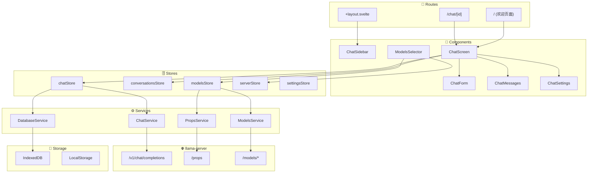
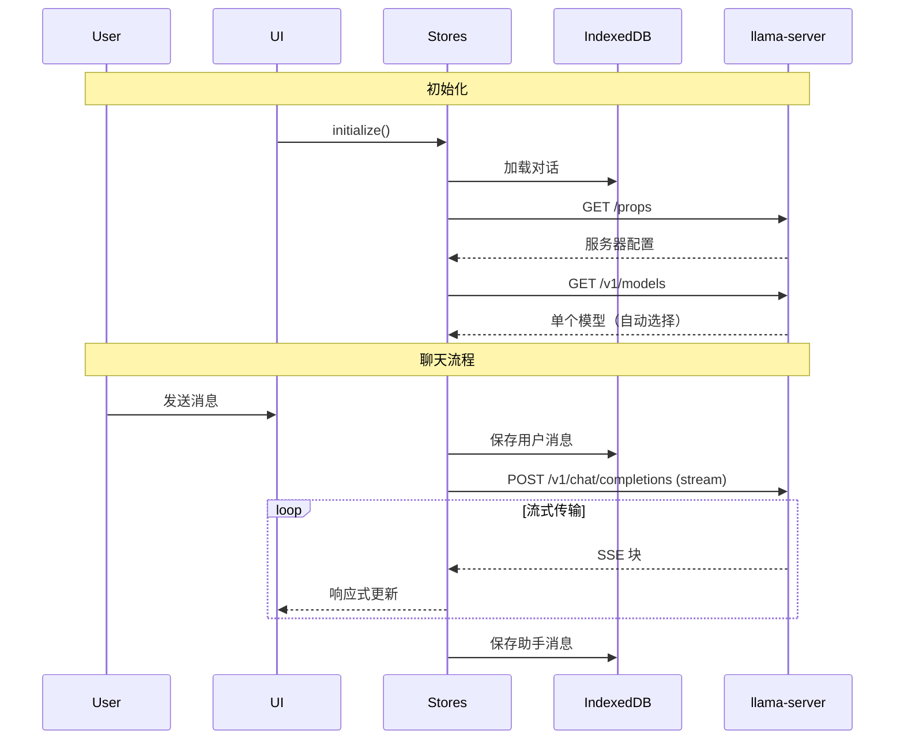
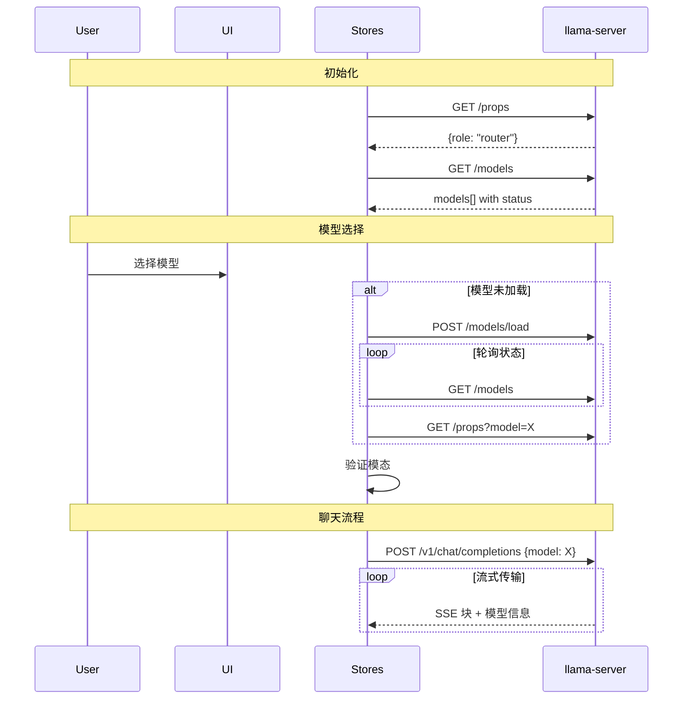
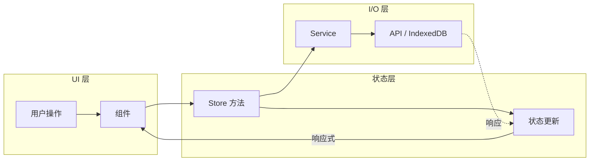
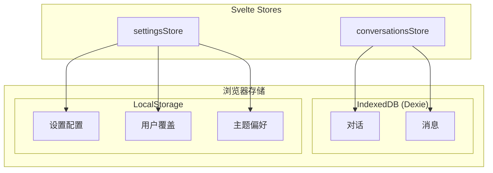

# llama-ui

一个为 llama-server 构建的现代、功能丰富的 Web 界面，使用 SvelteKit 构建。此 UI 提供直观的聊天界面，具有高级文件处理、对话管理和全面的模型交互功能。

Llama UI 支持两种服务器操作模式：

- **MODEL 模式** - 单模型操作（标准 llama-server）
- **ROUTER 模式** - 多模型操作，支持动态模型加载/卸载

---

## 目录

- [功能](#功能)
- [入门指南](#入门指南)
- [技术栈](#技术栈)
- [构建流程](#构建流程)
- [架构](#架构)
- [数据流](#数据流)
- [架构模式](#架构模式)
- [测试](#测试)

---

## 功能

### 聊天界面

- **流式响应**，实时更新
- **推理内容** - 支持具有思考/推理块的模型
- **深色/浅色主题**，自动检测系统偏好
- **响应式设计**，支持桌面和移动设备

### 文件附件

- **图片** - JPEG、PNG、GIF、WebP、SVG（自动转换为 PNG）
- **文档** - PDF（文本提取或图像转换，用于视觉模型）
- **音频** - MP3、WAV，用于支持音频的模型
- **文本文件** - 源代码、markdown 和其他文本格式
- **拖放和粘贴**支持，提供丰富的预览

### 对话管理

- **分支** - 通过编辑消息或重新生成响应在任意点分支对话，在分支之间导航
- **重新生成** - 使用可选的模型切换重新生成响应（ROUTER 模式）
- **导入/导出** - JSON 格式，用于备份和共享
- **搜索** - 按标题或内容查找对话

### 高级渲染

- **语法高亮** - 代码块，支持语言检测
- **数学公式** - KaTeX 渲染 LaTeX 表达式
- **Markdown** - 完整 GFM 支持，包括表格、列表等

### 多模型支持（ROUTER 模式）

- **模型选择器**，分为已加载/可用组
- **自动加载** - 模型在选择时加载
- **模态验证** - 防止向非视觉模型发送图片
- **LRU 卸载** - 服务器自动管理模型缓存

### 键盘快捷键

| 快捷键 | 操作 |
| ------------------ | -------------------- |
| `Shift+Ctrl/Cmd+O` | 新聊天 |
| `Shift+Ctrl/Cmd+E` | 编辑对话 |
| `Shift+Ctrl/Cmd+D` | 删除对话 |
| `Ctrl/Cmd+K` | 搜索对话 |
| `Ctrl/Cmd+B` | 切换侧边栏 |

### 开发者体验

- **请求跟踪** - 通过 `/slots` 端点监控令牌生成
- **Storybook** - 带有视觉测试的组件库
- **热重载** - 开发期间即时更新

---

## 入门指南

### 前置要求

- **Node.js** 18+（推荐 20+）
- **npm** 9+
- **llama-server** 在本地运行（用于 API 访问）

### 1. 安装依赖

```bash
cd tools/ui
npm install
```

### 2. 启动 llama-server

在单独的终端中，启动后端服务器：

```bash
# 单模型（MODEL 模式）
./llama-server -m model.gguf

# 多模型（ROUTER 模式）
./llama-server --models-dir /path/to/models
```

### 3. 启动开发服务器

```bash
npm run dev
```

这将启动：

- **Vite 开发服务器**，位于 `http://localhost:5173` - 主 UI 前端应用
- **Storybook**，位于 `http://localhost:6006` - 组件文档

Vite 开发服务器将 API 请求代理到 `http://localhost:8080`（默认 llama-server 端口）：

```typescript
// vite.config.ts 代理配置
proxy: {
  '/v1': 'http://localhost:8080',
  '/props': 'http://localhost:8080',
  '/slots': 'http://localhost:8080',
  '/models': 'http://localhost:8080'
}
```

### 开发工作流程

1. 在浏览器中打开 `http://localhost:5173`
2. 对 `.svelte`、`.ts` 或 `.css` 文件进行更改
3. 更改即时热重载
4. 使用 `http://localhost:6006` 的 Storybook 进行独立的组件开发

---

## 技术栈

| 层 | 技术 | 用途 |
| ----------------- | ------------------------------- | -------------------------------------------------------- |
| **框架** | SvelteKit + Svelte 5 | 使用 runes（`$state`、`$derived`、`$effect`）的响应式 UI |
| **UI 组件** | shadcn-svelte + bits-ui | 可访问、可定制的组件库 |
| **样式** | TailwindCSS 4 | 实用优先的 CSS，带有设计令牌 |
| **数据库** | IndexedDB (Dexie) | 用于对话和消息的客户端存储 |
| **构建** | Vite | 快速打包，使用静态适配器 |
| **测试** | Playwright + Vitest + Storybook | E2E、单元和视觉测试 |
| **Markdown** | remark + rehype | Markdown 处理，带有 KaTeX 和语法高亮 |

### 主要依赖

```json
{
    "svelte": "^5.0.0",
    "bits-ui": "^2.8.11",
    "dexie": "^4.0.11",
    "pdfjs-dist": "^5.4.54",
    "highlight.js": "^11.11.1",
    "rehype-katex": "^7.0.1"
}
```

---

## 构建流程

### 开发构建

```bash
npm run dev
```

在开发模式下运行 Vite，具有：

- 热模块替换（HMR）
- 源映射
- 代理到 llama-server

### 生产构建

```bash
npm run build
```

构建过程：

1. **Vite 构建** - 打包所有 TypeScript、Svelte 和 CSS
2. **静态适配器** - 输出到 `../../build/tools/ui/dist`（llama-server 的静态文件目录）
3. **构建后脚本** - 清理中间文件
4. **自定义插件** - 创建 `index.html`，包含：
   - 内联为 base64 的 favicon
   - GZIP 压缩（级别 9）
   - 确定性输出（零时间戳）

```text
tools/ui/        →  build  →  build/tools/ui/dist/
├── src/                                 ├── index.html  （由 llama-server 提供）
├── static/                              └── (favicon 内联)
└── ...
```

### SvelteKit 配置

```javascript
// svelte.config.js
adapter: adapter({
  pages: '../../build/tools/ui/dist',      // 输出目录
  assets: '../../build/tools/ui/dist',     // 静态资产
  fallback: 'index.html',  // SPA 回退
  strict: true
}),
output: {
  bundleStrategy: 'inline' // 单文件包
}
```

### 与 llama-server 集成

llama-ui 直接嵌入到 llama-server 二进制文件中：

1. `npm run build` 将 `index.html` 输出到 `build/tools/ui/dist/`
2. llama-server 在构建时将其编译到二进制文件中
3. 访问 `/` 时，llama-server 提供打包的 HTML

这产生了一个**包含完整 Llama UI 的单个便携式二进制文件**。

---

## 架构

Llama UI 遵循分层架构，具有单向数据流：

```text
Routes → Components → Hooks → Stores → Services → Storage/API
```

### 高级架构

请参阅：[`docs/architecture/high-level-architecture-simplified.md`](docs/architecture/high-level-architecture-simplified.md)



### 层次分解

#### Routes (`src/routes/`)

- **`/`** - 欢迎屏幕，创建新对话
- **`/chat/[id]`** - 活动聊天界面
- **`+layout.svelte`** - 侧边栏、导航、全局初始化

#### Components (`src/lib/components/`)

组件组织在 `app/`（应用程序特定）和 `ui/`（shadcn-svelte 原语）中。

**聊天组件** (`app/chat/`):

| 组件 | 职责 |
| ------------------ | --------------------------------------------------------------------------- |
| `ChatScreen/` | 主聊天容器，协调消息列表、输入表单和附件 |
| `ChatForm/` | 消息输入文本区域，支持文件上传、粘贴处理、键盘快捷键 |
| `ChatMessages/` | 消息列表，支持分支导航、重新生成/继续/编辑操作 |
| `ChatAttachments/` | 文件附件预览、拖放、PDF/图片/音频处理 |
| `ChatSettings/` | 参数滑块（温度、top-p 等），与服务器默认值同步 |
| `ChatSidebar/` | 对话列表、搜索、导入/导出、导航 |

**对话框组件** (`app/dialogs/`):

| 组件 | 职责 |
| ------------------------------- | -------------------------------------------------------- |
| `DialogChatSettings` | 全屏设置配置 |
| `DialogModelInformation` | 模型详细信息（上下文大小、模态、并行槽） |
| `DialogChatAttachmentPreview` | 图片、PDF（文本或页面视图）、代码的完整预览 |
| `DialogConfirmation` | 破坏性操作的通用确认 |
| `DialogConversationTitleUpdate` | 编辑对话标题 |

**服务器/模型组件** (`app/server/`、`app/models/`):

| 组件 | 职责 |
| ------------------- | --------------------------------------------------------- |
| `ServerErrorSplash` | 服务器无法访问时显示错误 |
| `ModelsSelector` | 模型下拉列表，具有已加载/可用组（ROUTER 模式） |

**共享 UI 组件** (`app/misc/`):

| 组件 | 职责 |
| -------------------------------- | ---------------------------------------------------------------- |
| `MarkdownContent` | Markdown 渲染，支持 KaTeX、语法高亮、复制按钮 |
| `SyntaxHighlightedCode` | 代码块，支持语言检测和高亮 |
| `ActionButton`、`ActionDropdown` | 可重复使用的操作按钮和菜单 |
| `BadgeModality`、`BadgeInfo` | 状态和能力徽章 |

#### Hooks (`src/lib/hooks/`)

- **`useModelChangeValidation`** - 根据对话模态验证模型切换
- **`useProcessingState`** - 跟踪流式进度和令牌生成

#### Stores (`src/lib/stores/`)

| Store | 职责 |
| -------------------- | --------------------------------------------------------- |
| `chatStore` | 消息发送、流式传输、中止控制、错误处理 |
| `conversationsStore` | 对话的 CRUD、消息分支、导航 |
| `modelsStore` | 模型列表、选择、加载/卸载（ROUTER） |
| `serverStore` | 服务器属性、角色检测、模态 |
| `settingsStore` | 用户偏好、参数与服务器默认值同步 |

#### Services (`src/lib/services/`)

| Service | 职责 |
| ---------------------- | ----------------------------------------------- |
| `ChatService` | 对 `/v1/chat/completions` 的 API 调用、SSE 解析 |
| `ModelsService` | `/models`、`/models/load`、`/models/unload` |
| `PropsService` | `/props`、`/props?model=` |
| `DatabaseService` | 通过 Dexie 的 IndexedDB 操作 |
| `ParameterSyncService` | 与服务器默认值同步设置 |

---

## 数据流

### MODEL 模式（单模型）

请参阅：[`docs/flows/data-flow-simplified-model-mode.md`](docs/flows/data-flow-simplified-model-mode.md)



### ROUTER 模式（多模型）

请参阅：[`docs/flows/data-flow-simplified-router-mode.md`](docs/flows/data-flow-simplified-router-mode.md)



### 详细流程图

| 流程 | 描述 | 文件 |
| ------------- | ------------------------------------------ | ----------------------------------------------------------- |
| Chat | 消息生命周期、流式传输、重新生成 | [`chat-flow.md`](docs/flows/chat-flow.md) |
| Models | 加载、卸载、模态缓存 | [`models-flow.md`](docs/flows/models-flow.md) |
| Server | Props 获取、角色检测 | [`server-flow.md`](docs/flows/server-flow.md) |
| Conversations | CRUD、分支、导入/导出 | [`conversations-flow.md`](docs/flows/conversations-flow.md) |
| Database | IndexedDB 模式、操作 | [`database-flow.md`](docs/flows/database-flow.md) |
| Settings | 参数同步、用户覆盖 | [`settings-flow.md`](docs/flows/settings-flow.md) |

---

## 架构模式

### 1. 使用 Svelte 5 Runes 的响应式状态

所有存储都使用 Svelte 5 的细粒度响应性：

```typescript
// 带有响应式状态的 Store
class ChatStore {
    #isLoading = $state(false);
    #currentResponse = $state('');

    // 派生值自动更新
    get isStreaming() {
        return $derived(this.#isLoading && this.#currentResponse.length > 0);
    }
}

// 导出的响应式访问器
export const isLoading = () => chatStore.isLoading;
export const currentResponse = () => chatStore.currentResponse;
```

### 2. 单向数据流

数据在一个方向上流动，使状态可预测：



组件将操作分派到存储，存储协调服务进行 I/O，状态更新响应式地传播回 UI。

### 3. 每对话状态

支持跨多个对话的并发流式传输：

```typescript
class ChatStore {
    chatLoadingStates = new Map<string, boolean>();
    chatStreamingStates = new Map<string, { response: string; messageId: string }>();
    abortControllers = new Map<string, AbortController>();
}
```

### 4. 消息分支的树结构

对话存储为树，而不是线性列表：

```typescript
interface DatabaseMessage {
    id: string;
    parent: string | null; // 指向父消息
    children: string[]; // 子消息 ID 列表
    // ...
}

interface DatabaseConversation {
    currentNode: string; // 当前查看的分支尖端
    // ...
}
```

在分支之间导航会更新 `currentNode`，而不会丢失历史记录。

### 5. 分层服务架构

存储处理状态；服务处理 I/O：

```text
┌─────────────────┐
│     Stores      │  业务逻辑，状态管理
├─────────────────┤
│    Services     │  API 调用，数据库操作
├─────────────────┤
│   Storage/API   │  IndexedDB, LocalStorage, HTTP
└─────────────────┘
```

### 6. 服务器角色抽象

单个代码库处理 MODEL 和 ROUTER 两种模式：

```typescript
// serverStore.ts
get isRouterMode() {
  return this.role === ServerRole.ROUTER;
}

// 组件根据模式条件渲染
{#if isRouterMode()}
  <ModelsSelector />
{/if}
```

### 7. 模态验证

防止向不兼容的模型发送附件：

```typescript
// useModelChangeValidation hook
const validate = (modelId: string) => {
    const modelModalities = modelsStore.getModelModalities(modelId);
    const conversationModalities = conversationsStore.usedModalities;

    // 检查模型是否支持所有使用的模态
    if (conversationModalities.hasImages && !modelModalities.vision) {
        return { valid: false, reason: 'Model does not support images' };
    }
    // ...
};
```

### 8. 持久存储策略

使用两种存储机制在会话之间持久化数据：



- **IndexedDB**：对话和消息（大型、结构化数据）
- **LocalStorage**：设置、用户参数覆盖、主题（小型键值数据）
- **仅内存**：服务器属性、模型列表（每次会话时重新获取）

---

## 测试

### 测试类型

| 类型 | 工具 | 位置 | 命令 |
| ------------- | ------------------ | ---------------- | ------------------- |
| **单元测试** | Vitest | `tests/unit/` | `npm run test:unit` |
| **UI/视觉测试** | Storybook + Vitest | `tests/stories/` | `npm run test:ui` |
| **E2E 测试** | Playwright | `tests/e2e/` | `npm run test:e2e` |
| **客户端测试** | Vitest | `tests/client/` | `npm run test:unit` |

### 运行测试

```bash
# 所有测试
npm run test

# 各个测试套件
npm run test:e2e      # 端到端（需要 llama-server）
npm run test:client   # 客户端单元测试
npm run test:server   # 服务器端单元测试
npm run test:ui       # Storybook 视觉测试
```

### Storybook 开发

```bash
npm run storybook     # 在 :6006 启动 Storybook 开发服务器
npm run build-storybook  # 构建静态 Storybook
```

### 代码检查和格式化

```bash
npm run lint          # 检查代码风格
npm run format        # 使用 Prettier 自动格式化
npm run check         # TypeScript 类型检查
```

---

## 项目结构

```text
tools/ui/
├── src/
│   ├── lib/
│   │   ├── components/   # UI 组件（app/、ui/）
│   │   ├── hooks/        # Svelte hooks
│   │   ├── stores/       # 状态管理
│   │   ├── services/     # API 和数据库服务
│   │   ├── types/        # TypeScript 接口
│   │   └── utils/        # 实用函数
│   ├── routes/           # SvelteKit 路由
│   └── styles/           # 全局样式
├── static/               # 静态资产
├── tests/                # 测试文件
├── docs/                 # 架构图
│   ├── architecture/     # 高级架构
│   └── flows/            # 特定功能的流程
└── .storybook/           # Storybook 配置
```

---

## 相关文档

- [llama.cpp Server README](../server/README.md) - 完整的服务器文档
- [多模态文档](../../docs/multimodal.md) - 图片和音频支持
- [函数调用](../../docs/function-calling.md) - 工具使用能力